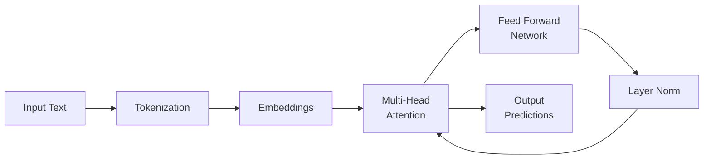
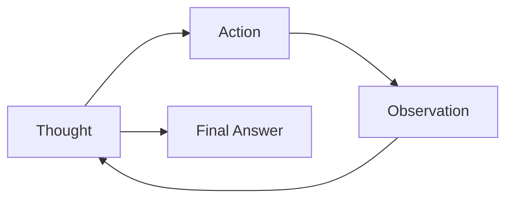
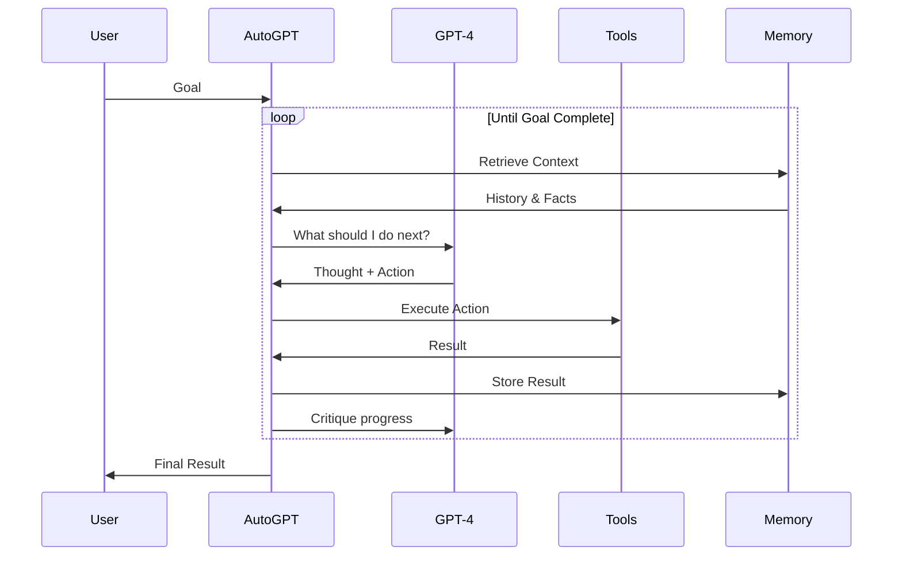
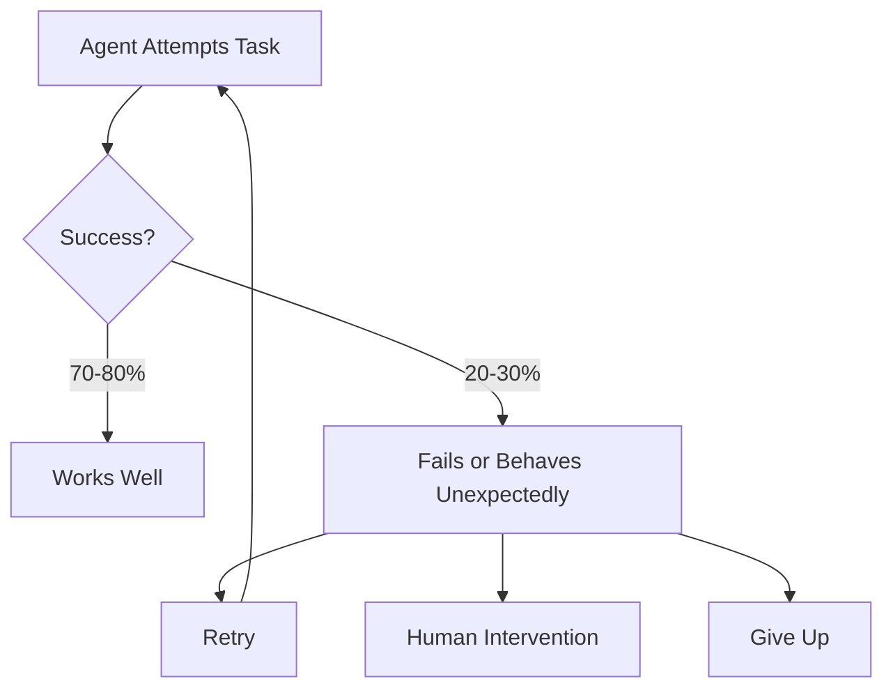
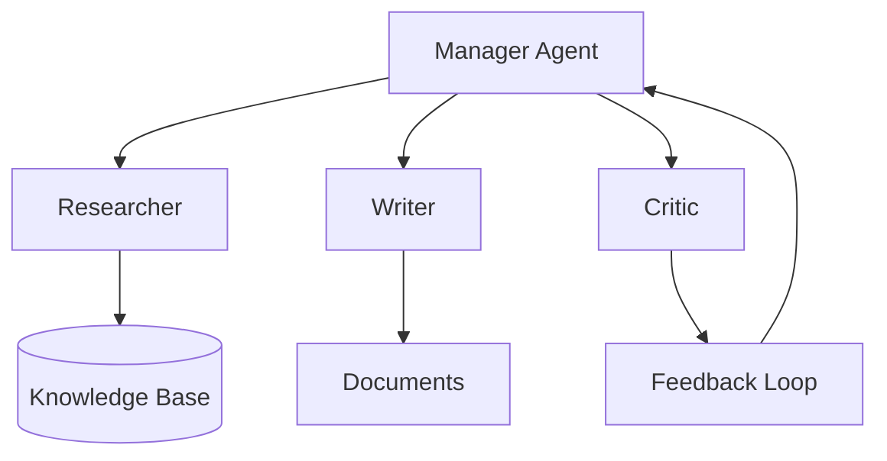

# Evolution of LLM Agents

## Table of Contents
- [Introduction](#introduction)
- [Pre-LLM Era Context](#pre-llm-era-context)
- [The Transformer Revolution](#the-transformer-revolution)
- [From Language Models to Agents](#from-language-models-to-agents)
- [Key Capabilities Enabling Agents](#key-capabilities-enabling-agents)
- [The Agent Explosion (2023)](#the-agent-explosion-2023)
- [Framework Evolution](#framework-evolution)
- [Current State and Capabilities](#current-state-and-capabilities)
- [Challenges and Limitations](#challenges-and-limitations)
- [Future Trajectories](#future-trajectories)
- [Further Reading](#further-reading)

## Introduction

The emergence of Large Language Models (LLMs) as the foundation for AI agents represents one of the most significant paradigm shifts in artificial intelligence. In just a few years, LLMs have transformed from text completion systems to autonomous agents capable of complex reasoning, tool use, and goal-directed behavior.

This document traces the rapid evolution from GPT-3's release in 2020 to today's sophisticated multi-agent systems, examining the key innovations, breakthroughs, and patterns that emerged.

*For broader historical context, see [History of AI Agents](history-of-ai-agents.md).*

## Pre-LLM Era Context

### Limitations of Traditional Agents

Before LLMs, AI agents faced fundamental constraints:

❌ **Narrow Domains**: Agents worked only in specific, pre-programmed contexts
❌ **Rigid Interfaces**: Required structured inputs, couldn't handle natural language
❌ **No Common Sense**: Lacked basic world knowledge
❌ **Expensive Customization**: Each new domain required extensive engineering
❌ **Poor Generalization**: Couldn't transfer knowledge across tasks

### What Was Missing

Traditional agents lacked a **general-purpose reasoning engine** that could:
- Understand natural language instructions
- Apply common sense and world knowledge
- Adapt to new tasks without retraining
- Explain their reasoning
- Learn from few examples

**LLMs provided exactly these capabilities.**

## The Transformer Revolution

### Attention Is All You Need (2017)

The transformer architecture by Vaswani et al. introduced:

**Self-Attention Mechanism**:
```
Attention(Q, K, V) = softmax(QK^T / √d_k)V
```

**Key Innovations**:
- Parallel processing (vs. sequential RNNs)
- Long-range dependencies
- Scalability to billions of parameters



### Pre-Training Paradigm

**Transfer Learning at Scale**:
1. **Pre-train** on massive text corpus (unsupervised)
2. **Fine-tune** on specific tasks (supervised)

This approach unlocked unprecedented generalization capabilities.

## From Language Models to Agents

### GPT-3 Era (2020-2022)

#### GPT-3 Release (June 2020)

**Capabilities**:
- 175 billion parameters
- Few-shot learning via prompting
- Surprisingly coherent long-form generation
- Basic arithmetic and reasoning

**Limitations as an Agent**:
- No tool use
- No external memory
- Hallucination issues
- No iterative refinement

#### Early Prompt Engineering

Researchers discovered LLMs could perform tasks through clever prompting:

**Zero-Shot**:
```
Translate English to French:
Hello, how are you?
```

**Few-Shot**:
```
English: Hello
French: Bonjour

English: Goodbye
French: Au revoir

English: Thank you
French:
```

**Chain-of-Thought** (Wei et al., 2022):
```
Q: Roger has 5 tennis balls. He buys 2 more cans of tennis balls. 
Each can has 3 tennis balls. How many tennis balls does he have now?

A: Let's think step by step.
Roger started with 5 balls.
2 cans of 3 balls each is 6 balls.
5 + 6 = 11 balls.
The answer is 11.
```

*Detailed explanation: [Reasoning](../04-core-concepts/reasoning.md).*

### The Tool Use Breakthrough (2021-2022)

#### Toolformer (Schick et al., 2023)

LLMs learned to decide when and how to use external tools:

**Example**:
```
Question: What is the weather in Paris?
Thought: I need current weather data.
Action: search("Paris weather today")
Result: 18°C, partly cloudy
Answer: It's 18°C and partly cloudy in Paris today.
```

**Significance**: Bridged LLMs' knowledge cutoff and real-world data.

*Comprehensive guide: [Tool Use](../04-core-concepts/tool-use.md).*

#### WebGPT (Nakano et al., 2021)

GPT-3 + web browser for answering questions:
- Search queries
- Click links
- Scroll pages
- Extract information

**Key Insight**: LLMs can navigate complex information spaces with the right interfaces.

#### ReAct (Yao et al., 2023)

**Re**asoning + **Act**ing paradigm:



**Pattern**:
1. Thought: Reason about what to do
2. Action: Execute tool or operation
3. Observation: Process result
4. Repeat until goal achieved

*Implementation pattern: [Tool Calling Pattern](../07-design-patterns/tool-calling-pattern.md).*

### ChatGPT Launch (November 2022)

ChatGPT brought LLMs to mainstream consciousness.

**Key Innovations**:
- **RLHF** (Reinforcement Learning from Human Feedback)
- Conversational interface
- Instruction following
- Helpfulness, harmlessness, honesty (HHH)

**Impact on Agents**:
- Demonstrated practical value of LLM interaction
- Set expectations for agent behavior
- Created demand for autonomous capabilities

## Key Capabilities Enabling Agents

### 1. In-Context Learning

LLMs can learn from examples in the prompt without parameter updates.

**Mechanism**: Attention over prompt examples guides behavior

**Agent Implication**: Agents can adapt on-the-fly to new tasks

### 2. Chain-of-Thought Reasoning

Breaking down complex problems into steps:

**Variants**:
- **Self-Consistency**: Sample multiple reasoning paths, use majority vote
- **Tree-of-Thoughts**: Explore multiple reasoning branches
- **Graph-of-Thoughts**: Non-linear reasoning structures

*Detailed: [Reasoning](../04-core-concepts/reasoning.md) and [Planning](../04-core-concepts/planning.md).*

### 3. Function Calling

LLMs can generate structured API calls:

**OpenAI Function Calling** (June 2023):
```json
{
  "name": "get_weather",
  "arguments": {
    "location": "San Francisco",
    "unit": "celsius"
  }
}
```

**Impact**: Reliable tool use became practical at scale

### 4. Long Context Windows

Context length evolution:
- GPT-3: 4K tokens (2020)
- GPT-3.5: 16K tokens (2023)
- GPT-4: 32K tokens (2023)
- Claude 2: 100K tokens (2023)
- GPT-4 Turbo: 128K tokens (2023)
- Gemini 1.5: 1M tokens (2024)

**Agent Implication**: Agents can maintain rich conversation history and process entire codebases.

### 5. Multimodal Understanding

GPT-4 Vision, Gemini, and Claude 3+ support:
- Images
- Documents
- Charts and diagrams
- Screenshots

**Agent Implication**: Agents can understand and act on visual information.

## The Agent Explosion (2023)

### AutoGPT (March 2023)

The first viral autonomous GPT-4 agent.

**Core Loop**:
1. Think about task
2. Reason about approach
3. Execute actions (search, read/write files, code execution)
4. Self-critique and iterate
5. Remember context



**Impact**: 
- GitHub: 150K+ stars in weeks
- Sparked agent development boom
- Revealed both potential and limitations

*Full analysis: [AutoGPT Case Study](../06-case-studies/autogpt.md).*

### BabyAGI (April 2023)

Yohei Nakajima's task-driven autonomous agent.

**Elegant Simplicity**:
```python
while True:
    # 1. Pull task from queue
    task = task_queue.popleft()
    
    # 2. Execute with LLM
    result = llm.complete(task)
    
    # 3. Store in memory
    memory.store(result)
    
    # 4. Create new tasks
    new_tasks = llm.generate_tasks(result, objective)
    task_queue.extend(new_tasks)
```

**Philosophy**: Minimal viable agent architecture

*Detailed: [BabyAGI Case Study](../06-case-studies/babyagi.md).*

### LangChain Agents (2023)

Formalized agent patterns:

**Agent Types**:
- **Zero-shot ReAct**: Decide tool use from descriptions
- **Conversational**: Maintain dialogue state
- **ReAct**: Reasoning + Acting loops
- **Self-ask with Search**: Decompose questions

*Comprehensive guide: [LangChain](../03-frameworks/langchain.md).*

### Proliferation of Agent Projects

**Notable Projects** (2023):
- AgentGPT
- GPT-Engineer
- MetaGPT
- SuperAGI
- DevGPT
- Voyager (Minecraft agent)
- Generative Agents (Stanford simulation)

**Common Patterns**:
- Goal-directed behavior
- Tool use and API integration
- Memory systems
- Self-reflection and critique

## Framework Evolution

### Wave 1: Single-Agent Frameworks (2022-Early 2023)

**LangChain** (Harrison Chase, late 2022):
- First comprehensive framework
- Chains, agents, memory abstractions
- Tool/API integration
- Rapid adoption

**LlamaIndex** (Jerry Liu, late 2022):
- Data-centric approach
- Document indexing and retrieval
- Knowledge graph integration
- RAG (Retrieval-Augmented Generation)

*Compare: [Framework Comparison](../03-frameworks/comparison-table.md).*

### Wave 2: Multi-Agent Frameworks (Mid-Late 2023)

**AutoGen** (Microsoft, September 2023):
- Conversable agents
- Human-in-the-loop
- Group chat patterns
- Code execution

**CrewAI** (October 2023):
- Role-based agents
- Task delegation
- Process workflows (sequential, hierarchical)
- Production-focused

**MetaGPT** (August 2023):
- Software company simulation
- Product manager, architect, engineer roles
- Document-driven development
- Structured output

*Detailed guides*:
- [AutoGen](../03-frameworks/autogen.md)
- [CrewAI](../03-frameworks/crewai.md)

### Wave 3: Specialized & Lightweight (2024)

**OpenAI Swarm** (October 2024):
- Minimal, educational framework
- Handoffs between agents
- Routine-based patterns
- < 1000 lines of code

**Pydantic AI** (2024):
- Type-safe agent definitions
- Python-native experience
- Validation and error handling

*Guide: [OpenAI Swarm](../03-frameworks/openai-swift-agents.md).*

## Current State and Capabilities

### What LLM Agents Can Do Well (2024-2025)

✅ **Natural Language Understanding**
- Complex instructions
- Ambiguous requests
- Context understanding

✅ **Task Decomposition**
- Breaking down complex goals
- Creating subtask hierarchies
- Adaptive planning

✅ **Tool Use**
- API integration
- Code execution
- Database queries
- Web search and browsing

✅ **Knowledge Synthesis**
- Combining information from multiple sources
- Summarization and analysis
- Report generation

✅ **Code Generation**
- Writing functions and scripts
- Debugging and fixing errors
- Code explanation

✅ **Multi-Agent Collaboration**
- Role specialization
- Information sharing
- Coordinated problem-solving

*Real applications: [Real-World Applications](../05-multi-agent-systems/real-world-applications.md).*

### Architecture Patterns That Emerged

**1. ReAct Loop**
```
Thought → Action → Observation → Thought → ...
```

**2. Planner-Executor**
- Planner: Creates high-level strategy
- Executor: Implements steps
- Critic: Evaluates and refines

*Pattern: [Planner-Executor Pattern](../07-design-patterns/planner-executor-pattern.md).*

**3. Reflection Loop**
- Execute action
- Evaluate outcome
- Learn from mistakes
- Improve future actions

*Pattern: [Reflection Loop Pattern](../07-design-patterns/reflection-loop-pattern.md).*

**4. Multi-Agent Orchestration**
- Manager coordinates specialist agents
- Agents communicate through protocols
- Emergent problem-solving

*Pattern: [Multi-Agent Orchestration](../07-design-patterns/multi-agent-orchestration.md).*

### Memory Systems

**Short-Term Memory**:
- Conversation context
- Working memory for current task
- Limited by context window

**Long-Term Memory**:
- Vector databases (Pinecone, Chroma, Weaviate)
- Episodic memory (past experiences)
- Semantic memory (facts and knowledge)

**Memory Architectures**:
- **Buffer Memory**: Simple FIFO
- **Summary Memory**: Compress old context
- **Entity Memory**: Track entities and relationships
- **Knowledge Graphs**: Structured information

*Deep dive: [Memory](../04-core-concepts/memory.md).*

## Challenges and Limitations

### Current Limitations (2024-2025)

❌ **Reliability**
- Non-deterministic outputs
- Occasional hallucinations
- Failure to follow complex instructions
- Inconsistent tool use

❌ **Planning Horizon**
- Difficulty with long-term goals (>10 steps)
- Getting stuck in loops
- Poor backtracking when plans fail

❌ **Cost and Latency**
- Expensive API calls
- Multi-second response times
- Compound costs in multi-agent systems

❌ **Evaluation**
- Hard to measure agent quality
- Benchmark gaming
- Poor correlation with real-world performance

*Evaluation approaches: [Evaluation Methods](../08-research-papers/evaluation-methods.md).*

❌ **Safety and Control**
- Prompt injection vulnerabilities
- Unintended actions
- Difficulty constraining behavior
- Lack of formal guarantees

*Critical topic: [Autonomy and Alignment](../04-core-concepts/autonomy-and-alignment.md).*

### The Reliability Gap



**Challenge**: High variance in success rates makes production deployment difficult.

### Research Frontiers

**Open Problems**:
1. How to ensure consistent, reliable behavior?
2. How to handle truly long-term planning (100+ steps)?
3. How to make agents learn continually from experience?
4. How to verify agent behavior formally?
5. How to align agent goals with human values?

*Explore: [Research Papers](../08-research-papers/).*

## Future Trajectories

### Near-Term (2024-2026)

**Likely Developments**:

🔮 **Improved Reliability**
- Better prompt engineering
- Fine-tuning for agent tasks
- Verification layers

🔮 **Richer Tool Ecosystems**
- Standardized tool interfaces
- Tool composition
- Automated tool discovery

🔮 **Better Memory Systems**
- Hybrid memory architectures
- Efficient long-term storage
- Better retrieval mechanisms

🔮 **Multi-Modal Agents**
- Vision + language + audio
- Understanding physical environments
- Robotics applications

### Medium-Term (2026-2030)

**Possible Advances**:

🔮 **Continual Learning**
- Agents that improve from experience
- Personalization over time
- Domain adaptation

🔮 **Formal Verification**
- Provable safety guarantees
- Constrained generation
- Certification for critical applications

🔮 **Human-Agent Collaboration**
- Natural teamwork patterns
- Adaptive autonomy levels
- Seamless handoffs

🔮 **Embodied Agents**
- Physical robots with LLM reasoning
- Real-world manipulation
- Spatial understanding

### Long-Term Vision (2030+)

**Speculative Directions**:

🔮 **General-Purpose AGI Agents**
- True task generalization
- Human-level reasoning across domains
- Self-improving systems

🔮 **Massive Multi-Agent Systems**
- Thousands of coordinated agents
- Emergent collective intelligence
- Complex societal simulations

🔮 **Brain-Computer Interfaces**
- Direct neural integration
- Thought-based control
- Augmented cognition

⚠️ *Note: These are speculative and may not materialize as imagined.*

*Explore more: [Future Directions](../09-future-directions/).*

## Key Insights and Takeaways

### What Made LLM Agents Possible

**Technical Enablers**:
1. **Scale**: Billions of parameters enable emergent capabilities
2. **Pre-training**: Massive data provides world knowledge
3. **Transfer Learning**: Few-shot adaptation to new tasks
4. **Attention Mechanism**: Long-range reasoning
5. **Natural Language**: Universal interface for tasks

**Paradigm Shifts**:
- From programming to prompting
- From training to instructing
- From narrow to general-purpose
- From isolated to tool-using

### Lessons from the Evolution

**What Worked**:
✅ Simplicity - Minimal architectures (BabyAGI) often outperform complex ones
✅ Modularity - Separating planning, execution, and reflection
✅ Feedback - Self-critique and iteration improve outputs
✅ Tool Use - Extending capabilities beyond language generation
✅ Collaboration - Multi-agent approaches handle complexity better

**What Didn't Work**:
❌ Full Autonomy (Yet) - Agents still need guardrails and oversight
❌ Complex Architectures - Over-engineering often hurts more than helps
❌ Ignoring Context Limits - Working within context windows is crucial
❌ No Error Handling - Agents must gracefully handle failures
❌ Blind Trust - Output verification is essential

*Practical wisdom: [Reflections and Lessons](../06-case-studies/relections-and-lessions.md).*

### Design Principles Emerging

**1. Start with Clear Goals**
- Specific, measurable objectives
- Well-defined success criteria
- Scope limitation

**2. Build in Feedback Loops**
- Self-evaluation mechanisms
- Human-in-the-loop checkpoints
- Iterative refinement

*Details: [Feedback Loops](../04-core-concepts/feedback-loops.md).*

**3. Embrace Tool Use**
- Don't rely solely on LLM knowledge
- Integrate with external systems
- Verify information from tools

**4. Design for Failure**
- Graceful degradation
- Error recovery strategies
- Fallback mechanisms

**5. Monitor and Log**
- Track agent reasoning
- Record tool calls
- Enable debugging and improvement

## Comparison: Before and After LLMs

### Agent Capabilities Matrix

| Capability | Pre-LLM Era | LLM Era |
|-----------|-------------|---------|
| **Natural Language** | Limited, template-based | Fluent, contextual |
| **Task Adaptation** | Requires retraining | Few-shot prompting |
| **Tool Use** | Hard-coded | Dynamic, learned |
| **Reasoning** | Rule-based | Emergent from pre-training |
| **Knowledge** | Domain-specific | Broad world knowledge |
| **Development Time** | Months | Hours to days |
| **Customization** | Expert required | Accessible to developers |
| **Generalization** | Poor | Strong |
| **Reliability** | High (in domain) | Variable |
| **Explainability** | Clear rules | Opaque (but can explain in language) |

### Cost-Benefit Evolution

**Pre-LLM Agents**:
- High upfront development cost
- Low operational cost
- Narrow applicability
- High reliability in scope

**LLM Agents**:
- Low upfront development cost
- Higher operational cost (API calls)
- Broad applicability
- Variable reliability

**Sweet Spot**: Hybrid approaches combining both paradigms.

## Notable Research Milestones

### 2020-2021: Foundation Models

**GPT-3** (Brown et al., 2020)
- Demonstrated few-shot learning at scale
- In-context learning without fine-tuning

**CLIP** (Radford et al., 2021)
- Vision-language understanding
- Zero-shot image classification

### 2022: Reasoning Breakthroughs

**Chain-of-Thought Prompting** (Wei et al., 2022)
- Step-by-step reasoning improves accuracy
- Emergent ability at scale

**Self-Consistency** (Wang et al., 2022)
- Sample multiple reasoning paths
- Majority voting for reliability

**Least-to-Most Prompting** (Zhou et al., 2022)
- Progressive problem decomposition
- Builds solutions incrementally

### 2023: Agent-Specific Research

**ReAct** (Yao et al., 2023)
- Interleaving reasoning and acting
- Foundation for modern agents

**Reflexion** (Shinn et al., 2023)
- Self-reflection for improvement
- Learning from mistakes

**Generative Agents** (Park et al., 2023)
- Memory streams for believable behavior
- Simulated human communities

**HuggingGPT** (Shen et al., 2023)
- LLM as controller for AI models
- Task planning and model selection

*Comprehensive list: [LLM as Agent Research](../08-research-papers/llm-as-agent.md).*

### 2024: Multimodal and Specialized Agents

**GPT-4V** (OpenAI, 2024)
- Vision-language integration
- Screenshot understanding, UI navigation

**Claude 3** (Anthropic, 2024)
- Long context (200K tokens)
- Improved reasoning and analysis

**Gemini 1.5** (Google, 2024)
- 1M token context window
- Multimodal understanding

**Specialized Frameworks**
- Code-specific agents (Devin, SWE-agent)
- Research agents (Elicit, Consensus)
- Data analysis agents (Julius, Code Interpreter)

## Industry Adoption Patterns

### Early Adopters (2023)

**Use Cases**:
- Customer support automation
- Content generation and editing
- Data analysis and reporting
- Research assistance
- Code generation

**Challenges**:
- Managing hallucinations
- Cost control
- Quality assurance
- User trust

### Maturation (2024-2025)

**Emerging Patterns**:
- Hybrid human-agent workflows
- Agent-as-a-service platforms
- Domain-specific fine-tuning
- Enterprise agent frameworks
- Regulatory frameworks

**Success Factors**:
- Clear scope and constraints
- Robust error handling
- Human oversight mechanisms
- Incremental deployment
- Continuous monitoring

*Real-world examples: [Case Studies](../06-case-studies/).*

## Technical Architecture Evolution

### Generation 1: Monolithic Agents (2023)

```
User Input → LLM → Action → Result
```

**Characteristics**:
- Single LLM call per step
- Simple tool use
- Limited memory
- Basic error handling

**Examples**: Early AutoGPT, simple chatbots

### Generation 2: Modular Agents (2023-2024)

```
User Input → Planner → Executor → Critic → Memory
                ↓         ↓         ↓         ↑
              Tools    Actions   Feedback   Storage
```

**Characteristics**:
- Separation of concerns
- Specialized components
- Better error handling
- Persistent memory

**Examples**: LangChain agents, CrewAI

*Architecture details: [Agent Architectures](../02-architecture/agent-architectures.md).*

### Generation 3: Multi-Agent Systems (2024+)



**Characteristics**:
- Role specialization
- Parallel execution
- Inter-agent communication
- Emergent behaviors

**Examples**: AutoGen, CrewAI, MetaGPT

*Patterns: [Collaboration Patterns](../05-multi-agent-systems/collaboration-patterns.md).*

## Benchmarking and Evaluation

### Early Benchmarks (2023)

**AgentBench** (Liu et al., 2023)
- 8 distinct environments
- Code, game, web tasks
- OS interaction

**WebArena** (Zhou et al., 2023)
- Realistic web tasks
- Multi-step navigation
- Tool use evaluation

**GAIA** (Mialon et al., 2023)
- General AI assistant benchmark
- Multi-modal reasoning
- Real-world questions

### Evaluation Challenges

**Difficulties**:
- Task diversity makes comparison hard
- Success metrics unclear
- Long horizon tasks difficult to score
- Human judgment required
- Gaming the benchmarks

**Approaches**:
- Task completion rate
- Efficiency (steps/cost)
- Human preference ratings
- Ablation studies
- Real-world deployment metrics

*Comprehensive guide: [Evaluation Methods](../08-research-papers/evaluation-methods.md).*

## Philosophical Implications

### Agency and Autonomy

**Key Questions**:
- Do LLM agents truly have "agency"?
- What distinguishes agent from tool?
- When is autonomy appropriate?
- How much control should humans retain?

**Perspectives**:
- **Instrumentalist**: Agents are sophisticated tools
- **Emergentist**: Agency emerges from complexity
- **Gradualist**: Agency is a spectrum

*Deep dive: [Autonomy and Alignment](../04-core-concepts/autonomy-and-alignment.md).*

### Ethical Considerations

**Concerns**:
- Accountability for agent actions
- Bias amplification
- Privacy and data handling
- Job displacement
- Dual-use potential

**Mitigations**:
- Human oversight requirements
- Bias detection and correction
- Privacy-preserving techniques
- Reskilling initiatives
- Responsible use guidelines

### The Intelligence Question

**Are LLM Agents "Intelligent"?**

Arguments **For**:
- Solve complex problems
- Adapt to new situations
- Use tools creatively
- Explain reasoning
- Learn from context

Arguments **Against**:
- Pattern matching, not understanding
- No genuine consciousness
- Brittle in novel situations
- Lack true reasoning
- Cannot learn continually

**Pragmatic View**: Intelligence is a multifaceted concept; LLM agents exhibit certain forms of intelligence while lacking others.

## Practical Guidance for Builders

### When to Use LLM Agents

✅ **Good Use Cases**:
- Natural language interfaces needed
- Tasks require reasoning and adaptation
- Multiple tools must be orchestrated
- Domain knowledge is broad
- Quick prototyping desired

❌ **Poor Use Cases**:
- Deterministic behavior required
- Real-time, low-latency critical
- 100% accuracy mandatory
- Simple, well-defined workflows
- Budget is very constrained

### Getting Started

**Step-by-Step Approach**:

1. **Start Simple**
   - Single-agent, single-task
   - Use existing frameworks
   - Clear success criteria

2. **Add Capabilities Incrementally**
   - Tool use
   - Memory
   - Multi-step planning

3. **Iterate Based on Failures**
   - Log everything
   - Analyze failure modes
   - Add guardrails

4. **Scale Thoughtfully**
   - Multi-agent only when needed
   - Monitor costs closely
   - Human oversight for critical paths

*Practical patterns: [Design Patterns](../07-design-patterns/).*

### Framework Selection Guide

**Choose LangChain if**:
- Comprehensive toolkit needed
- Rapid prototyping
- Extensive integrations required

**Choose AutoGen if**:
- Multi-agent conversations
- Human-in-the-loop important
- Complex group dynamics

**Choose CrewAI if**:
- Role-based workflows
- Production deployment focus
- Hierarchical processes

**Choose OpenAI Swarm if**:
- Learning and experimentation
- Lightweight solution
- Custom control logic

*Full comparison: [Framework Comparison Table](../03-frameworks/comparison-table.md).*

## Summary

The evolution of LLM agents represents a paradigm shift from narrow, brittle AI systems to flexible, general-purpose agents capable of complex reasoning and autonomous action.

**Key Evolutionary Stages**:
1. **GPT-3 Era** (2020-2022): Foundation models with emergent capabilities
2. **Tool Use** (2021-2022): Connecting LLMs to external systems
3. **Agent Explosion** (2023): AutoGPT, BabyAGI spark mainstream interest
4. **Framework Maturation** (2023-2024): Production-ready multi-agent systems
5. **Specialization** (2024+): Domain-specific agents and applications

**Core Insights**:
- **Language as Interface**: Natural language enables general-purpose instruction
- **Emergent Capabilities**: Complex behaviors arise from scale and pre-training
- **Tool Use is Key**: Extending beyond text generation unlocks real utility
- **Reliability Remains Challenging**: High variance in outputs limits some applications
- **Hybrid Approaches Win**: Combining LLMs with traditional systems often best

**The Future is Being Built Today**: While challenges remain, LLM agents are rapidly becoming practical for real-world applications. The field is still young, and significant innovations likely lie ahead.

*Continue learning*:
- [Core Components](../02-architecture/core-components.md) - How agents are built
- [Core Concepts](../04-core-concepts/) - Deep dives into key capabilities
- [Case Studies](../06-case-studies/) - Real-world implementations
- [Framework Guides](../03-frameworks/) - Practical tools for building

## Further Reading

### Within This Repository

**Foundations**:
- [What are AI Agents?](what-are-ai-agents.md) - Core definitions
- [History of AI Agents](history-of-ai-agents.md) - Broader historical context
- [Glossary](glossary.md) - Key terminology

**Technical Details**:
- [Agent Architectures](../02-architecture/agent-architectures.md)
- [Planning and Reasoning](../02-architecture/planning-and-reasoning.md)
- [Core Components](../02-architecture/core-components.md)

**Implementation**:
- [Tool Use](../04-core-concepts/tool-use.md)
- [Memory](../04-core-concepts/memory.md)
- [Reasoning](../04-core-concepts/reasoning.md)
- [Reflection](../04-core-concepts/reflection.md)

**Frameworks**:
- [LangChain](../03-frameworks/langchain.md)
- [AutoGen](../03-frameworks/autogen.md)
- [CrewAI](../03-frameworks/crewai.md)
- [OpenAI Swarm](../03-frameworks/openai-swift-agents.md)

**Case Studies**:
- [AutoGPT](../06-case-studies/autogpt.md)
- [BabyAGI](../06-case-studies/babyagi.md)
- [Real-World Applications](../05-multi-agent-systems/real-world-applications.md)

**Research**:
- [Foundational Papers](../08-research-papers/foundational-papers.md)
- [LLM as Agent](../08-research-papers/llm-as-agent.md)
- [Evaluation Methods](../08-research-papers/evaluation-methods.md)

### External Resources

**Key Papers**:
- "Attention Is All You Need" (Vaswani et al., 2017)
- "Language Models are Few-Shot Learners" (Brown et al., 2020)
- "Chain-of-Thought Prompting" (Wei et al., 2022)
- "ReAct: Synergizing Reasoning and Acting" (Yao et al., 2023)
- "Toolformer" (Schick et al., 2023)
- "Generative Agents" (Park et al., 2023)

**Documentation**:
- [OpenAI API Documentation](https://platform.openai.com/docs)
- [Anthropic Claude Docs](https://docs.anthropic.com)
- [LangChain Documentation](https://python.langchain.com)
- [AutoGen Documentation](https://microsoft.github.io/autogen)

**Blogs and Tutorials**:
- Lilian Weng's Blog (OpenAI)
- Eugene Yan's Blog
- Simon Willison's Weblog
- AI Alignment Forum

---

**Navigation**:
- ← Previous: [History of AI Agents](history-of-ai-agents.md)
- → Next: [Glossary](glossary.md)
- ↑ Up: [Introduction](../README.md#01-introduction)

**Quick Links**:
- [Agent Architectures](../02-architecture/agent-architectures.md)
- [Framework Comparison](../03-frameworks/comparison-table.md)
- [Design Patterns](../07-design-patterns/)
- [Multi-Agent Systems](../05-multi-agent-systems/)