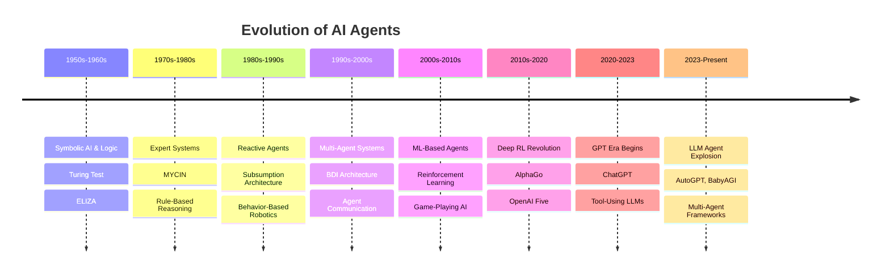
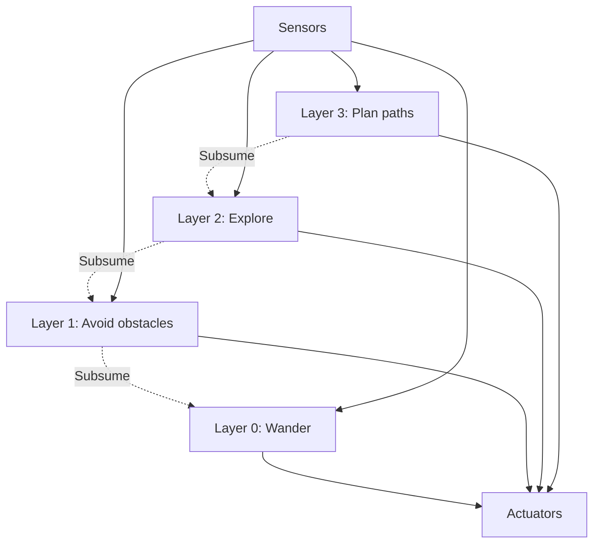
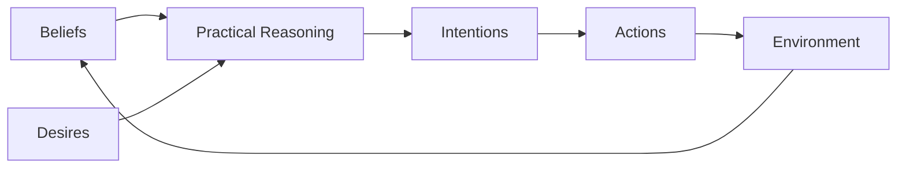
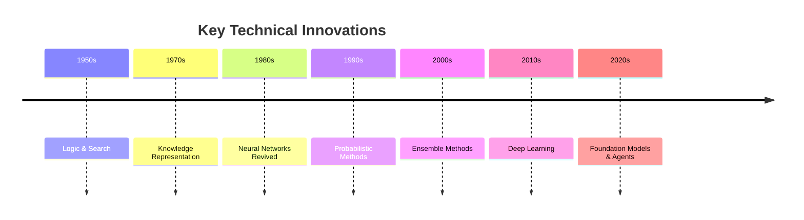
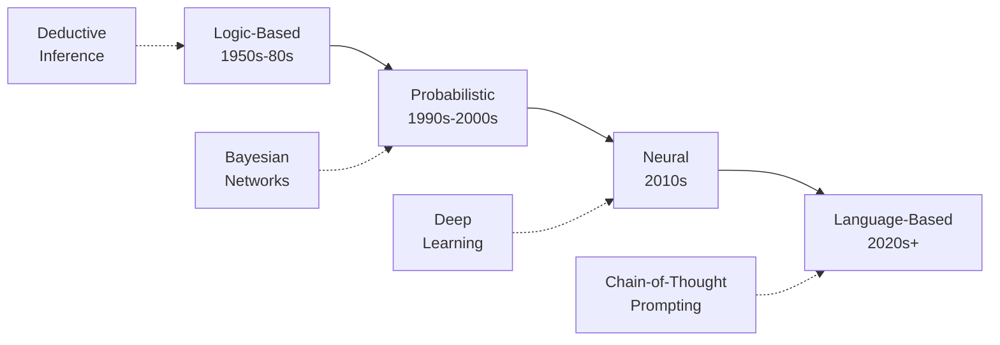
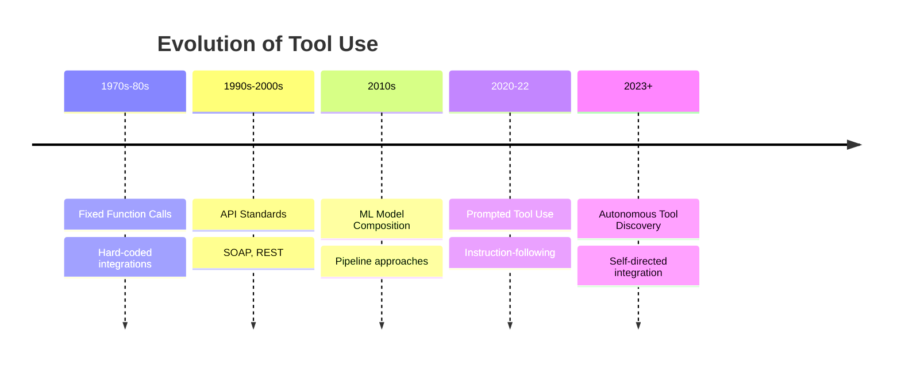

# History of AI Agents

## Table of Contents
- [Introduction](#introduction)
- [Timeline Overview](#timeline-overview)
- [Era 1: Symbolic AI and Expert Systems (1950s-1980s)](#era-1-symbolic-ai-and-expert-systems-1950s-1980s)
- [Era 2: Reactive and Behavior-Based Agents (1980s-1990s)](#era-2-reactive-and-behavior-based-agents-1980s-1990s)
- [Era 3: Multi-Agent Systems (1990s-2000s)](#era-3-multi-agent-systems-1990s-2000s)
- [Era 4: Machine Learning Agents (2000s-2010s)](#era-4-machine-learning-agents-2000s-2010s)
- [Era 5: Deep Learning Revolution (2010s-2020)](#era-5-deep-learning-revolution-2010s-2020)
- [Era 6: LLM-Powered Agents (2020-Present)](#era-6-llm-powered-agents-2020-present)
- [Key Milestones](#key-milestones)
- [Influential Research](#influential-research)
- [Evolution of Capabilities](#evolution-of-capabilities)
- [Further Reading](#further-reading)

## Introduction

The history of AI agents spans over seven decades, from early symbolic systems to modern LLM-powered autonomous agents. This evolution reflects fundamental shifts in AI paradigms, from rule-based reasoning to learning from data, and finally to leveraging large-scale language models for general-purpose task execution.

Understanding this history provides crucial context for appreciating the capabilities and limitations of current agent systems.

*For a focused look at recent developments, see [Evolution of LLM Agents](evolution-of-llm-agents.md).*

## Timeline Overview



## Era 1: Symbolic AI and Expert Systems (1950s-1980s)

### The Foundations (1950s-1960s)

#### Alan Turing's Vision (1950)
The conceptual foundation began with Turing's seminal paper "Computing Machinery and Intelligence," which posed the question: *"Can machines think?"*

**Key Contribution**: The Turing Test established a behavioral criterion for machine intelligence.

#### ELIZA (1966)
Joseph Weizenbaum's ELIZA was one of the first programs to demonstrate human-like conversation.

**Characteristics**:
- Pattern matching and substitution
- Simulated Rogerian psychotherapy
- No true understanding, but convincing interaction
- Demonstrated the ELIZA effect (anthropomorphization)

**Legacy**: Showed the power and limitations of rule-based conversational systems.

### Expert Systems Era (1970s-1980s)

#### MYCIN (1972-1980)
Developed at Stanford, MYCIN diagnosed bacterial infections and recommended antibiotics.

**Innovations**:
- Rule-based knowledge representation (600+ if-then rules)
- Uncertainty reasoning with certainty factors
- Explanation capabilities
- Performed at expert-level accuracy

```
IF: 
  (1) The infection is primary-bacteremia, AND
  (2) The site of culture is blood, AND  
  (3) The gram stain is negative
THEN:
  There is evidence (0.8) that the organism is E.coli
```

**Impact**: Demonstrated AI's potential in specialized domains.

#### DENDRAL (1965-1983)
First expert system for chemical analysis.

**Contribution**: Plan-generate-test paradigm for problem solving.

#### Limitations of Symbolic AI

❌ **Challenges**:
- **Brittleness**: Failed outside narrow domains
- **Knowledge Acquisition Bottleneck**: Encoding expert knowledge was labor-intensive
- **Combinatorial Explosion**: Too many rules became unmanageable
- **No Learning**: Couldn't improve from experience
- **Common Sense**: Struggled with obvious human knowledge

*These limitations led to the first "AI Winter" in the late 1980s.*

## Era 2: Reactive and Behavior-Based Agents (1980s-1990s)

### Subsumption Architecture (1986)

Rodney Brooks revolutionized robotics with a bottom-up approach.

**Key Insight**: Intelligence emerges from interaction with the environment, not internal symbolic reasoning.

#### Principles:
1. **Layered Control**: Multiple behavior layers running in parallel
2. **No Central Representation**: No world model needed
3. **Situatedness**: Agent embedded in real environment
4. **Embodiment**: Physical interaction matters



**Example**: Brooks' robots (Genghis, Allen) navigated complex terrain without maps.

**Impact**: Shifted focus from reasoning to reactive behavior, influencing robotics for decades.

*Modern implications in [Agent Architectures](../02-architecture/agent-architectures.md).*

### Behavior-Based Robotics

**Representative Work**:
- **Braitenberg Vehicles**: Simple rules producing complex behaviors
- **Neural Networks for Control**: Direct sensor-motor mappings
- **Evolutionary Robotics**: Evolving controllers

**Philosophy**: "Intelligence without representation" challenged classical AI assumptions.

## Era 3: Multi-Agent Systems (1990s-2000s)

### Distributed Artificial Intelligence

As networked computing grew, researchers explored systems of multiple interacting agents.

#### Key Concepts

**1. Agent Communication Languages**
- **KQML** (Knowledge Query and Manipulation Language)
- **FIPA ACL** (Foundation for Intelligent Physical Agents)

**2. Coordination Mechanisms**
- Negotiation protocols
- Auction-based allocation
- Contract nets

**3. Cooperation vs. Competition**
- Game theoretic analysis
- Coalition formation
- Mechanism design

*Detailed in [Coordination vs Competition](../05-multi-agent-systems/coordination-vs-competition.md).*

### BDI Architecture (1987-1990s)

The **Belief-Desire-Intention** model by Michael Bratman became influential.

#### Components:
- **Beliefs**: Agent's knowledge about the world
- **Desires**: Goals the agent wants to achieve  
- **Intentions**: Plans the agent commits to



**Implementations**: 
- AgentSpeak
- JACK
- Jason

**Applications**: Simulation, logistics, telecommunications.

*Foundation for modern [Planning and Reasoning](../02-architecture/planning-and-reasoning.md).*

### Swarm Intelligence (1990s)

Inspired by social insects, swarm algorithms emerged.

**Key Algorithms**:
- **Ant Colony Optimization**: Pheromone-based pathfinding
- **Particle Swarm Optimization**: Population-based search
- **Boid Models**: Flocking behavior

**Applications**: Optimization, routing, pattern formation.

*Modern applications: [Swarm Intelligence](../05-multi-agent-systems/swarm-intelligence.md).*

## Era 4: Machine Learning Agents (2000s-2010s)

### Reinforcement Learning Takes Center Stage

Agents that learn optimal policies through trial and error.

#### Q-Learning and Temporal Difference Methods

**Key Idea**: Learn value functions to estimate long-term rewards.

```
Q(s,a) ← Q(s,a) + α[r + γ max Q(s',a') - Q(s,a)]
```

**Breakthrough Applications**:
- **TD-Gammon** (1992): Mastered backgammon through self-play
- **Robotic Control**: Learning locomotion and manipulation
- **Game Playing**: Chess, Go, video games

#### Policy Gradient Methods

Direct optimization of action selection policies.

**Advances**:
- **Actor-Critic Methods**: Separate value and policy networks
- **REINFORCE**: Monte Carlo policy gradient
- **PPO** (Proximal Policy Optimization): Stable RL training

### Probabilistic Reasoning

**Bayesian Networks**: Reasoning under uncertainty
**POMDPs** (Partially Observable MDPs): Planning with incomplete information

**Applications**: Robotics, autonomous vehicles, medical diagnosis.

## Era 5: Deep Learning Revolution (2010s-2020)

### Deep Reinforcement Learning

Combining deep neural networks with RL unlocked unprecedented capabilities.

#### Landmark Achievements

**1. DQN - Atari Games (2013-2015)**

DeepMind's Deep Q-Network learned to play Atari games from pixels.

**Innovation**: Experience replay + target networks for stable training.

**Impact**: Demonstrated end-to-end learning of complex behaviors.

**2. AlphaGo (2016)**

Defeated world champion Lee Sedol in Go, a game long thought beyond AI reach.

**Techniques**:
- Monte Carlo Tree Search
- Deep neural networks for position evaluation
- Self-play training

**Significance**: Showed AI could master intuitive, strategic domains.

*Case study implications: [Foundational Papers](../08-research-papers/foundational-papers.md).*

**3. AlphaZero (2017)**

Generalized to chess, shogi, and Go through pure self-play.

**Philosophy**: Learn from scratch without human knowledge.

**4. OpenAI Five (2018)**

Mastered Dota 2, a complex team-based strategy game.

**Challenges Overcome**:
- Long time horizons (20,000+ timesteps)
- Partial observability
- Team coordination
- Massive action space

**5. AlphaStar (2019)**

Achieved Grandmaster level in StarCraft II.

### Limitations of Deep RL Agents

Despite impressive achievements, pure RL agents faced significant challenges:

❌ **Sample Inefficiency**: Required millions of training episodes
❌ **Narrow Transfer**: Skills didn't generalize to new tasks
❌ **Reward Engineering**: Needed careful reward design
❌ **Interpretability**: Opaque decision-making
❌ **Real-World Gap**: Sim-to-real transfer remained difficult

*These limitations motivated the shift to LLM-based approaches.*

## Era 6: LLM-Powered Agents (2020-Present)

### The Transformer Revolution

#### GPT Series (2018-2023)

**GPT-1 (2018)**: Demonstrated language understanding through pre-training
**GPT-2 (2019)**: Showed emergent few-shot learning
**GPT-3 (2020)**: 175B parameters, impressive in-context learning
**ChatGPT (2022)**: Conversational AI for the masses
**GPT-4 (2023)**: Multimodal, enhanced reasoning

#### Key Innovations

**1. In-Context Learning**
LLMs can learn new tasks from examples in the prompt, without parameter updates.

**2. Chain-of-Thought Reasoning**
Breaking down problems into step-by-step reasoning improves performance.

*Detailed in [Reasoning](../04-core-concepts/reasoning.md).*

**3. Tool Use / Function Calling**
LLMs can invoke external APIs and tools to extend capabilities.

*Comprehensive guide: [Tool Use](../04-core-concepts/tool-use.md).*

### The Agent Explosion (2023-Present)

#### AutoGPT (March 2023)

First widely-adopted autonomous GPT-4 agent.

**Capabilities**:
- Self-directed goal pursuit
- Internet search and file operations
- Memory management
- Iterative task execution

**Impact**: Sparked explosion of agent projects.

*Full case study: [AutoGPT](../06-case-studies/autogpt.md).*

#### BabyAGI (April 2023)

Task-driven autonomous agent by Yohei Nakajima.

**Core Loop**:
1. Pull task from queue
2. Execute with LLM
3. Enrich result and store
4. Create new tasks based on results

*Detailed analysis: [BabyAGI](../06-case-studies/babyagi.md).*

#### Agent Frameworks Emerge

**LangChain** (2022): Comprehensive framework for LLM apps
**AutoGen** (2023): Microsoft's multi-agent framework  
**CrewAI** (2023): Role-based agent collaboration
**OpenAI Swarm** (2024): Lightweight orchestration

*Compare frameworks: [Framework Comparison](../03-frameworks/comparison-table.md).*

### Current State (2024-2025)

**Advances**:
- ✅ Multimodal agents (text, images, audio)
- ✅ Long-context understanding (100K+ tokens)
- ✅ Improved tool use and code execution
- ✅ Better memory systems
- ✅ Multi-agent collaboration patterns

**Challenges**:
- ❌ Reliability and consistency
- ❌ Cost of operation
- ❌ Safety and alignment
- ❌ Evaluation and benchmarking

*Evaluation approaches: [Evaluation Methods](../08-research-papers/evaluation-methods.md).*

## Key Milestones

### Conceptual Breakthroughs

| Year | Milestone | Impact |
|------|-----------|--------|
| 1950 | Turing Test | Defined machine intelligence criteria |
| 1956 | Dartmouth Conference | Birth of AI as field |
| 1959 | Machine Learning coined | Shifted focus to learning |
| 1986 | Subsumption Architecture | Reactive, embodied intelligence |
| 1997 | Deep Blue beats Kasparov | AI mastery of chess |
| 2011 | Watson wins Jeopardy | Natural language understanding |
| 2016 | AlphaGo beats Lee Sedol | Strategic game mastery |
| 2020 | GPT-3 released | Large-scale language understanding |
| 2022 | ChatGPT launched | Conversational AI mainstream |
| 2023 | AutoGPT/BabyAGI | Autonomous LLM agents |
| 2024 | Multi-agent frameworks mature | Collaborative agent systems |

### Technical Innovations



## Influential Research

### Foundational Papers

#### Classic Works

**1. "Computing Machinery and Intelligence" (Turing, 1950)**
- Established criteria for machine intelligence
- Introduced the imitation game (Turing Test)

**2. "A Logical Calculus of Ideas Immanent in Nervous Activity" (McCulloch & Pitts, 1943)**
- Mathematical model of neurons
- Foundation for neural networks

**3. "Situated Automata" (Rosenschein & Kaelbling, 1986)**
- Bridged declarative and procedural approaches
- Influenced reactive agent design

**4. "Intention is Choice with Commitment" (Bratman, 1987)**
- Philosophical foundation for BDI architecture
- Practical reasoning in agents

#### Modern Agent Papers

**1. "ReAct: Synergizing Reasoning and Acting in Language Models" (Yao et al., 2023)**
- Interleaving reasoning traces with actions
- Foundation for modern LLM agents

**2. "Toolformer: Language Models Can Teach Themselves to Use Tools" (Schick et al., 2023)**
- Self-supervised tool learning
- LLMs deciding when and how to use tools

**3. "Generative Agents: Interactive Simulacra of Human Behavior" (Park et al., 2023)**
- Memory streams for believable agents
- Simulated human-like behavior

**4. "AutoGPT: An Autonomous GPT-4 Experiment" (Significant Labs, 2023)**
- Demonstrated autonomous goal pursuit
- Sparked agent development boom

*Comprehensive list: [Foundational Papers](../08-research-papers/foundational-papers.md).*

### Influential Researchers

**Early Pioneers**:
- Alan Turing - Theoretical foundations
- John McCarthy - AI as field, LISP
- Marvin Minsky - Frames, neural networks
- Herbert Simon - Heuristic search, problem-solving

**Agent Systems**:
- Rodney Brooks - Behavior-based robotics
- Michael Bratman - BDI architecture
- Michael Wooldridge - Formal agent theory
- Katia Sycara - Multi-agent systems

**Modern Era**:
- Demis Hassabis - DeepMind, AlphaGo/AlphaZero
- Yann LeCun - Deep learning foundations
- Geoffrey Hinton - Neural network revival
- Yoshua Bengio - Deep learning theory

**LLM Agents**:
- Yohei Nakajima - BabyAGI
- Significant Labs - AutoGPT
- Harrison Chase - LangChain
- Microsoft Research - AutoGen

## Evolution of Capabilities

### Reasoning Evolution



### Memory Systems Evolution

| Era | Memory Type | Example | Limitations |
|-----|-------------|---------|-------------|
| **1970s-80s** | Rule bases | MYCIN rules | Fixed, no learning |
| **1990s** | Episodic logs | Case-based reasoning | No generalization |
| **2000s** | Statistical models | Topic models | Limited context |
| **2010s** | Neural embeddings | Word2Vec | No explicit memory |
| **2020s** | Vector databases | RAG systems | Integration challenges |
| **Present** | Hybrid systems | Memory streams | Scaling issues |

*Modern approaches: [Memory](../04-core-concepts/memory.md).*

### Planning Capabilities

**Classical Planning (1960s-90s)**:
- STRIPS operators
- Hierarchical task networks
- Limited to symbolic domains

**Probabilistic Planning (1990s-2000s)**:
- MDPs and POMDPs
- Uncertainty handling
- Computational complexity

**Learning-Based Planning (2010s)**:
- Model-free RL (no explicit planning)
- Model-based RL (learned dynamics)
- Limited generalization

**LLM-Based Planning (2020s+)**:
- Natural language task decomposition
- Tool-augmented execution
- Better generalization, less reliability

*Deep dive: [Planning](../04-core-concepts/planning.md).*

### Tool Use Evolution



*Comprehensive guide: [Tool Use](../04-core-concepts/tool-use.md).*

## Paradigm Shifts

### From Symbolic to Sub-Symbolic

**Symbolic AI (1950s-1980s)**:
- Explicit knowledge representation
- Logic and rules
- Human-interpretable
- Brittle and narrow

**Sub-Symbolic AI (1980s-2020s)**:
- Learned representations
- Neural networks
- Difficult to interpret
- Better generalization

**Neuro-Symbolic Integration (2020s+)**:
- Combining strengths of both
- LLMs as symbolic reasoners
- Grounding in neural representations

### From Single to Multi-Agent

**Single Agent (1950s-1990s)**:
- Monolithic systems
- Centralized control
- Limited scalability

**Multi-Agent Systems (1990s-2010s)**:
- Distributed problem-solving
- Coordination challenges
- Specialized agents

**Modern Multi-Agent (2020s+)**:
- LLM-based communication
- Dynamic team formation
- Emergent collaboration

*Patterns and practices: [Multi-Agent Orchestration](../07-design-patterns/multi-agent-orchestration.md).*

### From Task-Specific to General Purpose

**Narrow AI (1950s-2010s)**:
- Expert systems for specific domains
- Game-playing specialized agents
- Limited transfer

**General-Purpose Agents (2020s+)**:
- LLM foundation enables broad capabilities
- Zero-shot and few-shot adaptation
- Cross-domain application

*Still evolving - see [Future Directions](../09-future-directions/).*

## Lessons from History

### What Worked

✅ **Learning from Data**: More effective than hand-coding knowledge
✅ **Scale**: Larger models/datasets improve capabilities
✅ **Reinforcement**: Trial-and-error learning powerful for sequential decisions
✅ **Language**: Natural language as interface and reasoning medium
✅ **Modularity**: Combining specialized components beats monolithic systems

### What Didn't Work (Initially)

❌ **Pure Symbolic AI**: Too brittle for real-world complexity
❌ **Neural Networks (1960s-80s)**: Insufficient compute and data
❌ **Expert Systems**: Knowledge acquisition bottleneck
❌ **Behavior-Based Only**: Needed higher-level reasoning
❌ **Pure Model-Free RL**: Sample inefficiency

### Recurring Patterns

**The AI Cycle**:
1. Initial excitement and bold claims
2. Practical limitations become apparent
3. "AI Winter" - reduced funding and interest
4. New approach emerges
5. Repeat

**Key Insight**: Progress is non-linear but cumulative. Ideas dismissed in one era often succeed later with better technology.

## AI Winters and Revivals

### First AI Winter (1974-1980)

**Causes**:
- Unmet expectations from symbolic AI
- Perceptron limitations (Minsky & Papert, 1969)
- Limited computational power
- Funding cuts

### Second AI Winter (1987-1993)

**Causes**:
- Expert system limitations
- LISP machine market collapse
- Failure of Fifth Generation Computer Project
- Over-hyped expectations

### AI Spring (2010s-Present)

**Enablers**:
- Massive datasets (ImageNet, web-scale text)
- GPU acceleration
- Deep learning breakthroughs
- Cloud computing

**Key Lesson**: Infrastructure and data matter as much as algorithms.

## Future Perspectives

### Ongoing Debates

**1. Symbolic vs. Sub-Symbolic**
Will we need explicit symbolic reasoning, or can neural networks handle everything?

**2. Agentic vs. Tool**
Are LLMs better as autonomous agents or as tools augmenting humans?

**3. Specialist vs. Generalist**
Should we build specialized agents or one general-purpose AGI?

**4. Centralized vs. Distributed**
Single powerful agent or swarms of smaller agents?

*Explore: [Future Directions](../09-future-directions/).*

### Historical Perspective on Current Trends

**What's Different Now**:
- ✅ Scale of data and compute unprecedented
- ✅ Emergent capabilities from pre-training
- ✅ Natural language as universal interface
- ✅ Rapid iteration and open research

**What Remains Challenging**:
- ❌ Long-term planning and consistency
- ❌ Grounding and factual accuracy
- ❌ Safety and alignment
- ❌ Efficient learning (still data-hungry)
- ❌ Common sense reasoning

*Safety considerations: [Autonomy and Alignment](../04-core-concepts/autonomy-and-alignment.md).*

## Implications for Practice

### For Developers

**Learn from History**:
1. **Start Simple**: Brooks' subsumption shows simple can work
2. **Test Extensively**: Expert systems taught us about brittleness
3. **Iterate Rapidly**: Modern agents benefit from quick feedback
4. **Expect Unexpected**: Emergent behaviors are common
5. **Build Safeguards**: Autonomy requires constraints

*Practical patterns: [Design Patterns](../07-design-patterns/).*

### For Researchers

**Open Questions**:
- How to combine symbolic reasoning with neural learning?
- What architectures enable continual learning?
- How to measure true understanding vs. pattern matching?
- Can we achieve sample-efficient learning?
- What are the fundamental limits of current approaches?

*Research directions: [Research Papers](../08-research-papers/).*

## Summary

The history of AI agents reveals a journey from rigid, rule-based systems to flexible, learning-based systems, culminating in today's LLM-powered autonomous agents.

**Key Evolutionary Steps**:
1. **Symbolic AI** → Knowledge representation, but brittle
2. **Reactive Agents** → Real-time responsiveness, but no planning
3. **Multi-Agent Systems** → Distributed intelligence, coordination challenges
4. **Learning Agents** → Adaptation through experience
5. **Deep RL** → Complex behavior learning, but narrow
6. **LLM Agents** → General-purpose capability, still maturing

**Core Insight**: Each paradigm addressed limitations of predecessors while introducing new challenges. Modern LLM agents inherit strengths from all eras:
- Symbolic reasoning (via language)
- Reactive behavior (via tool use)
- Multi-agent coordination (via frameworks)
- Learning (via fine-tuning and in-context learning)
- Deep understanding (via pre-training)

Understanding this history helps us:
- Appreciate current capabilities and limitations
- Avoid repeating past mistakes
- Anticipate future developments
- Design better agent systems

*Continue to: [Evolution of LLM Agents](evolution-of-llm-agents.md) for a focused look at the modern era.*

## Further Reading

### Within This Repository

**Context and Concepts**:
- [What are AI Agents?](what-are-ai-agents.md) - Fundamental definitions
- [Evolution of LLM Agents](evolution-of-llm-agents.md) - Deep dive into LLM era
- [Glossary](glossary.md) - Historical and modern terminology

**Technical Deep Dives**:
- [Agent Architectures](../02-architecture/agent-architectures.md) - How designs evolved
- [Core Components](../02-architecture/core-components.md) - Building blocks across eras
- [Planning and Reasoning](../02-architecture/planning-and-reasoning.md) - Evolution of thinking

**Modern Implementations**:
- [Framework Comparison](../03-frameworks/comparison-table.md) - Today's tools
- [Case Studies](../06-case-studies/) - Real-world applications
- [Real-World Applications](../05-multi-agent-systems/real-world-applications.md)

**Research Foundation**:
- [Foundational Papers](../08-research-papers/foundational-papers.md)
- [LLM as Agent Research](../08-research-papers/llm-as-agent.md)

### External Resources

**Historical**:
- Nilsson's "The Quest for Artificial Intelligence" (2009)
- Russell & Norvig's "Artificial Intelligence: A Modern Approach"
- Wooldridge's "An Introduction to MultiAgent Systems"

**Modern**:
- LLM agent papers on ArXiv
- Agent framework documentation
- AI safety research

---

**Navigation**:
- ← Previous: [What are AI Agents?](what-are-ai-agents.md)
- → Next: [Evolution of LLM Agents](evolution-of-llm-agents.md)
- ↑ Up: [Introduction](../README.md#01-introduction)