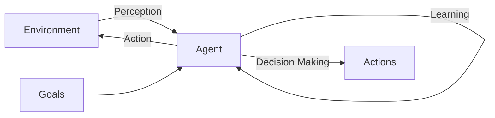
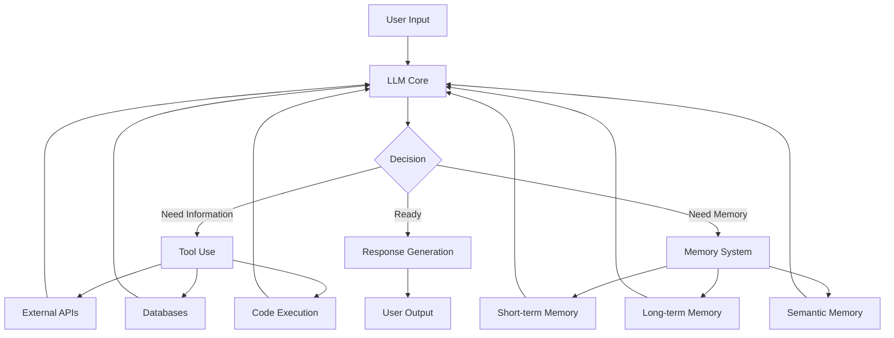
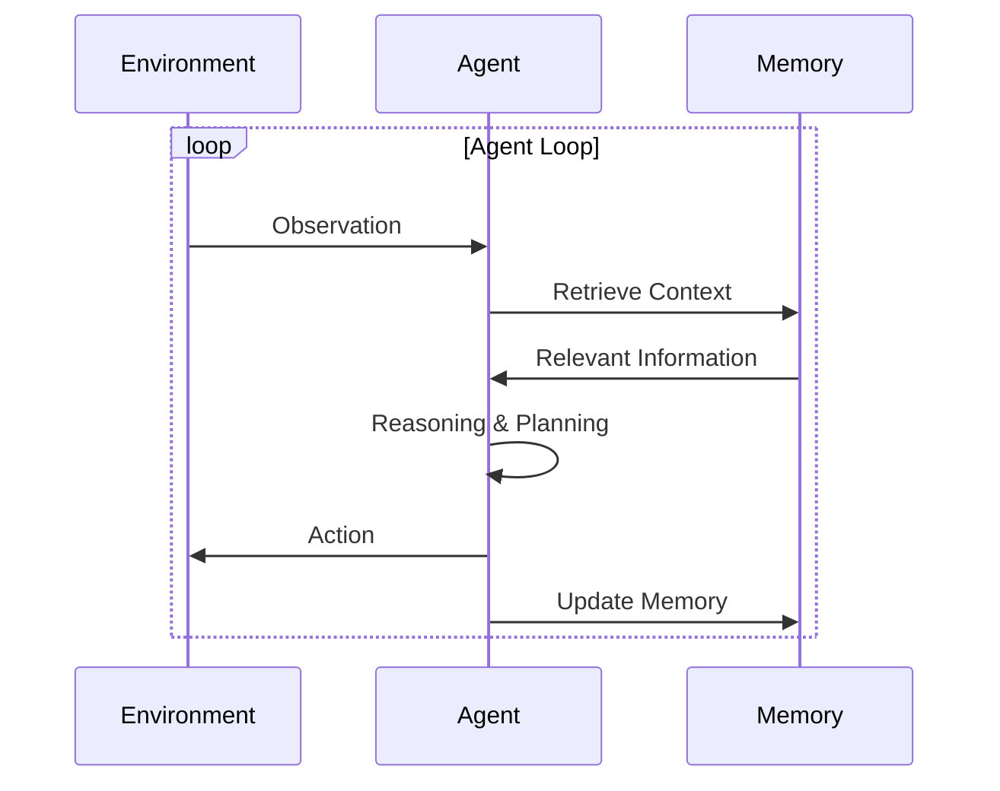

# What are AI Agents?

## Table of Contents
- [Introduction](#introduction)
- [Defining AI Agents](#defining-ai-agents)
- [Key Characteristics](#key-characteristics)
- [Agent vs Traditional Software](#agent-vs-traditional-software)
- [Types of AI Agents](#types-of-ai-agents)
- [LLM-Powered Agents](#llm-powered-agents)
- [Real-World Examples](#real-world-examples)
- [Further Reading](#further-reading)

## Introduction

An AI agent is an autonomous software entity that perceives its environment, makes decisions, and takes actions to achieve specific goals. Unlike traditional programs that follow predetermined instructions, agents can adapt their behavior based on feedback and learning.



## Defining AI Agents

### Core Definition

An **AI agent** is a system that:
1. **Perceives** its environment through sensors or data inputs
2. **Reasons** about observations to make decisions
3. **Acts** upon the environment through actuators or APIs
4. **Learns** from feedback to improve performance
5. **Operates** autonomously with minimal human intervention

### Formal Definition

From the perspective of AI research:

> "An agent is anything that can be viewed as perceiving its environment through sensors and acting upon that environment through actuators to maximize some notion of expected utility or goal satisfaction."

## Key Characteristics

### 1. Autonomy
Agents operate independently without constant human supervision.

**Example**: A customer service agent handles queries automatically, escalating only complex issues.

### 2. Reactivity
Agents respond to changes in their environment in real-time.

**Example**: A trading agent adjusts strategies based on market fluctuations.

### 3. Proactivity
Agents take initiative to achieve goals, not just react to stimuli.

**Example**: A scheduling agent proactively suggests meeting times based on calendar patterns.

### 4. Social Ability
Agents can interact with other agents and humans through communication protocols.

**Example**: Multiple research agents collaborate to produce a comprehensive report.

*See [Communication Protocols](../02-architecture/communication-protocols.md) for details on inter-agent communication.*

### 5. Learning
Agents improve their performance through experience and feedback.

**Example**: A recommendation agent learns user preferences over time.

*Learn more in [Feedback Loops](../04-core-concepts/feedback-loops.md).*

## Agent vs Traditional Software

| Aspect | Traditional Software | AI Agent |
|--------|---------------------|----------|
| **Behavior** | Deterministic | Adaptive |
| **Decision Making** | Rule-based | Inference-based |
| **Control Flow** | Sequential/Procedural | Goal-directed |
| **Adaptation** | Requires reprogramming | Self-learning |
| **Interaction** | User-driven | Autonomous |
| **Complexity Handling** | Brittle with edge cases | Generalizes to new situations |

### Example Comparison

**Traditional Software (Flight Booking)**:
```python
def book_flight(departure, destination, date):
    if validate_input(departure, destination, date):
        search_results = query_database(departure, destination, date)
        return display_results(search_results)
    else:
        return "Invalid input"
```

**AI Agent (Flight Booking)**:
```python
class TravelAgent:
    def book_flight(self, user_request):
        # Understand natural language request
        intent = self.understand_intent(user_request)
        
        # Plan multi-step approach
        plan = self.create_plan(intent)
        
        # Execute with tool use
        for step in plan:
            result = self.execute_step(step)
            if needs_clarification(result):
                self.ask_user_clarification()
        
        # Learn from interaction
        self.update_preferences(user_feedback)
        
        return optimized_booking
```

*Explore detailed architectural differences in [Agent Architectures](../02-architecture/agent-architectures.md).*

## Types of AI Agents

### 1. Simple Reflex Agents
React to current percepts using condition-action rules.

**Characteristics**:
- No memory of past events
- Fast and simple
- Limited to fully observable environments

**Example**: Thermostat adjusting temperature based on current reading.

### 2. Model-Based Reflex Agents
Maintain internal state to track aspects of the world.

**Characteristics**:
- Handle partially observable environments
- Use internal model of the world
- More robust than simple reflex agents

**Example**: Vacuum cleaning robot mapping room layout.

### 3. Goal-Based Agents
Make decisions to achieve explicit goals.

**Characteristics**:
- Consider future consequences
- Search and planning capabilities
- Flexible to goal changes

**Example**: Navigation agent finding optimal route.

*Deep dive into planning in [Planning and Reasoning](../02-architecture/planning-and-reasoning.md).*

### 4. Utility-Based Agents
Optimize for utility functions to make rational decisions.

**Characteristics**:
- Handle trade-offs between conflicting goals
- Measure quality of outcomes
- Maximize expected utility

**Example**: Investment agent balancing risk and return.

### 5. Learning Agents
Improve performance through experience.

**Characteristics**:
- Adapt to changing environments
- Discover new strategies
- Handle unknown situations

**Example**: Recommendation system learning user preferences.

*Explore learning mechanisms in [Memory](../04-core-concepts/memory.md) and [Reflection](../04-core-concepts/reflection.md).*

## LLM-Powered Agents

Large Language Models (LLMs) have revolutionized agent capabilities by providing:

### Core Capabilities

1. **Natural Language Understanding**
   - Parse complex user instructions
   - Understand context and nuance
   - Handle ambiguous requests

2. **Reasoning and Planning**
   - Break down complex tasks
   - Chain thoughts logically
   - Generate execution plans

3. **Tool Use**
   - Call external APIs and functions
   - Integrate with databases and services
   - Execute code and scripts

4. **Memory and Context**
   - Maintain conversation history
   - Reference past interactions
   - Build knowledge over time

*See [Evolution of LLM Agents](evolution-of-llm-agents.md) for the transformation LLMs brought.*

### Architecture of LLM Agents



*Detailed components in [Core Components](../02-architecture/core-components.md).*

### Popular LLM Agent Frameworks

1. **LangChain** - Comprehensive framework for LLM applications
   - *Documentation: [LangChain Guide](../03-frameworks/langchain.md)*

2. **AutoGen** - Multi-agent conversation framework
   - *Documentation: [AutoGen Guide](../03-frameworks/autogen.md)*

3. **CrewAI** - Role-based multi-agent collaboration
   - *Documentation: [CrewAI Guide](../03-frameworks/crewai.md)*

4. **LlamaIndex** - Data-centric agent framework
   - *Documentation: [LlamaIndex Guide](../03-frameworks/llamaindex.md)*

5. **OpenAI Swarm** - Lightweight agent orchestration
   - *Documentation: [OpenAI Swarm Guide](../03-frameworks/openai-swift-agents.md)*

*Compare all frameworks: [Framework Comparison](../03-frameworks/comparison-table.md)*

## Real-World Examples

### 1. Customer Support Agent
**Function**: Handle customer inquiries, troubleshoot issues, escalate when needed.

**Capabilities**:
- Understand natural language queries
- Access knowledge bases
- Query order systems
- Create support tickets
- Learn from resolution patterns

**Tools Used**: Database queries, ticketing APIs, knowledge search

### 2. Research Assistant Agent
**Function**: Gather information, synthesize findings, generate reports.

**Capabilities**:
- Web search and information retrieval
- Document analysis and summarization
- Citation management
- Report generation
- Fact verification

**Tools Used**: Search APIs, document parsers, citation databases

*Case study: [AutoGPT](../06-case-studies/autogpt.md)*

### 3. Code Development Agent
**Function**: Write, debug, and optimize code based on requirements.

**Capabilities**:
- Generate code from descriptions
- Debug and fix errors
- Optimize performance
- Write tests and documentation
- Refactor legacy code

**Tools Used**: Code execution, testing frameworks, linters

*Case study: [SmolAgents](../06-case-studies/smolagents.md)*

### 4. Multi-Agent Software Team
**Function**: Collaborative development with specialized roles.

**Agents**:
- **Product Manager**: Define requirements
- **Architect**: Design system
- **Developer**: Implement features
- **QA Engineer**: Test and validate
- **DevOps**: Deploy and monitor

**Collaboration**: Agents communicate, share context, and coordinate tasks.

*Learn about multi-agent systems: [Collaboration Patterns](../05-multi-agent-systems/collaboration-patterns.md)*

### 5. Data Analysis Agent
**Function**: Analyze datasets, generate insights, create visualizations.

**Capabilities**:
- Load and clean data
- Perform statistical analysis
- Generate visualizations
- Identify patterns and anomalies
- Write analysis reports

**Tools Used**: Pandas, NumPy, Matplotlib, SQL queries

*Pattern: [Planner-Executor Pattern](../07-design-patterns/planner-executor-pattern.md)*

## Key Concepts to Understand

### Agent Loop
The fundamental cycle of agent operation:



*Detailed in [Agent Architectures](../02-architecture/agent-architectures.md)*

### Perception-Action Cycle
How agents interact with their environment:

1. **Perceive**: Receive input from environment
2. **Process**: Interpret and understand the input
3. **Plan**: Determine best course of action
4. **Act**: Execute the chosen action
5. **Reflect**: Evaluate the outcome

*Explore reflection: [Reflection](../04-core-concepts/reflection.md)*

## Design Considerations

### When to Use AI Agents

✅ **Good Use Cases**:
- Tasks requiring adaptation to new situations
- Natural language interaction needed
- Complex decision-making with multiple factors
- Long-running autonomous operations
- Need for learning and improvement over time

❌ **Not Ideal For**:
- Simple, deterministic tasks
- Real-time critical systems (safety concerns)
- Tasks requiring 100% accuracy
- When explainability is mandatory
- High-frequency, low-latency operations

### Autonomy vs. Control Trade-off


*Critical topic: [Autonomy and Alignment](../04-core-concepts/autonomy-and-alignment.md)*

## Challenges and Limitations

### Current Challenges

1. **Reliability**: Agents can produce unpredictable or incorrect outputs
2. **Safety**: Ensuring agents don't take harmful actions
3. **Cost**: LLM API calls can be expensive
4. **Latency**: Multi-step reasoning takes time
5. **Evaluation**: Difficult to measure agent performance objectively

*Evaluation methods: [Evaluation Methods](../08-research-papers/evaluation-methods.md)*

### Mitigation Strategies

- **Guardrails**: Implement safety checks and constraints
- **Human Oversight**: Critical decisions require human approval
- **Testing**: Extensive testing in controlled environments
- **Monitoring**: Real-time monitoring of agent behavior
- **Fallbacks**: Graceful degradation when agent fails

*Design patterns: [Design Patterns](../07-design-patterns/)*

## Future of AI Agents

### Emerging Trends

1. **Multimodal Agents**: Process text, images, audio, video
2. **Embodied Agents**: Physical robots with agent capabilities
3. **Collaborative Multi-Agent Systems**: Teams of specialized agents
4. **Continuous Learning**: Agents that improve indefinitely
5. **Explainable Agents**: Better transparency and interpretability

*Explore: [Future Directions](../09-future-directions/)*

### Research Frontiers

- Long-term memory and knowledge accumulation
- Efficient reasoning with reduced computational cost
- Better tool learning and composition
- Robust safety and alignment mechanisms
- Human-agent collaboration interfaces

*Academic perspective: [Foundational Papers](../08-research-papers/foundational-papers.md)*

## Further Reading

### Within This Repository

**Fundamentals**:
- [History of AI Agents](history-of-ai-agents.md) - Evolution from symbolic AI to LLMs
- [Evolution of LLM Agents](evolution-of-llm-agents.md) - How LLMs changed the game
- [Glossary](glossary.md) - Key terms and definitions

**Architecture**:
- [Core Components](../02-architecture/core-components.md)
- [Agent Architectures](../02-architecture/agent-architectures.md)
- [Planning and Reasoning](../02-architecture/planning-and-reasoning.md)

**Implementation**:
- [Tool Use](../04-core-concepts/tool-use.md)
- [Memory](../04-core-concepts/memory.md)
- [Reasoning](../04-core-concepts/reasoning.md)

**Practical Examples**:
- [BabyAGI Case Study](../06-case-studies/babyagi.md)
- [CrewAI Case Study](../06-case-studies/crewai.md)
- [Real-World Applications](../05-multi-agent-systems/real-world-applications.md)

### External Resources

- [OpenAI Documentation](https://platform.openai.com/docs)
- [Anthropic Claude](https://docs.anthropic.com)
- [LangChain Docs](https://python.langchain.com)
- [Microsoft AutoGen](https://microsoft.github.io/autogen)

## Summary

AI agents represent a paradigm shift from traditional software to autonomous, adaptive systems. By combining:
- **Perception**: Understanding the environment
- **Reasoning**: Making intelligent decisions  
- **Action**: Executing tasks effectively
- **Learning**: Improving over time

Agents can handle complex, dynamic tasks that were previously impossible to automate. LLM-powered agents, in particular, have unlocked new possibilities through natural language understanding, reasoning, and tool use.

The journey from simple reflex agents to sophisticated multi-agent systems reflects the rapid evolution of AI capabilities. As the field advances, agents will become increasingly integral to software systems, requiring careful consideration of design, safety, and human-agent collaboration.

---

**Next Steps**:
1. Understand the [History of AI Agents](history-of-ai-agents.md)
2. Learn about [Evolution of LLM Agents](evolution-of-llm-agents.md)
3. Explore [Agent Architectures](../02-architecture/agent-architectures.md)
4. Review [Glossary](glossary.md) for key terminology

**Quick Links**:
- [Frameworks Comparison](../03-frameworks/comparison-table.md)
- [Core Concepts](../04-core-concepts/)
- [Case Studies](../06-case-studies/)
- [Design Patterns](../07-design-patterns/)