# Agent Architectures: Comprehensive Guide

## Table of Contents
1. [Introduction](#introduction)
2. [Foundational Concepts](#foundational-concepts)
3. [Classical Agent Architectures](#classical-agent-architectures)
4. [Modern LLM-Based Architectures](#modern-llm-based-architectures)
5. [Cognitive Architectures](#cognitive-architectures)
6. [Reactive vs Deliberative Paradigms](#reactive-vs-deliberative-paradigms)
7. [Hybrid Architectures](#hybrid-architectures)
8. [Memory Systems](#memory-systems)
9. [Multi-Agent Architectures](#multi-agent-architectures)
10. [Design Principles](#design-principles)
11. [Comparative Analysis](#comparative-analysis)
12. [Implementation Guidelines](#implementation-guidelines)

---

## Introduction

Agent architectures define the fundamental structure and organization that govern how an AI agent perceives its environment, processes information, makes decisions, and executes actions. This guide explores both classical and modern approaches to building intelligent agents.

### What is an Agent Architecture?

An **agent architecture** specifies:

| Aspect | Description |
|--------|-------------|
| **Information Flow** | How data moves through the system |
| **Decision-Making** | Processes for selecting actions |
| **Knowledge Representation** | How information is stored and accessed |
| **Learning Mechanisms** | How the agent improves over time |
| **Modularity** | How components interact and integrate |

### Related Documentation

- **[Core Components](core-components.md)** - Detailed component breakdown
- **[Planning and Reasoning](planning-and-reasoning.md)** - Planning algorithms
- **[Communication Protocols](communication-protocols.md)** - Inter-agent communication
- **[Diagrams](diagrams/)** - Visual representations

---

## Foundational Concepts

### The Agent Model

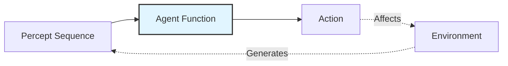

| Component | Description |
|-----------|-------------|
| **Percept** | Information received from environment |
| **Agent Function** | Maps percept sequences to actions |
| **Action** | What the agent does to affect environment |

### PEAS Framework

Every agent must consider the PEAS framework:

| Component | Description | Example (Self-Driving Car) |
|-----------|-------------|---------------------------|
| **Performance** | Success metrics | Safety, efficiency, comfort |
| **Environment** | Operating context | Roads, traffic, weather |
| **Actuators** | Action mechanisms | Steering, acceleration, brakes |
| **Sensors** | Perception mechanisms | Cameras, LIDAR, GPS |

### Agent Properties

| Property | Description | Importance |
|----------|-------------|------------|
| **Reactivity** | Responds to environmental changes | Real-time adaptation |
| **Proactivity** | Goal-directed, takes initiative | Task completion |
| **Social Ability** | Interacts with other agents/humans | Collaboration |
| **Autonomy** | Self-governance without constant control | Independence |
| **Learning** | Adaptation and improvement | Performance optimization |
| **Rationality** | Acts to achieve best expected outcome | Optimal decisions |

### Environment Classifications

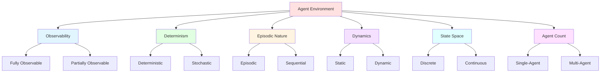

| Dimension | Types | Architecture Implications |
|-----------|-------|--------------------------|
| **Observability** | Fully Observable / Partially Observable | Need for state estimation and belief maintenance |
| **Determinism** | Deterministic / Stochastic | Uncertainty handling mechanisms required |
| **Episodic** | Episodic / Sequential | Memory and temporal reasoning needs |
| **Dynamics** | Static / Dynamic | Real-time processing requirements |
| **State Space** | Discrete / Continuous | State space representation approach |
| **Agents** | Single / Multi | Coordination and communication protocols |

---

## Classical Agent Architectures

### Architecture Evolution Timeline

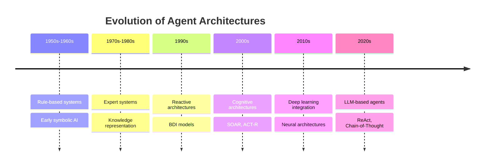

### 1. Simple Reflex Agent

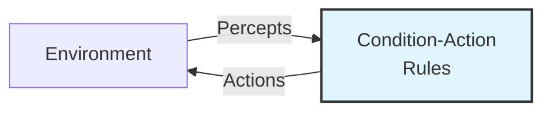

**Architecture Table:**

| Aspect | Details |
|--------|---------|
| **Internal State** | None - Memoryless |
| **Decision Process** | IF condition THEN action |
| **Response Time** | Fastest (milliseconds) |
| **Complexity** | Very Low |
| **Learning** | Not supported |
| **Environment** | Fully observable only |

**Strengths & Limitations:**

| Strengths | Limitations |
|-----------|-------------|
| ✅ Extremely fast | ❌ No memory |
| ✅ Simple implementation | ❌ Cannot handle partial observability |
| ✅ Predictable behavior | ❌ No planning capability |
| ✅ Low resource requirements | ❌ Cannot learn from experience |

**Example Use Cases:**
- Thermostat control
- Simple robotic reflexes  
- Alarm systems
- Basic IoT devices

---

### 2. Model-Based Reflex Agent

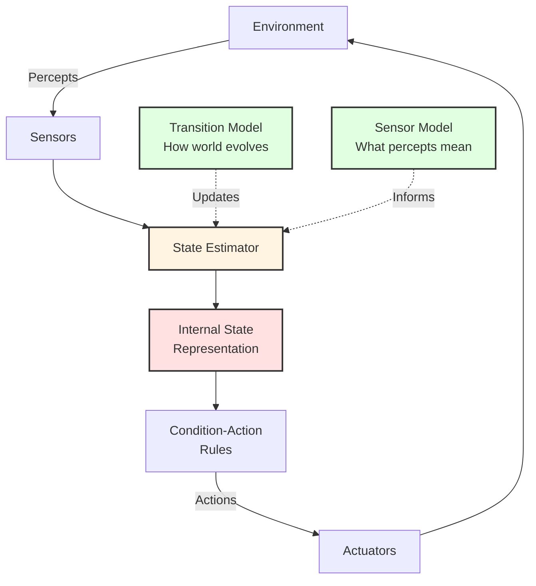

**Architecture Components:**

| Component | Purpose | Example |
|-----------|---------|---------|
| **Internal State** | Track unobserved aspects | Robot's belief about room layout |
| **Transition Model** | Predict state changes | "Moving forward changes position" |
| **Sensor Model** | Interpret percepts | "Sonar reading → distance estimate" |
| **State Estimator** | Update beliefs | Kalman filter, Particle filter |

**State Update Equation:**
```
S(t+1) = Update(S(t), Action(t), Percept(t+1))
```

**Comparison with Simple Reflex:**

| Feature | Simple Reflex | Model-Based Reflex |
|---------|---------------|-------------------|
| Memory | ❌ None | ✅ Internal state |
| Partial Observability | ❌ Cannot handle | ✅ Can handle |
| World Model | ❌ None | ✅ Transition + Sensor models |
| Planning | ❌ No | ❌ Limited |
| Complexity | Very Low | Low-Medium |

---

### 3. Goal-Based Agent

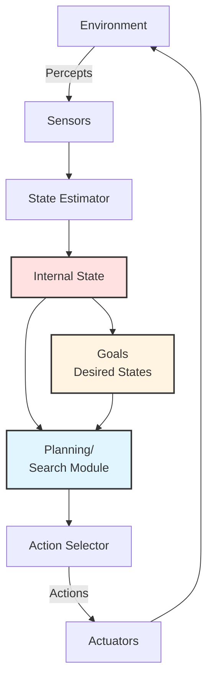

**Planning Approaches:**

| Approach | Direction | Best For |
|----------|-----------|----------|
| **Forward Planning** | Current → Goal | Known start state |
| **Backward Planning** | Goal → Current | Well-defined goal |
| **Hierarchical** | Top-down decomposition | Complex tasks |
| **Bidirectional** | Both directions | Large search spaces |

**Goal Satisfaction Function:**
```
Goal: G ⊆ S (subset of desirable states)
Agent seeks: π: S → A such that executing π leads to G
```

**Planning Process:**

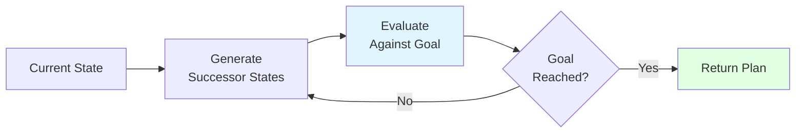

**Advantages & Challenges:**

| Advantages | Challenges |
|------------|-----------|
| ✅ Flexible behavior | ❌ Computationally expensive |
| ✅ Reasons about consequences | ❌ Goal specification difficulty |
| ✅ Complex task decomposition | ❌ Real-time constraints |
| ✅ Adaptable to novel situations | ❌ State space explosion |

---

### 4. Utility-Based Agent

```mermaid
graph TB
    A[Environment] -->|Percepts| B[State Estimator]
    B --> C[Internal State]
    C --> D[Action Generator]
    D --> E[Outcome Predictor<br/>P&#40;s'|a,e&#41;]
    E --> F[Utility Function<br/>U&#40;s'&#41;]
    F --> G[Expected Utility<br/>Calculator]
    G --> H[Action Selector<br/>Maximize EU]
    H -->|Best Action| A
    
    style F fill:#ffe1ff,stroke:#333,stroke-width:2px
    style G fill:#e1f5ff,stroke:#333,stroke-width:2px
    style H fill:#e1ffe1,stroke:#333,stroke-width:2px
```

**Expected Utility Formula:**
```
EU(a|e) = Σ P(s'|a,e) × U(s')
```

**Utility Function Properties:**

| Property | Description | Example |
|----------|-------------|---------|
| **Completeness** | Can compare all states | Prefer A over B or B over A |
| **Transitivity** | If A>B and B>C, then A>C | Consistent preferences |
| **Continuity** | No discontinuous jumps | Smooth preference curves |
| **Monotonicity** | More is better (for goods) | Higher reward preferred |

**Decision-Making Process:**

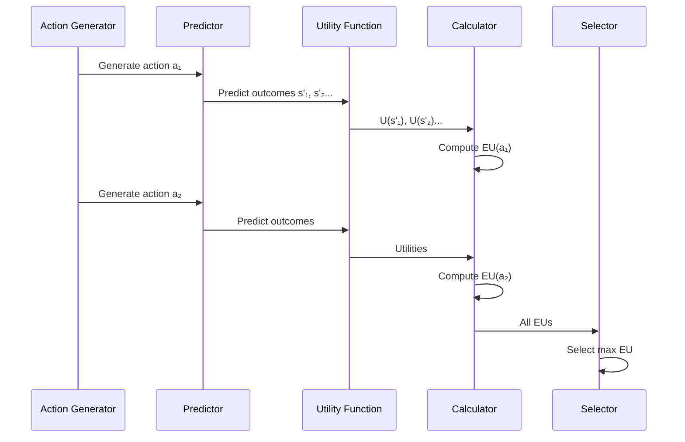

**Utility-Based vs Goal-Based:**

| Aspect | Goal-Based | Utility-Based |
|--------|------------|---------------|
| Success Metric | Binary (achieved/not) | Continuous value |
| Trade-offs | Difficult to handle | Natural handling |
| Uncertainty | Struggles | Handles well |
| Multiple Goals | Conflicts arise | Unified objective |
| Optimality | Satisficing | Maximizing |

---

### 5. Learning Agent

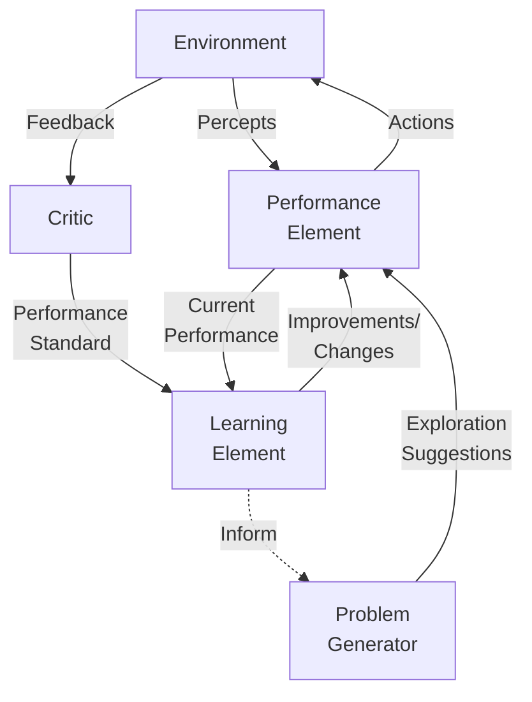

**Learning Agent Components:**

| Component | Purpose | Example |
|-----------|---------|---------|
| **Performance Element** | Selects actions | Any agent type (reflex, goal-based, etc.) |
| **Learning Element** | Improves performance | Neural network, rule learner |
| **Critic** | Provides feedback | Reward function, human feedback |
| **Problem Generator** | Suggests exploration | Curiosity module, entropy maximizer |

**Learning Paradigms:**

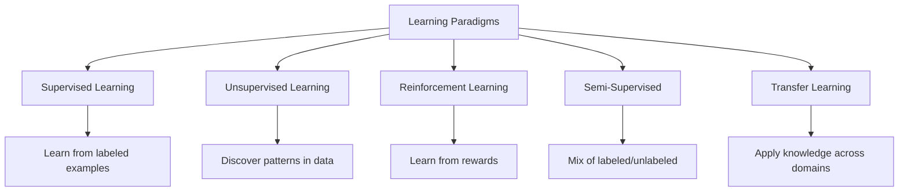

**Reinforcement Learning Framework:**

| Element | Description | Example |
|---------|-------------|---------|
| **State (s)** | Current situation | Board configuration in chess |
| **Action (a)** | Choice available | Move a piece |
| **Reward (r)** | Immediate feedback | +1 for win, -1 for loss |
| **Policy (π)** | Strategy | s → a mapping |
| **Value (V)** | Expected future reward | How good is this state? |

**Q-Learning Update:**
```
Q(s,a) ← Q(s,a) + α[r + γ max Q(s',a') - Q(s,a)]
```

**Exploration vs Exploitation:**

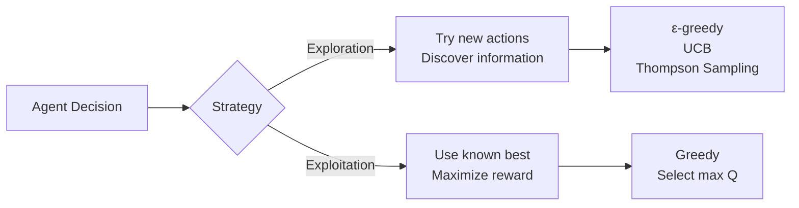

---

## Modern LLM-Based Architectures

### Architecture Overview Table

| Architecture | Core Mechanism | Best For | Complexity |
|--------------|----------------|----------|------------|
| **ReAct** | Thought-Action interleaving | Tool-using tasks | Medium |
| **Chain-of-Thought** | Step-by-step reasoning | Mathematical problems | Low-Medium |
| **Tree-of-Thoughts** | Search over reasoning paths | Complex problem-solving | High |
| **Reflexion** | Self-reflection loops | Iterative refinement | Medium-High |
| **Plan-and-Execute** | Hierarchical decomposition | Long-horizon workflows | Medium |

---

### 1. ReAct (Reasoning + Acting)

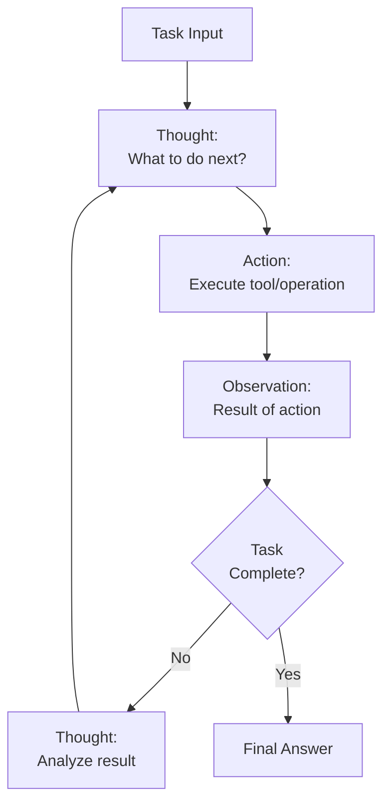

**ReAct Pattern Structure:**

| Step | Type | Description | Example |
|------|------|-------------|---------|
| 1 | Thought | Reasoning trace | "I need to find the population" |
| 2 | Action | Tool execution | `search("Paris population 2024")` |
| 3 | Observation | Result | "2.1 million in city proper" |
| 4 | Thought | Analysis | "This is the city, need metropolitan area" |
| 5 | Action | Refined search | `search("Paris metropolitan population")` |
| 6 | Observation | New result | "12.4 million" |
| 7 | Thought | Conclusion | "Now I can answer" |
| 8 | Answer | Final output | "Paris metro: 12.4M" |

**Reasoning Types:**

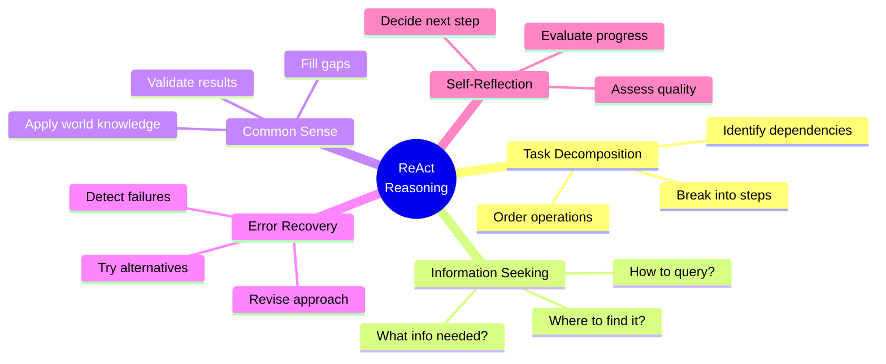

**Advantages & Limitations:**

| Advantages | Limitations |
|------------|-------------|
| ✅ Interpretable reasoning traces | ❌ Sequential only (no backtracking) |
| ✅ Flexible tool integration | ❌ Can get stuck in loops |
| ✅ Natural error recovery | ❌ Verbose (many API calls) |
| ✅ Easy to debug | ❌ Requires good tool descriptions |

---

### 2. Chain-of-Thought (CoT)

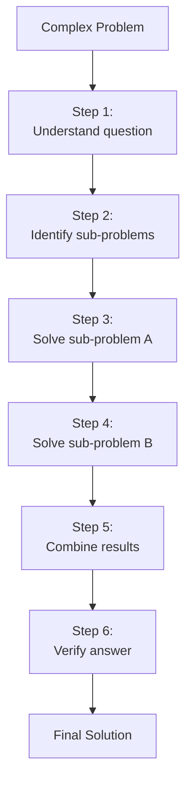

**CoT Variants Comparison:**

| Variant | Description | When to Use | Example Prompt |
|---------|-------------|-------------|----------------|
| **Zero-Shot CoT** | Generic reasoning prompt | Unknown problem types | "Let's think step by step" |
| **Few-Shot CoT** | Examples with reasoning | Specific formats needed | Show 2-3 solved examples |
| **Auto-CoT** | Automatically generate examples | Reduce manual effort | Cluster & sample diverse examples |
| **Self-Consistency CoT** | Multiple paths, vote | High accuracy needed | Generate 5 solutions, pick majority |

**Mathematical Problem Example:**

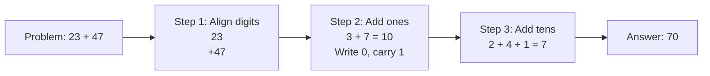

**Benefits Table:**

| Benefit | Explanation | Impact |
|---------|-------------|--------|
| **Improved Accuracy** | Catches errors in reasoning | 20-30% performance boost |
| **Better Interpretability** | See the reasoning process | Easier debugging |
| **Enhanced Generalization** | Transfer reasoning patterns | Works on novel problems |
| **Error Detection** | Identify where logic breaks | Self-correction possible |

---

### 3. Tree-of-Thoughts (ToT)

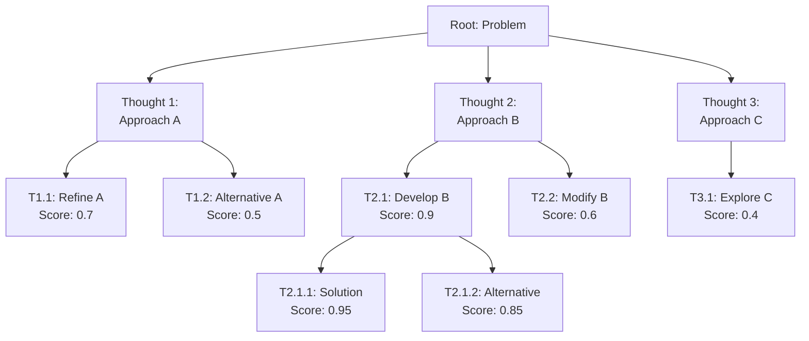

**Search Strategies:**

| Strategy | Description | Pros | Cons | Best For |
|----------|-------------|------|------|----------|
| **BFS** | Breadth-first | Complete, optimal | High memory | Small trees |
| **DFS** | Depth-first | Memory efficient | May miss optimal | Deep reasoning |
| **Best-First** | Heuristic-guided | Efficient, good solutions | Not guaranteed optimal | Time-constrained |
| **Beam Search** | Keep top-k at each level | Balanced | May prune good paths | Medium complexity |

**ToT Process Flow:**

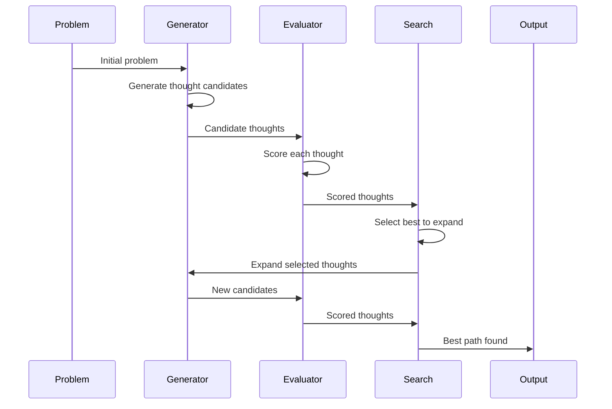

**Evaluation Methods:**

| Method | Description | Example |
|--------|-------------|---------|
| **Value** | Scalar score | Probability of success (0-1) |
| **Vote** | LLM votes good/bad | "Is this promising? Yes/No" |
| **Comparison** | Pairwise ranking | "Which thought is better: A or B?" |

---

### 4. Reflexion Architecture

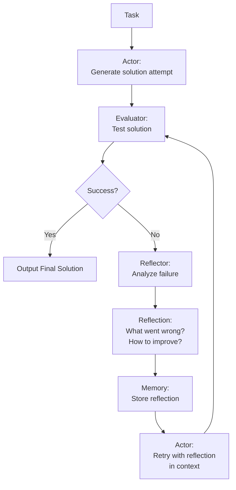

**Reflexion Memory Architecture:**

| Memory Type | Duration | Content | Example |
|-------------|----------|---------|---------|
| **Short-term** | Current episode | Task context, current attempt | "Trying to solve math problem X" |
| **Episodic** | Across attempts | Specific failure experiences | "Failed attempt 2: wrong formula" |
| **Semantic** | Long-term | General lessons learned | "Always check unit compatibility" |

**Reflection Types:**

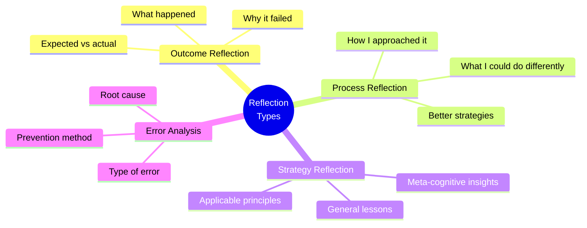

**Reflexion Loop Example:**

| Iteration | Attempt | Evaluation | Reflection | Improvement |
|-----------|---------|------------|------------|-------------|
| 1 | Solution A | ❌ Failed (syntax error) | "Forgot to validate input format" | Add validation step |
| 2 | Solution B | ❌ Failed (wrong output) | "Misunderstood requirement" | Re-read specifications |
| 3 | Solution C | ✅ Success | "Careful reading + validation works" | Store pattern |

---

### 5. Plan-and-Execute Architecture

```mermaid
graph TB
    A[Task Input] --> B[Planner LLM]
    B --> C[Detailed Plan]
    C --> D[Step 1]
    C --> E[Step 2]
    C --> F[Step 3]
    C --> G[Step N]
    
    D --> H[Executor]
    E --> H
    F --> H
    G --> H
    
    H --> I{Execution<br/>Success?}
    I -->|Yes| J[Next Step]
    I -->|No| K[Replanner]
    K --> L[Updated Plan]
    L --> H
    J --> M{All Steps<br/>Done?}
    M -->|No| H
    M -->|Yes| N[Final Output]
```

**Planning Stage Details:**

| Element | Description | Example |
|---------|-------------|---------|
| **Goal Analysis** | Break down objective | "Write research report" |
| **Task Decomposition** | Identify subtasks | [Research, Outline, Write, Edit] |
| **Dependencies** | Order requirements | Research before Writing |
| **Resource Allocation** | Assign tools/time | Use search API, allocate 2hrs |
| **Contingencies** | Backup plans | If source unavailable, use alternative |

**Execution Stage Components:**

```mermaid
graph LR
    A[Current Step] --> B[Execute Action]
    B --> C[Observe Result]
    C --> D{Matches<br/>Expected?}
    D -->|Yes| E[Continue to Next Step]
    D -->|No| F[Deviation Detected]
    F --> G{Can<br/>Recover?}
    G -->|Yes| H[Local Adjustment]
    G -->|No| I[Trigger Replan]
    H --> E
    I --> J[Return to Planner]
    
```

**Replanning Strategies:**

| Strategy | Description | When to Use | Cost |
|----------|-------------|-------------|------|
| **Full Replan** | Generate entirely new plan | Major deviation | High |
| **Local Repair** | Fix only affected steps | Minor issue | Low |
| **Continuation** | Adjust remaining steps | Partial completion | Medium |
| **Fallback** | Switch to backup plan | Predictable failure | Low |

---

## Cognitive Architectures

### Overview Comparison

| Architecture | Inspiration | Key Feature | Focus Area |
|--------------|-------------|-------------|------------|
| **SOAR** | Human problem-solving | Unified cognition | General intelligence |
| **ACT-R** | Cognitive psychology | Neural plausibility | Human behavior modeling |
| **CLARION** | Dual-process theory | Implicit + Explicit | Learning mechanisms |
| **LIDA** | Global workspace | Consciousness | Attention & awareness |

---

### 1. SOAR Architecture

```mermaid
graph TB
    A[Environment] <--> B[Perception]
    B --> C[Working Memory<br/>Current state & goals]
    C --> D[Production Memory<br/>If-then rules]
    D --> E[Decision Procedure<br/>Select operator]
    E --> F{Can Decide?}
    F -->|Yes| G[Execute Action]
    G --> H[Motor Output]
    H --> A
    F -->|No - Impasse| I[Subgoaling]
    I --> J[Chunking<br/>Learn new rule]
    J --> D
    
    K[Long-term Memory] --> D

```

**SOAR Core Principles:**

| Principle | Description | Example |
|-----------|-------------|---------|
| **Problem Space** | All deliberate behavior = search | Navigate to goal state |
| **Operators** | Actions that transform states | Move, rotate, pickup |
| **Impasse** | When can't decide/proceed | Conflicting operators |
| **Chunking** | Compile problem-solving into rules | Create new production rule |
| **Universal Subgoaling** | Resolve impasses via subgoals | Learn sub-procedure |

**Learning Mechanism - Chunking:**

```mermaid
sequenceDiagram
    participant WM as Working Memory
    participant PM as Production Memory
    participant DP as Decision Procedure
    participant C as Chunking
    
    WM->>DP: Problem situation
    DP->>DP: Impasse detected
    DP->>WM: Create subgoal
    WM->>PM: Solve subgoal (multiple steps)
    PM->>WM: Subgoal resolved
    WM->>C: Successful problem-solving trace
    C->>C: Analyze dependencies
    C->>PM: Create new production rule
    PM->>DP: New rule available
```

**SOAR Memory Types:**

| Memory | Description | Update Mechanism | Capacity |
|--------|-------------|------------------|----------|
| **Working Memory** | Current state, goals, operators | Each cycle | ~7-9 chunks |
| **Production Memory** | If-then rules | Chunking | Unlimited |
| **Semantic Memory** | Long-term facts | Reinforcement | Unlimited |
| **Episodic Memory** | Specific experiences | Automatic recording | Unlimited |

---

### 2. ACT-R Architecture

```mermaid
graph TB
    A[External World] <--> B[Visual Module]
    A <--> C[Auditory Module]
    A <--> D[Manual Module]
    A <--> E[Vocal Module]
    
    B --> F[Visual Buffer]
    C --> G[Auditory Buffer]
    F --> H[Central Production System]
    G --> H
    
    H <--> I[Goal Buffer]
    H <--> J[Retrieval Buffer]
    
    K[Declarative Memory] --> J
    L[Procedural Memory<br/>Production Rules] --> H
    
    I --> D
    J --> E
  
```

**ACT-R Modules:**

| Module | Function | Buffer | Example |
|--------|----------|--------|---------|
| **Declarative** | Long-term facts | Retrieval | "Paris is in France" |
| **Procedural** | Production rules | None (direct) | IF goal X THEN action Y |
| **Goal** | Current intentions | Goal | "Solve equation" |
| **Visual** | Visual perception | Visual | "See red square" |
| **Manual** | Motor control | Manual | "Press key" |
| **Vocal** | Speech output | Vocal | "Say 'yes'" |

**Activation Equation:**

```
Activation(i) = BaseLevel(i) + Σ Wⱼ × Strength(j,i) + Noise
```

| Component | Description | Example Value |
|-----------|-------------|---------------|
| **BaseLevel** | Frequency & recency of use | 0.5 to 5.0 |
| **Wⱼ** | Source activation | 1.0 |
| **Strength** | Association strength | -0.5 to 2.0 |
| **Noise** | Random variation | -0.25 to 0.25 |

**Production Rules Format:**

```
IF 
    Goal is to add two numbers
    First number is retrieved
    Second number is retrieved
THEN
    Compute sum
    Store result in goal
```

**ACT-R Cognitive Cycle:**

```mermaid
graph LR
    A[Perception] --> B[Match Productions<br/>~50ms]
    B --> C[Select Production<br/>~50ms]
    C --> D[Execute Action<br/>~50ms]
    D --> E[Update Buffers]
    E --> F[Retrieval from Memory<br/>~50ms]
    F --> A

```

---

### 3. CLARION Architecture

```mermaid
graph TB
    A[Environment] <--> B[Action-Centered Subsystem]
    A <--> C[Non-Action-Centered Subsystem]
    
    B --> D[Explicit Level<br/>Symbolic Rules]
    B --> E[Implicit Level<br/>Neural Networks]
    
    C --> F[Explicit Level<br/>Declarative Knowledge]
    C --> G[Implicit Level<br/>Associative Structures]
    
    D <--> E
    F <--> G
    
    E --> H[Action Output]
    D --> H
    
```

**Dual-Process Interaction:**

| Interaction Type | Direction | Mechanism | Example |
|-----------------|-----------|-----------|---------|
| **Bottom-up** | Implicit → Explicit | Rule extraction | Extract driving rules from experience |
| **Top-down** | Explicit → Implicit | Assimilation | Consciously learned facts guide intuition |
| **Integration** | Both levels | Action selection | Combine intuition + reasoning |

**CLARION Learning Stages:**

```mermaid
graph LR
    A[Stage 1:<br/>Pure Implicit] --> B[Stage 2:<br/>Mixed]
    B --> C[Stage 3:<br/>Explicit Dominance]
    C --> D[Stage 4:<br/>Proceduralized]
    
    E[Novice:<br/>Trial & error] --> F[Learning:<br/>Rule formation]
    F --> G[Competent:<br/>Rule following]
    G --> H[Expert:<br/>Automatic intuition]
    
```

**Subsystem Comparison:**

| Feature | Implicit | Explicit |
|---------|----------|----------|
| **Representation** | Distributed (neural) | Symbolic (rules) |
| **Access** | Unconscious | Conscious |
| **Learning** | Gradual, automatic | Sudden, deliberate |
| **Speed** | Fast | Slower |
| **Flexibility** | Limited | High |
| **Verbalizability** | Difficult | Easy |

---

### 4. LIDA Architecture

```mermaid
graph TB
    A[Environment] --> B[Sensory Memory<br/>Brief retention]
    B --> C[Perceptual<br/>Associative Memory<br/>Recognition]
    C --> D[Workspace<br/>Global Broadcast]
    D --> E[Attention<br/>Coalition Competition]
    E --> F[Conscious Contents]
    F --> G[Action Selection]
    G --> H[Procedural Memory<br/>Schemes]
    H --> I[Motor Output]
    I --> A
    
    D <--> J[Episodic Memory<br/>Recent events]
    D <--> K[Declarative Memory<br/>Facts]
    
    F --> L[Learning Module]
    L --> C
    L --> K
    L --> H
    
```

**LIDA Cognitive Cycle:**

| Phase | Duration | Description | Output |
|-------|----------|-------------|--------|
| **Understanding** | ~80ms | Perception & recognition | Current situation model |
| **Attention** | ~90ms | Competition for consciousness | Conscious contents |
| **Action Selection** | ~100ms | Choose behavior | Selected action |
| **Learning** | Varies | Update memories | Modified structures |

**Global Workspace Theory:**

```mermaid
graph TB
    A[Specialized Processors] --> B[Global Workspace<br/>Limited Capacity]
    B --> C[Broadcast to all<br/>Processors]
    C --> A
    
    D[Visual] --> B
    E[Auditory] --> B
    F[Memory] --> B
    G[Planning] --> B
    
    B --> D
    B --> E
    B --> F
    B --> G
    
```

**Attention Mechanisms:**

| Mechanism | Description | Example |
|-----------|-------------|---------|
| **Bottom-up** | Stimulus-driven | Sudden loud noise |
| **Top-down** | Goal-driven | Looking for keys |
| **Competition** | Parallel processing | Multiple sensory inputs compete |
| **Coalition** | Grouped features | Face recognition (eyes+nose+mouth) |

---

## Reactive vs Deliberative Paradigms

### Paradigm Comparison

```mermaid
graph TB
    A[Agent Paradigms] --> B[Reactive]
    A --> C[Deliberative]
    A --> D[Hybrid]
    
    B --> B1[Fast Response]
    B --> B2[No Planning]
    B --> B3[Behavior-based]
    
    C --> C1[Slow Response]
    C --> C2[Extensive Planning]
    C --> C3[Model-based]
    
    D --> D1[Medium Response]
    D --> D2[Adaptive Planning]
    D --> D3[Layered]

```

| Aspect | Reactive | Deliberative | Hybrid |
|--------|----------|--------------|--------|
| **Response Time** | <10ms | Seconds to minutes | 10ms - seconds |
| **World Model** | None/Minimal | Comprehensive | Partial/Layered |
| **Planning** | None | Extensive | Selective |
| **Adaptability** | Low | High | Medium-High |
| **Robustness** | High | Medium | High |
| **Complexity** | Low | High | Medium-High |
| **Resource Use** | Low | High | Medium |

---

### Reactive Architecture: Subsumption

```mermaid
graph BT
    A[Environment] <--> B[Layer 0: Avoid Objects<br/>Basic Reflexes]
    B --> C[Layer 1: Wander<br/>Random Exploration]
    C --> D[Layer 2: Explore<br/>Directed Movement]
    D --> E[Layer 3: Build Map<br/>Spatial Reasoning]
    
    E -.Subsumes.-> D
    D -.Subsumes.-> C
    C -.Subsumes.-> B
```

**Subsumption Principles:**

| Principle | Description | Example |
|-----------|-------------|---------|
| **Layering** | Behaviors organized vertically | Avoid → Wander → Explore |
| **No Representation** | No world model needed | Direct sensor-motor mapping |
| **Subsumption** | Higher layers override lower | Explore can suppress wander |
| **Parallel Execution** | All layers run simultaneously | Multiple behaviors active |
| **Incremental** | Add complexity layer by layer | Start simple, add features |

**Layer Communication:**

```mermaid
graph LR
    A[Sensors] --> B[Layer 1]
    A --> C[Layer 2]
    A --> D[Layer 3]
    
    B --> E[Actuators]
    C --> E
    D --> E
    
    D -.Suppress.-> C
    C -.Suppress.-> B
    D -.Inhibit.-> B
```

---

### Deliberative Architecture: STRIPS Planning

```mermaid
graph TB
    A[Initial State] --> B[Goal State]
    A --> C[Available Actions]
    
    C --> D[Search Algorithm]
    B --> D
    
    D --> E[Plan Generation]
    E --> F{Valid Plan?}
    F -->|No| D
    F -->|Yes| G[Execute Plan]
    
    G --> H[Monitor Execution]
    H --> I{Success?}
    I -->|No| J[Replan]
    J --> D
    I -->|Yes| K[Goal Achieved]

```

**STRIPS Representation:**

| Component | Description | Example |
|-----------|-------------|---------|
| **State** | Set of predicates | `At(Robot, RoomA), Holding(Box)` |
| **Action** | Name + parameters | `Move(from, to)` |
| **Preconditions** | Required state | `At(Robot, from)` |
| **Effects** | State changes | `At(Robot, to), ¬At(Robot, from)` |

---

## Hybrid Architectures

### 1. Three-Layer Architecture (3T)

```mermaid
graph TB
    A[Environment] <--> B[Reactive Layer<br/>Sensorimotor Control<br/>~10ms]
    
    B <--> C[Executive Layer<br/>Sequencing & Monitoring<br/>~100ms]
    
    C <--> D[Deliberative Layer<br/>Planning & Reasoning<br/>~seconds]
    
    E[Goals] --> D
    D -->|High-level plans| C
    C -->|Task sequences| B
    B -->|Status| C
    C -->|State updates| D
    
```

**Layer Responsibilities:**

| Layer | Time Scale | Functions | Example |
|-------|-----------|-----------|---------|
| **Deliberative** | Seconds-Minutes | Planning, reasoning, goal management | "Plan route to destination" |
| **Executive** | 100ms-Seconds | Task sequencing, resource allocation, monitoring | "Execute waypoint navigation" |
| **Reactive** | <10ms | Reflexive behaviors, emergency responses | "Avoid sudden obstacle" |

**Information Flow Patterns:**

```mermaid
sequenceDiagram
    participant D as Deliberative
    participant E as Executive
    participant R as Reactive
    participant Env as Environment
    
    D->>E: Generate high-level plan
    E->>E: Decompose into tasks
    E->>R: Send task commands
    R->>Env: Execute actions
    Env->>R: Sensory feedback
    R->>E: Report status
    E->>D: Progress update
    Note over E: Detects deviation
    E->>D: Request replan
    D->>E: Updated plan
```

---

### 2. BDI (Belief-Desire-Intention) Architecture

```mermaid
graph TB
    A[Environment] -->|Percepts| B[Belief Revision<br/>Update beliefs]
    B --> C[Beliefs<br/>Information state]
    C --> D[Option Generation<br/>From beliefs + desires]
    E[Desires<br/>Goals] --> D
    D --> F[Filtering<br/>Select intentions]
    F --> G[Intentions<br/>Commitments]
    G --> H[Plan Library<br/>Pre-compiled plans]
    H --> I[Action Selection]
    I -->|Actions| A
    A -->|Feedback| J[Success/Failure]
    J --> F

```

**BDI Mental Attitudes:**

| Attitude | Description | Properties | Example |
|----------|-------------|------------|---------|
| **Beliefs** | Information about world | May be false, updated by perception | "Door is closed" |
| **Desires** | States to achieve | Can be conflicting | "Be wealthy AND have free time" |
| **Intentions** | Chosen commitments | Consistent, persistent | "Go to work today" |

**BDI Reasoning Cycle:**

```mermaid
graph TB
    A[Sense] --> B[Update Beliefs]
    B --> C[Generate Options<br/>Desires + Beliefs]
    C --> D[Deliberate<br/>Select Intention]
    D --> E[Means-End Reasoning<br/>Find Plan]
    E --> F[Execute Plan Step]
    F --> G{Intention<br/>Achieved?}
    G -->|No| H{Still<br/>Possible?}
    H -->|Yes| A
    H -->|No| I[Drop Intention]
    I --> A
    G -->|Yes| J[Drop Intention]
    J --> A
    
```

**Commitment Strategies:**

| Strategy | Description | Reconsider When | Best For |
|----------|-------------|-----------------|----------|
| **Blind** | Never reconsider | Never | Static environments |
| **Single-minded** | Reconsider minimally | Achieved or impossible | Moderate dynamics |
| **Open-minded** | Frequent reconsideration | Every cycle | Highly dynamic |

**Plan Library Structure:**

```mermaid
graph TB
    A[Goal: Get Coffee] --> B[Plan 1: Vending Machine]
    A --> C[Plan 2: Coffee Shop]
    A --> D[Plan 3: Make at Home]
    
    B --> B1[Context: At office<br/>Have coins]
    B --> B2[Steps: Walk, Insert, Select]
    
    C --> C1[Context: Have money<br/>Shop nearby]
    C --> C2[Steps: Walk, Order, Pay]
    
    D --> D1[Context: At home<br/>Have beans]
    D --> D2[Steps: Grind, Brew, Pour]
```

---

## Memory Systems

### Memory Hierarchy

```mermaid
graph TB
    A[Sensory Memory<br/>~100-500ms<br/>High capacity] --> B[Working Memory<br/>~15-30s<br/>~7 items]
    B --> C[Long-term Memory<br/>Permanent<br/>Unlimited]
    
    C --> D[Episodic<br/>Personal experiences]
    C --> E[Semantic<br/>Facts & concepts]
    C --> F[Procedural<br/>Skills & procedures]
    
    B <-.Encoding.-> C
    C <-.Retrieval.-> B
    
```

**Memory Type Comparison:**

| Memory Type | Capacity | Duration | Content | Access |
|-------------|----------|----------|---------|--------|
| **Sensory** | Very large | <1 second | Raw sensory data | Automatic |
| **Working** | 7±2 chunks | 15-30 seconds | Active information | Conscious |
| **Episodic** | Unlimited | Lifetime | Personal events | Effortful recall |
| **Semantic** | Unlimited | Lifetime | General knowledge | Fast retrieval |
| **Procedural** | Unlimited | Lifetime | Motor skills | Automatic execution |

---

### Retrieval-Augmented Architecture

```mermaid
graph TB
    A[User Query] --> B[Query Encoder]
    B --> C[Embedding Vector]
    C --> D[Similarity Search]
    E[Vector Database<br/>Memory Store] --> D
    D --> F[Top-K Retrieved<br/>Documents]
    F --> G[Context Augmentation]
    A --> G
    G --> H[LLM Generator]
    H --> I[Response]

```

**Retrieval Mechanisms:**

| Method | Description | Pros | Cons |
|--------|-------------|------|------|
| **Dense Retrieval** | Embedding similarity | Semantic matching | Requires training |
| **Sparse Retrieval** | Keyword matching (BM25) | Fast, interpretable | Misses semantics |
| **Hybrid** | Combine both | Best of both | More complex |
| **Re-ranking** | Two-stage retrieval | Higher precision | Slower |

**Memory Storage Patterns:**

```mermaid
graph LR
    A[Input] --> B{Storage<br/>Strategy}
    B -->|Episodic| C[Store as-is<br/>with timestamp]
    B -->|Semantic| D[Extract facts<br/>+ concepts]
    B -->|Compressed| E[Summarize +<br/>key points]
    
    C --> F[Vector DB]
    D --> F
    E --> F

```

---

## Multi-Agent Architectures

### Coordination Patterns

```mermaid
graph TB
    A[Multi-Agent<br/>Coordination] --> B[Centralized]
    A --> C[Decentralized]
    A --> D[Hierarchical]
    
    B --> B1[Central Coordinator]
    B1 --> B2[Agent 1]
    B1 --> B3[Agent 2]
    B1 --> B4[Agent 3]
    
    C --> C1[Agent A ↔ Agent B]
    C --> C2[Agent B ↔ Agent C]
    C --> C3[Agent C ↔ Agent A]
    
    D --> D1[Manager]
    D1 --> D2[Supervisor 1]
    D1 --> D3[Supervisor 2]
    D2 --> D4[Worker A]
    D2 --> D5[Worker B]
    D3 --> D6[Worker C]

```

**Coordination Comparison:**

| Pattern | Communication | Scalability | Robustness | Optimality | Best For |
|---------|--------------|-------------|------------|------------|----------|
| **Centralized** | Hub-spoke | Low | Low | High | Small systems, optimization needed |
| **Decentralized** | Peer-to-peer | High | High | Medium | Large systems, robustness critical |
| **Hierarchical** | Tree structure | Medium | Medium | Medium-High | Organizational tasks |

---

### Multi-Agent Communication

```mermaid
sequenceDiagram
    participant A1 as Agent 1
    participant A2 as Agent 2
    participant A3 as Agent 3
    
    A1->>A2: Request(Task, Price)
    A2->>A1: Propose(Price, Time)
    A3->>A1: Propose(Price, Time)
    A1->>A1: Evaluate Proposals
    A1->>A2: Accept
    A1->>A3: Reject
    A2->>A1: Confirm
    A2->>A2: Execute Task
    A2->>A1: Inform(Complete)
    A1->>A2: Acknowledge
```

**Communication Protocols:**

| Protocol | Purpose | Message Types | Use Case |
|----------|---------|---------------|----------|
| **Contract Net** | Task allocation | Call-for-proposals, bid, award | Distributed task assignment |
| **Auction** | Resource allocation | Bid, winner announcement | Resource competition |
| **Negotiation** | Agreement | Propose, counter-propose, accept | Conflict resolution |
| **Broadcast** | Information sharing | Inform, announce | State synchronization |

---

## Design Principles

### Architectural Design Checklist

| Principle | Description | Questions to Ask |
|-----------|-------------|-----------------|
| **Modularity** | Separate concerns | Can components be developed independently? |
| **Abstraction** | Hide complexity | Are there clear interfaces? |
| **Separation** | Decouple knowledge/reasoning | Can knowledge be updated without changing logic? |
| **Graceful Degradation** | Partial functionality | Does it fail safely? |
| **Incrementality** | Build gradually | Can we add features iteratively? |
| **Scalability** | Handle growth | Does performance degrade linearly? |
| **Testability** | Enable verification | Can components be tested in isolation? |

---

### Design Decision Framework

```mermaid
graph TB
    A[Start: Requirements] --> B{Real-time<br/>Critical?}
    B -->|Yes| C{Planning<br/>Needed?}
    B -->|No| D{Complex<br/>Reasoning?}
    
    C -->|Yes| E[Hybrid:<br/>3-Layer]
    C -->|No| F[Reactive:<br/>Subsumption]
    
    D -->|Yes| G{Long<br/>Horizon?}
    D -->|No| H[Goal-based]
    
    G -->|Yes| I[Plan-Execute]
    G -->|No| J[ReAct/CoT]
    
```

---

## Comparative Analysis

### Classical Architectures

| Architecture | Complexity | Response | Learning | Best For |
|--------------|------------|----------|----------|----------|
| **Simple Reflex** | Very Low | Instant | None | Simple tasks, full observability |
| **Model-Based** | Low | Fast | Limited | Partial observability, state tracking |
| **Goal-Based** | Medium | Moderate | Yes | Multi-step problems, planning needed |
| **Utility-Based** | High | Slow | Yes | Trade-offs, uncertainty |
| **Learning** | Variable | Variable | Strong | Adaptation required |

### Modern LLM Architectures

| Architecture | Reasoning Power | Tool Use | Complexity | API Calls | Best For |
|--------------|----------------|----------|------------|-----------|----------|
| **Direct Prompting** | Low | Limited | Very Low | 1 | Simple Q&A |
| **Chain-of-Thought** | Medium | No | Low | 1 | Math, logic problems |
| **ReAct** | Medium-High | Yes | Medium | Many | Tool-using tasks |
| **Tree-of-Thoughts** | High | Limited | High | Very Many | Complex problem-solving |
| **Reflexion** | High | Yes | Medium-High | Many (iterative) | Iterative refinement |
| **Plan-Execute** | High | Yes | Medium | Moderate | Long workflows |

### Cognitive Architectures

| Architecture | Psych Validity | Completeness | Learning | Implementation | Use Case |
|--------------|----------------|--------------|----------|----------------|----------|
| **SOAR** | Medium | High | Chunking | Complex | General intelligence research |
| **ACT-R** | High | High | Multiple | Complex | Cognitive modeling |
| **CLARION** | High | Medium | Dual-process | Very Complex | Learning research |
| **LIDA** | Medium | High | Multiple | Very Complex | Consciousness research |

---

## Implementation Guidelines

### Step 1: Requirements Analysis

```mermaid
graph TB
    A[Define Requirements] --> B[Environment Analysis]
    A --> C[Task Analysis]
    A --> D[Performance Criteria]
    
    B --> B1[Observable?]
    B --> B2[Deterministic?]
    B --> B3[Dynamic?]
    
    C --> C1[Complexity]
    C --> C2[Planning horizon]
    C --> C3[Real-time needs]
    
    D --> D1[Speed vs accuracy]
    D --> D2[Resource constraints]
    D --> D3[Explainability]
    
```

### Step 2: Architecture Selection

**Selection Matrix:**

| If Requirements Include | Then Consider |
|------------------------|---------------|
| Real-time response (<10ms) | Reactive (Subsumption) |
| Partial observability + tracking | Model-based Reflex |
| Multi-step planning | Goal-based or Plan-Execute |
| Trade-offs under uncertainty | Utility-based |
| Continuous improvement | Learning Agent |
| Tool integration | ReAct |
| Complex reasoning | Tree-of-Thoughts |
| Long workflows | Plan-and-Execute |
| Multi-agent coordination | BDI + Communication protocols |

### Step 3: Component Design

**Core Components Checklist:**

| Component | Required? | Considerations |
|-----------|-----------|----------------|
| **Perception** | Always | Sensor types, preprocessing, feature extraction |
| **State Estimation** | If partial observability | Kalman filter, particle filter, belief state |
| **Memory** | Usually | Working vs long-term, retrieval mechanism |
| **Reasoning** | If deliberative | Planning algorithm, heuristics, search strategy |
| **Learning** | If adaptation needed | Supervised, RL, meta-learning |
| **Action Selection** | Always | Policy, decision rules, execution control |
| **Communication** | If multi-agent | Protocols, message format, coordination |

### Step 4: Integration Pattern

```mermaid
graph TB
    A[Perception Module] --> B[State Estimator]
    B --> C[Memory System]
    C --> D[Reasoning Engine]
    D --> E[Action Selector]
    E --> F[Execution Monitor]
    F --> G[Actuators]
    G --> H[Environment]
    H --> A
    
    I[Learning Module] -.-> C
    I -.-> D
    I -.-> E
    
```

### Step 5: Testing Strategy

| Test Level | Focus | Methods |
|------------|-------|---------|
| **Unit** | Individual components | Mock inputs, assertions |
| **Integration** | Component interactions | Interface testing |
| **System** | Complete agent | Simulation environments |
| **Performance** | Speed, accuracy | Benchmarks, metrics |
| **Robustness** | Edge cases, failures | Adversarial testing |
| **Safety** | Harmful behavior | Red-teaming, constraints |

---

## Future Directions

### Emerging Architectures

```mermaid
mindmap
    root((Future<br/>Architectures))
        Neurosymbolic
            Logic Tensor Networks
            Neural Module Networks
            Differentiable Reasoning
        Continual Learning
            Prevent forgetting
            Transfer across tasks
            Lifelong adaptation
        Meta-Learning
            Learn to learn
            Few-shot adaptation
            Algorithm learning
        Causal Reasoning
            Structural causal models
            Intervention vs observation
            Counterfactual reasoning
        Embodied Intelligence
            Sensorimotor integration
            Active perception
            Physical grounding
        Social Intelligence
            Theory of mind
            Communication emergence
            Collaborative reasoning
        Quantum-Inspired
            Superposition states
            Entanglement patterns
            Quantum probability

### Research Challenges

| Challenge | Description | Current Approaches | Open Problems |
|-----------|-------------|-------------------|---------------|
| **Symbol Grounding** | How symbols acquire meaning | Vision-language models, embodiment | True understanding vs simulation |
| **Catastrophic Forgetting** | Losing old knowledge | EWC, progressive networks, replay | Unbounded continual learning |
| **Transfer Learning** | Applying knowledge across domains | Meta-learning, pre-training | Negative transfer, similarity metrics |
| **Alignment** | Ensuring desired behavior | RLHF, constitutional AI | Value specification, scalability |
| **Explainability** | Understanding decisions | Attention, concept bottlenecks | Faithful explanations |
| **Robustness** | Handling adversarial inputs | Adversarial training, certification | Out-of-distribution generalization |
| **Scalability** | Computational efficiency | Distillation, pruning, quantization | Real-time large-scale systems |

---

## Practical Examples

### Example 1: Building a Customer Service Agent

**Requirements:**
- Handle customer inquiries
- Access knowledge base
- Escalate to humans when needed
- Learn from interactions

**Architecture Choice: ReAct + Memory**

```mermaid
graph TB
    A[Customer Query] --> B[Intent Classifier]
    B --> C{Can Handle?}
    C -->|Yes| D[ReAct Agent]
    C -->|No| E[Escalate to Human]
    
    D --> F[Thought: What info needed?]
    F --> G[Action: Search KB]
    G --> H[Observation: Retrieved docs]
    H --> I[Thought: Is this sufficient?]
    I --> J{Complete?}
    J -->|No| F
    J -->|Yes| K[Generate Response]
    
    K --> L[Memory Store]
    L --> M[Learning Module]
    M -.Update.-> D
    

```

**Components:**

| Component | Technology | Purpose |
|-----------|-----------|---------|
| **Intent Classifier** | Fine-tuned LLM | Route queries |
| **ReAct Agent** | LLM + tools | Multi-step reasoning |
| **Knowledge Base** | Vector DB | Store company info |
| **Memory** | Vector DB + structured | Store interactions |
| **Learning** | RLHF | Improve responses |

---

### Example 2: Autonomous Robot Navigation

**Requirements:**
- Real-time obstacle avoidance
- Path planning to destination
- Energy-efficient movement
- Adaptable to new environments

**Architecture Choice: Three-Layer Hybrid**

```mermaid
graph TB
    A[Deliberative Layer] --> B[Plan optimal path<br/>Consider energy]
    B --> C[Generate waypoints]
    
    C --> D[Executive Layer]
    D --> E[Sequence navigation tasks]
    E --> F[Monitor progress]
    F --> G{On track?}
    G -->|No| H[Adjust or replan]
    H --> D
    G -->|Yes| I[Continue]
    
    I --> J[Reactive Layer]
    J --> K[Obstacle avoidance]
    J --> L[Motor control]
    J --> M[Emergency stop]
    
    N[Environment] --> J
    L --> N

```

**Layer Details:**

| Layer | Frequency | Algorithms | Sensors |
|-------|-----------|-----------|---------|
| **Deliberative** | 1-10 Hz | A*, Dijkstra, RRT | Map, GPS |
| **Executive** | 10-50 Hz | Task scheduling, monitoring | Odometry, IMU |
| **Reactive** | 50-100 Hz | Potential fields, PID | LIDAR, ultrasonic |

---

### Example 3: Multi-Agent Research Team

**Requirements:**
- Collaborative research
- Different specializations
- Information sharing
- Consensus building

**Architecture Choice: BDI + Contract Net**

```mermaid
graph TB
    subgraph Manager Agent
    A[Belief: Research goal]
    B[Desire: Complete study]
    C[Intention: Coordinate team]
    end
    
    subgraph Literature Agent
    D[Belief: Paper database]
    E[Desire: Find relevant papers]
    F[Intention: Search & summarize]
    end
    
    subgraph Data Agent
    G[Belief: Dataset sources]
    H[Desire: Analyze data]
    I[Intention: Process & visualize]
    end
    
    subgraph Writing Agent
    J[Belief: Research findings]
    K[Desire: Clear paper]
    L[Intention: Draft sections]
    end
    
    C --> M[Call for proposals:<br/>Need literature review]
    M --> F
    M --> I
    M --> L
    
    F --> N[Bid: I can do it, 2 hours]
    I --> O[Bid: Not my specialty]
    L --> P[Bid: After data ready]
    
    N --> C
    C --> Q[Award to Literature Agent]
    
```

**Communication Flow:**

```mermaid
sequenceDiagram
    participant M as Manager
    participant L as Literature
    participant D as Data
    participant W as Writing
    
    M->>M: Desire: Research paper
    M->>L: CFP: Literature review
    M->>D: CFP: Data analysis
    L->>M: Propose: Review in 2h
    D->>M: Propose: Analysis in 4h
    M->>L: Accept: Literature task
    M->>D: Accept: Data task
    L->>L: Execute: Search papers
    L->>M: Inform: Review complete
    D->>D: Execute: Analyze data
    D->>M: Inform: Analysis complete
    M->>W: CFP: Write paper
    W->>M: Propose: Draft in 6h
    M->>W: Accept: Writing task
    W->>L: Request: Literature findings
    W->>D: Request: Data results
    L->>W: Inform: Summary
    D->>W: Inform: Visualizations
    W->>W: Execute: Draft paper
    W->>M: Inform: Draft complete
```

---

## Code Examples

### Simple Reflex Agent (Python)

```python
class SimpleReflexAgent:
    def __init__(self, rules):
        """
        rules: dict mapping conditions to actions
        e.g., {'temperature > 25': 'turn_on_ac', 'temperature < 18': 'turn_on_heat'}
        """
        self.rules = rules
    
    def perceive(self, environment):
        """Get current percepts from environment"""
        return environment.get_state()
    
    def evaluate_condition(self, condition, percepts):
        """Check if condition matches current percepts"""
        # Simple evaluation - in practice, use more sophisticated matching
        return eval(condition, percepts)
    
    def select_action(self, percepts):
        """Match percepts to rules and select action"""
        for condition, action in self.rules.items():
            if self.evaluate_condition(condition, percepts):
                return action
        return 'no_action'
    
    def act(self, environment):
        """Main agent loop"""
        percepts = self.perceive(environment)
        action = self.select_action(percepts)
        environment.execute(action)
        return action

# Usage
rules = {
    'temperature > 25': 'turn_on_ac',
    'temperature < 18': 'turn_on_heat',
    'temperature >= 18 and temperature <= 25': 'maintain'
}
agent = SimpleReflexAgent(rules)
```

### Model-Based Agent (Python)

```python
class ModelBasedAgent:
    def __init__(self, transition_model, sensor_model):
        self.state = {}  # Internal belief state
        self.transition_model = transition_model
        self.sensor_model = sensor_model
        self.action_history = []
    
    def update_state(self, action, percept):
        """Update internal state based on action taken and percept received"""
        # Predict state change from action
        predicted_state = self.transition_model(self.state, action)
        
        # Correct prediction with percept
        self.state = self.sensor_model(predicted_state, percept)
        
        self.action_history.append(action)
    
    def select_action(self):
        """Select action based on current belief state"""
        # Use rules based on believed state
        if self.state.get('obstacle_ahead', False):
            return 'turn_left'
        elif self.state.get('target_visible', False):
            return 'move_forward'
        else:
            return 'explore'
    
    def act(self, environment):
        percept = environment.get_percept()
        action = self.select_action()
        environment.execute(action)
        self.update_state(action, percept)
        return action
```

### ReAct Agent (Pseudocode)

```python
class ReActAgent:
    def __init__(self, llm, tools):
        self.llm = llm
        self.tools = tools
        self.history = []
    
    def run(self, task):
        max_iterations = 10
        
        for i in range(max_iterations):
            # Generate thought
            thought = self.llm.generate(
                f"Task: {task}\nHistory: {self.history}\nThought:"
            )
            self.history.append(f"Thought: {thought}")
            
            # Decide on action
            action = self.llm.generate(
                f"Based on thought '{thought}', what action should I take?\nAction:"
            )
            self.history.append(f"Action: {action}")
            
            # Execute action
            if action.startswith("Final Answer:"):
                return action.replace("Final Answer:", "").strip()
            
            observation = self.execute_tool(action)
            self.history.append(f"Observation: {observation}")
            
            # Check if task complete
            if self.is_complete(task, observation):
                final_answer = self.llm.generate(
                    f"Task: {task}\nHistory: {self.history}\nFinal Answer:"
                )
                return final_answer
        
        return "Max iterations reached without solution"
    
    def execute_tool(self, action):
        """Parse action and execute corresponding tool"""
        # Parse: "search('query')" or "calculate(2+2)"
        tool_name, args = self.parse_action(action)
        return self.tools[tool_name](*args)
    
    def is_complete(self, task, observation):
        """Check if observation satisfies task"""
        # Use LLM to judge completion
        result = self.llm.generate(
            f"Task: {task}\nObservation: {observation}\nIs task complete? (yes/no):"
        )
        return result.strip().lower() == "yes"
```

### BDI Agent (Python)

```python
class BDIAgent:
    def __init__(self, initial_beliefs, initial_desires):
        self.beliefs = initial_beliefs
        self.desires = initial_desires
        self.intentions = []
        self.plan_library = {}
    
    def perceive(self, environment):
        """Update beliefs based on perception"""
        percepts = environment.get_percepts()
        self.beliefs.update(percepts)
    
    def generate_options(self):
        """Generate possible intentions from beliefs and desires"""
        options = []
        for desire in self.desires:
            if self.is_achievable(desire):
                options.append(desire)
        return options
    
    def is_achievable(self, desire):
        """Check if desire is achievable given current beliefs"""
        # Check preconditions for plans that achieve desire
        for plan in self.plan_library.get(desire, []):
            if self.check_preconditions(plan):
                return True
        return False
    
    def deliberate(self, options):
        """Select which options become intentions"""
        # Filter based on consistency, resources, priorities
        new_intentions = []
        for option in options:
            if self.is_consistent(option, self.intentions):
                new_intentions.append(option)
        return new_intentions
    
    def is_consistent(self, option, current_intentions):
        """Check if option conflicts with current intentions"""
        # Simple version - check for resource conflicts
        return True  # Implement actual consistency check
    
    def means_end_reasoning(self, intention):
        """Find plan to achieve intention"""
        applicable_plans = []
        for plan in self.plan_library.get(intention, []):
            if self.check_context(plan):
                applicable_plans.append(plan)
        
        if applicable_plans:
            return applicable_plans[0]  # Select best plan
        return None
    
    def check_context(self, plan):
        """Check if plan's context conditions are satisfied"""
        for condition in plan.context:
            if not self.beliefs.get(condition, False):
                return False
        return True
    
    def execute_step(self, plan):
        """Execute next step of plan"""
        if plan.steps:
            action = plan.steps.pop(0)
            return action
        return None
    
    def run_cycle(self, environment):
        """Main BDI reasoning cycle"""
        # 1. Update beliefs
        self.perceive(environment)
        
        # 2. Generate options
        options = self.generate_options()
        
        # 3. Deliberate - select intentions
        new_intentions = self.deliberate(options)
        self.intentions.extend(new_intentions)
        
        # 4. Means-end reasoning
        for intention in self.intentions:
            plan = self.means_end_reasoning(intention)
            
            if plan:
                # 5. Execute
                action = self.execute_step(plan)
                if action:
                    environment.execute(action)
                
                # Check if intention achieved
                if self.is_achieved(intention):
                    self.intentions.remove(intention)
                    if intention in self.desires:
                        self.desires.remove(intention)
    
    def is_achieved(self, intention):
        """Check if intention has been achieved"""
        return self.beliefs.get(f"{intention}_achieved", False)
```

---

## Best Practices

### Architecture Selection Guidelines

```mermaid
graph TB
    A[Start] --> B{Environment<br/>Fully Observable?}
    B -->|No| C[Need Model-Based]
    B -->|Yes| D{Real-time<br/>Critical?}
    
    C --> E{Planning<br/>Required?}
    E -->|Yes| F[Model-Based + Planning]
    E -->|No| G[Model-Based Reflex]
    
    D -->|Yes| H{Complexity?}
    H -->|Low| I[Simple Reflex]
    H -->|Medium-High| J[Hybrid 3-Layer]
    
    D -->|No| K{Multiple<br/>Goals?}
    K -->|Yes| L{Conflicting<br/>Goals?}
    L -->|Yes| M[Utility-Based]
    L -->|No| N[Goal-Based]
    K -->|No| N
    
```

### Common Pitfalls & Solutions

| Pitfall | Description | Solution |
|---------|-------------|----------|
| **Over-engineering** | Too complex for task | Start simple, add complexity as needed |
| **No fallback** | Single point of failure | Implement graceful degradation |
| **Tight coupling** | Components interdependent | Use clear interfaces, loose coupling |
| **No monitoring** | Can't debug in production | Add logging, metrics, alerts |
| **Ignoring edge cases** | Fails on unusual inputs | Comprehensive testing, error handling |
| **State explosion** | Too many states to manage | Use abstraction, hierarchical states |
| **No learning** | Static behavior | Add feedback loops, adaptation |
| **Poor modularity** | Hard to maintain | Separate concerns, single responsibility |

### Performance Optimization

| Technique | Description | When to Use |
|-----------|-------------|-------------|
| **Caching** | Store computed results | Repeated computations |
| **Lazy Evaluation** | Compute only when needed | Expensive operations |
| **Parallelization** | Execute simultaneously | Independent operations |
| **Approximation** | Trade accuracy for speed | Real-time constraints |
| **Pruning** | Eliminate unpromising paths | Large search spaces |
| **Hierarchical** | Solve at multiple levels | Complex problems |
| **Anytime Algorithms** | Improve with more time | Variable time budgets |

---

## Evaluation Metrics

### Performance Metrics

| Metric | Description | Formula | Ideal Value |
|--------|-------------|---------|-------------|
| **Task Success Rate** | % of tasks completed | Successes / Total | 100% |
| **Response Time** | Time to act | t_action - t_percept | Minimize |
| **Accuracy** | Correctness of actions | Correct / Total | 100% |
| **Efficiency** | Resource usage | Output / Resources | Maximize |
| **Robustness** | Performance under noise | Success rate with perturbations | High |
| **Adaptability** | Improvement over time | Performance(t+1) - Performance(t) | Positive |

### Architecture-Specific Metrics

```mermaid
graph LR
    A[Architecture Type] --> B[Reactive]
    A --> C[Deliberative]
    A --> D[Hybrid]
    A --> E[LLM-based]
    
    B --> B1[Response latency<br/>Robustness]
    C --> C1[Plan quality<br/>Planning time]
    D --> D1[Layer coordination<br/>Overall efficiency]
    E --> E1[Token usage<br/>Reasoning quality]
```

---

## Summary Tables

### Quick Reference: Architecture Selection

| Task Type | Recommended Architecture | Rationale |
|-----------|-------------------------|-----------|
| **Thermostat, Basic Control** | Simple Reflex | Fast, no memory needed |
| **Robot Navigation** | Model-Based + Reactive | State tracking + fast response |
| **Route Planning** | Goal-Based | Multi-step planning |
| **Investment Decisions** | Utility-Based | Trade-offs under uncertainty |
| **Game Playing** | Utility-Based + Learning | Optimize strategy, adapt |
| **Question Answering** | ReAct | Tool use, multi-step |
| **Math Problems** | Chain-of-Thought | Step-by-step reasoning |
| **Complex Puzzles** | Tree-of-Thoughts | Search-based exploration |
| **Code Generation** | Reflexion | Iterative refinement |
| **Research Assistant** | Plan-and-Execute | Long workflows |
| **Multi-Robot Coordination** | BDI + Communication | Distributed decision-making |

### Technology Stack Recommendations

| Component | Classical Approach | Modern LLM Approach |
|-----------|-------------------|---------------------|
| **Perception** | OpenCV, sensor libraries | Vision-language models |
| **State Representation** | Probabilistic models (Kalman) | LLM context window |
| **Planning** | PDDL, STRIPS planners | LLM-based planning |
| **Memory** | Databases, hash maps | Vector databases (Pinecone, Weaviate) |
| **Learning** | RL libraries (Stable-Baselines3) | Fine-tuning, RLHF |
| **Communication** | FIPA-ACL, ROS | Natural language, APIs |
| **Execution** | ROS, robot frameworks | LangChain, function calling |

---

## Glossary

| Term | Definition |
|------|------------|
| **Agent** | Autonomous entity that perceives and acts in an environment |
| **Percept** | Information received from environment through sensors |
| **Action** | Operation performed by agent to affect environment |
| **State** | Configuration of the environment or agent |
| **Belief** | Agent's information about the world (may be uncertain) |
| **Desire** | States the agent wants to achieve |
| **Intention** | Committed plans the agent will pursue |
| **Policy** | Mapping from states to actions |
| **Utility** | Numerical measure of desirability of a state |
| **Rationality** | Acting to maximize expected utility |
| **Reactivity** | Responding promptly to environmental changes |
| **Proactivity** | Taking initiative toward goals |
| **Deliberation** | Reasoning about future actions |
| **Subsumption** | Higher-level behaviors override lower-level ones |
| **Chunking** | Compiling sequences of actions into single rules |
| **Impasse** | Situation where agent cannot decide on action |
| **Working Memory** | Short-term, limited capacity memory |
| **Episodic Memory** | Memory of specific past experiences |
| **Semantic Memory** | General knowledge and facts |
| **Procedural Memory** | Skills and procedures |

---

## References

### Foundational Papers

1. **Russell, S., & Norvig, P.** (2020). *Artificial Intelligence: A Modern Approach* (4th ed.)
2. **Brooks, R. A.** (1991). "Intelligence without representation." *Artificial Intelligence*
3. **Newell, A.** (1990). *Unified Theories of Cognition*
4. **Wooldridge, M.** (2009). *An Introduction to MultiAgent Systems*

### LLM-Based Agents

5. **Yao, S., et al.** (2022). "ReAct: Synergizing Reasoning and Acting in Language Models"
6. **Wei, J., et al.** (2022). "Chain-of-Thought Prompting Elicits Reasoning in Large Language Models"
7. **Yao, S., et al.** (2023). "Tree of Thoughts: Deliberate Problem Solving with Large Language Models"
8. **Shinn, N., et al.** (2023). "Reflexion: Language Agents with Verbal Reinforcement Learning"

### Cognitive Architectures

9. **Laird, J. E.** (2012). *The Soar Cognitive Architecture*
10. **Anderson, J. R.** (2007). *How Can the Human Mind Occur in the Physical Universe?*
11. **Sun, R.** (2016). *Anatomy of the Mind* (CLARION)
12. **Franklin, S., & Graesser, A.** (1997). "Is it an Agent, or just a Program?"

---

## Appendix: Notation

### Mathematical Notation

| Symbol | Meaning |
|--------|---------|
| S | State space |
| A | Action space |
| P | Percept space |
| π | Policy (strategy) |
| s, s' | States |
| a | Action |
| p | Percept |
| r | Reward |
| γ | Discount factor |
| α | Learning rate |
| Q(s,a) | Action-value function |
| V(s) | State-value function |
| U(s) | Utility of state |
| P(s'|s,a) | Transition probability |
| B, D, I | Beliefs, Desires, Intentions (BDI) |

### Abbreviations

| Abbr. | Full Term |
|-------|-----------|
| **AI** | Artificial Intelligence |
| **RL** | Reinforcement Learning |
| **LLM** | Large Language Model |
| **BDI** | Belief-Desire-Intention |
| **SOAR** | State, Operator, And Result |
| **ACT-R** | Adaptive Control of Thought-Rational |
| **CoT** | Chain-of-Thought |
| **ToT** | Tree-of-Thoughts |
| **PDDL** | Planning Domain Definition Language |
| **MAS** | Multi-Agent System |
| **FSM** | Finite State Machine |
| **POMDP** | Partially Observable Markov Decision Process |
| **HTN** | Hierarchical Task Network |

---

## Document Information

- **Version**: 1.0
- **Last Updated**: 2024
- **Maintained by**: AI Agents Documentation Project
- **License**: MIT
- **Repository**: [AI Agents Comprehensive Guide](https://github.com/yourusername/ai_agents)

---

## Contributing

Contributions welcome! Please:
1. Fork the repository
2. Create a feature branch
3. Make your changes
4. Submit a pull request

For major changes, please open an issue first to discuss proposed modifications.

---

## Navigation

- **← Previous**: [Introduction](../01-introduction/)
- **↑ Parent**: [Architecture Overview](./README.md)
- **→ Next**: [Core Components](./core-components.md)

**Related Topics**:
- [Planning and Reasoning](./planning-and-reasoning.md)
- [Communication Protocols](./communication-protocols.md)
- [Multi-Agent Systems](../05-multi-agent-systems/)
- [Design Patterns](../07-design-patterns/)

---

*This comprehensive guide covers classical to cutting-edge agent architectures. For hands-on tutorials and code examples, see the [Implementation Guide](../implementation/).*