# Communication Protocols for AI Agents

## Table of Contents
1. [Introduction](#introduction)
2. [Fundamentals of Agent Communication](#fundamentals-of-agent-communication)
3. [Communication Models](#communication-models)
4. [Standard Protocols](#standard-protocols)
5. [Message Formats](#message-formats)
6. [Conversation Patterns](#conversation-patterns)
7. [Coordination Protocols](#coordination-protocols)
8. [Negotiation Protocols](#negotiation-protocols)
9. [Modern API-Based Communication](#modern-api-based-communication)
10. [Security and Privacy](#security-and-privacy)
11. [Performance Optimization](#performance-optimization)
12. [Implementation Examples](#implementation-examples)

---

## Introduction

Communication protocols are essential for multi-agent systems, enabling agents to exchange information, coordinate actions, negotiate resources, and collaborate on complex tasks. This document provides a comprehensive guide to agent communication protocols, from classical standards to modern approaches.

### Why Communication Protocols Matter

| Aspect | Importance | Impact |
|--------|------------|--------|
| **Interoperability** | Agents from different developers can work together | Ecosystem growth |
| **Coordination** | Synchronize actions across agents | Task efficiency |
| **Knowledge Sharing** | Distribute information effectively | System intelligence |
| **Scalability** | Support large numbers of agents | System growth |
| **Reliability** | Ensure message delivery and understanding | System robustness |

### Related Documentation

- **[Agent Architectures](agent-architectures.md)** - How protocols fit into agent design
- **[Multi-Agent Systems](../05-multi-agent-systems/)** - Coordination patterns
- **[Core Components](core-components.md)** - Communication modules

---

## Fundamentals of Agent Communication

### Communication Stack

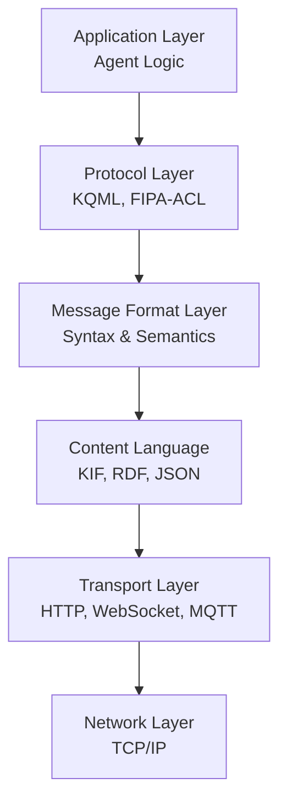
```mermaid
graph TB
    A[Application Layer<br/>Agent Logic] --> B[Protocol Layer<br/>KQML, FIPA-ACL]
    B --> C[Message Format Layer<br/>Syntax & Semantics]
    C --> D[Content Language<br/>KIF, RDF, JSON]
    D --> E[Transport Layer<br/>HTTP, WebSocket, MQTT]
    E --> F[Network Layer<br/>TCP/IP]
    

```

### Communication Components

| Component | Purpose | Examples |
|-----------|---------|----------|
| **Sender** | Initiates communication | Agent requesting information |
| **Receiver** | Receives and processes messages | Agent responding to request |
| **Message** | Information being exchanged | Query, command, inform |
| **Channel** | Medium of transmission | HTTP, WebSocket, Message Queue |
| **Protocol** | Rules governing exchange | FIPA-ACL, REST API |
| **Ontology** | Shared vocabulary | Domain-specific terms |
| **Content Language** | Message content format | JSON, XML, KIF |

### Communication Types

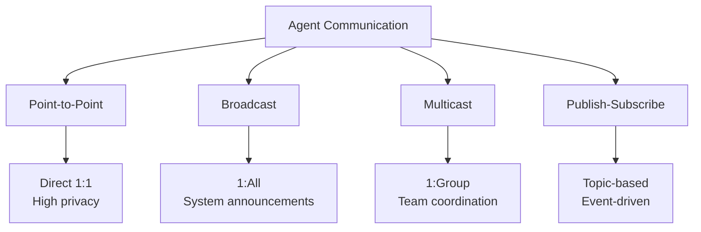
```mermaid
graph TB
    A[Agent Communication] --> B[Point-to-Point]
    A --> C[Broadcast]
    A --> D[Multicast]
    A --> E[Publish-Subscribe]
    
    B --> B1[Direct 1:1<br/>High privacy]
    C --> C1[1:All<br/>System announcements]
    D --> D1[1:Group<br/>Team coordination]
    E --> E1[Topic-based<br/>Event-driven]
    

```

---

## Communication Models

### 1. Speech Act Theory

Based on the philosophy of language, viewing communication as performing actions through speech.

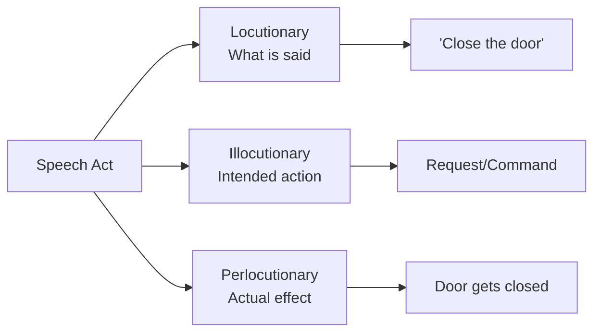
```mermaid
graph LR
    A[Speech Act] --> B[Locutionary<br/>What is said]
    A --> C[Illocutionary<br/>Intended action]
    A --> D[Perlocutionary<br/>Actual effect]
    
    B --> B1["'Close the door'"]
    C --> C1[Request/Command]
    D --> D1[Door gets closed]
    

```

**Illocutionary Acts:**

| Act Type | Purpose | Example |
|----------|---------|---------|
| **Assertives** | Commit to truth | inform, report, notify |
| **Directives** | Get receiver to do something | request, query, command |
| **Commissives** | Commit to action | promise, offer, agree |
| **Expressives** | Express psychological state | apologize, thank, congratulate |
| **Declarations** | Change state by declaration | declare, resign, appoint |

### 2. Synchronous vs Asynchronous

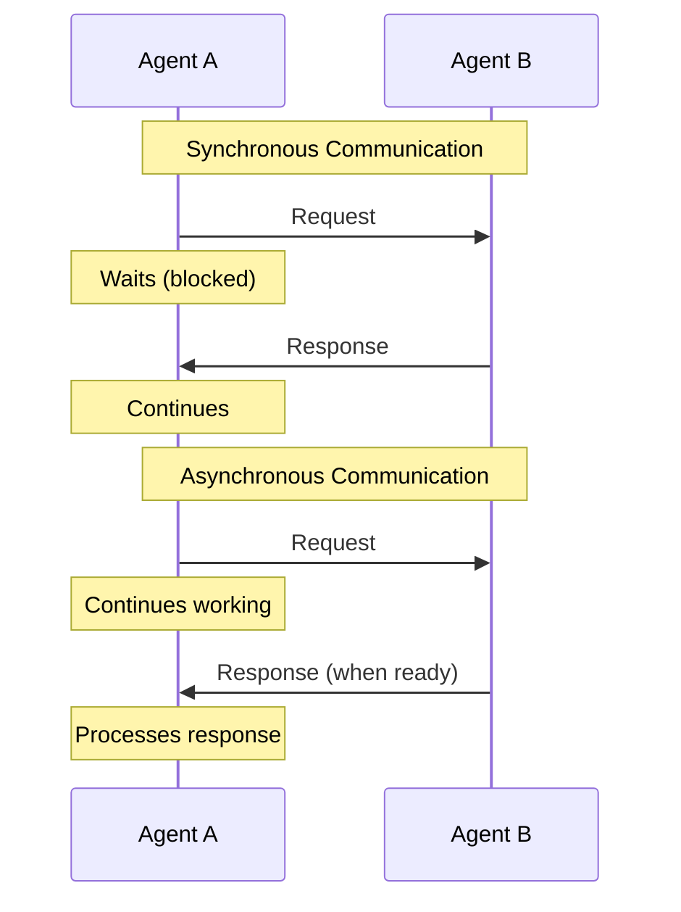
```mermaid
sequenceDiagram
    participant A as Agent A
    participant B as Agent B
    
    Note over A,B: Synchronous Communication
    A->>B: Request
    Note over A: Waits (blocked)
    B->>A: Response
    Note over A: Continues
    
    Note over A,B: Asynchronous Communication
    A->>B: Request
    Note over A: Continues working
    B->>A: Response (when ready)
    Note over A: Processes response
```

**Comparison:**

| Aspect | Synchronous | Asynchronous |
|--------|-------------|--------------|
| **Blocking** | Sender waits | Sender continues |
| **Coupling** | Tight | Loose |
| **Complexity** | Lower | Higher |
| **Scalability** | Limited | Better |
| **Response Time** | Immediate | Variable |
| **Best For** | Simple queries | Long operations |

### 3. Direct vs Mediated Communication

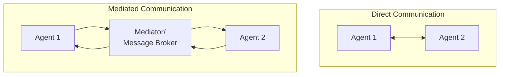
```mermaid
graph TB
    subgraph Direct Communication
    A1[Agent 1] <--> A2[Agent 2]
    end
    
    subgraph Mediated Communication
    B1[Agent 1] --> M[Mediator/<br/>Message Broker]
    M --> B2[Agent 2]
    B2 --> M
    M --> B1
    end
```

**Comparison:**

| Feature | Direct | Mediated |
|---------|--------|----------|
| **Latency** | Lower | Higher |
| **Scalability** | Poor | Excellent |
| **Decoupling** | Low | High |
| **Reliability** | Depends on agents | Can add guarantees |
| **Monitoring** | Difficult | Easy (centralized) |
| **Fault Tolerance** | Low | High |

---

## Standard Protocols

### 1. KQML (Knowledge Query and Manipulation Language)

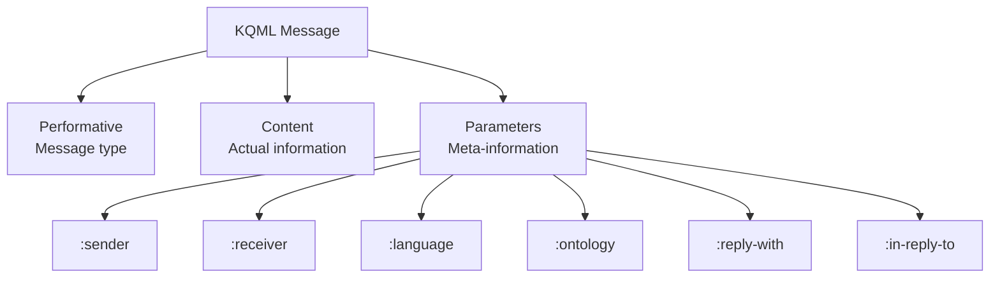
```mermaid
graph TB
    A[KQML Message] --> B[Performative<br/>Message type]
    A --> C[Content<br/>Actual information]
    A --> D[Parameters<br/>Meta-information]
    
    D --> D1[:sender]
    D --> D2[:receiver]
    D --> D3[:language]
    D --> D4[:ontology]
    D --> D5[:reply-with]
    D --> D6[:in-reply-to]

```

**KQML Performatives:**

| Category | Performatives | Purpose |
|----------|--------------|---------|
| **Basic** | tell, achieve, ask-if, ask-one, ask-all | Core information exchange |
| **Multi-response** | stream-in, stream-out, stream-all | Streaming data |
| **Generator** | generator, standby | Continuous queries |
| **Capability** | advertise, subscribe, monitor | Service discovery |
| **Networking** | register, unregister, broker | Agent registration |
| **Facilitation** | recommend, recruit | Finding agents |

**Example Message:**

```lisp
(tell
  :sender agent1
  :receiver agent2
  :language KIF
  :ontology traffic-domain
  :content (traffic-jam location-A heavy)
  :reply-with msg001
)
```

### 2. FIPA-ACL (Foundation for Intelligent Physical Agents - Agent Communication Language)

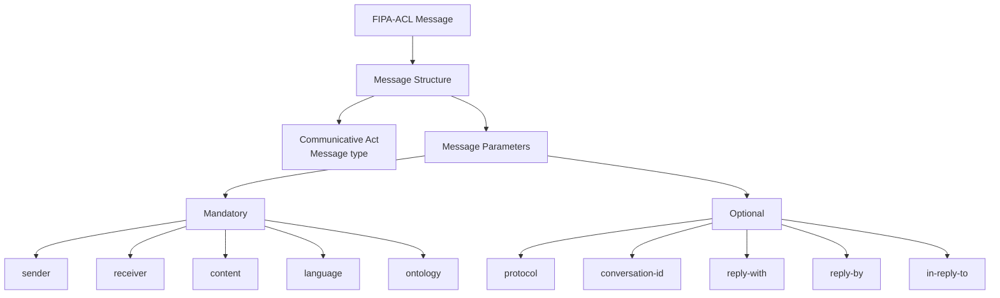
```mermaid
graph TB
    A[FIPA-ACL Message] --> B[Message Structure]
    B --> C[Communicative Act<br/>Message type]
    B --> D[Message Parameters]
    
    D --> D1[Mandatory]
    D --> D2[Optional]
    
    D1 --> E1[sender]
    D1 --> E2[receiver]
    D1 --> E3[content]
    D1 --> E4[language]
    D1 --> E5[ontology]
    
    D2 --> F1[protocol]
    D2 --> F2[conversation-id]
    D2 --> F3[reply-with]
    D2 --> F4[reply-by]
    D2 --> F5[in-reply-to]
```

**FIPA Communicative Acts:**

| Category | Acts | Meaning |
|----------|------|---------|
| **Information** | inform, confirm, disconfirm | Share beliefs |
| **Request** | request, query-if, query-ref | Ask for actions/information |
| **Negotiation** | cfp, propose, accept-proposal, reject-proposal | Resource allocation |
| **Agreement** | agree, refuse, cancel | Commitment management |
| **Performance** | inform-done, inform-result, failure | Action outcomes |
| **Error Handling** | not-understood | Communication problems |

**FIPA Message Format:**

```
(REQUEST
  :sender (agent-identifier :name agent1@platform)
  :receiver (agent-identifier :name agent2@platform)
  :content "((action (agent-identifier :name agent2) 
              (deliver box1 location-B)))"
  :language fipa-sl
  :ontology logistics-ontology
  :protocol fipa-request
  :conversation-id conv-01
  :reply-with req-01
)
```

### 3. Comparison: KQML vs FIPA-ACL

| Aspect | KQML | FIPA-ACL |
|--------|------|----------|
| **Standardization** | Less formal | Official standard |
| **Performatives** | ~40 performatives | ~20 communicative acts |
| **Semantics** | Informal | Formal (modal logic) |
| **Adoption** | Academic | Industry + Academic |
| **Complexity** | More complex | Simpler, cleaner |
| **Nested Content** | Supported | Limited |
| **Best For** | Research systems | Production systems |

---

## Message Formats

### Message Structure Components

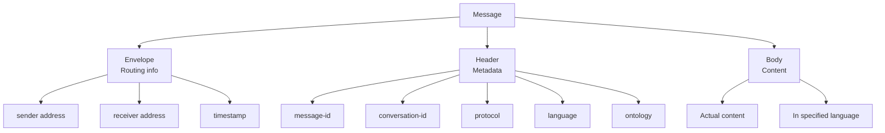
```mermaid
graph TB
    A[Message] --> B[Envelope<br/>Routing info]
    A --> C[Header<br/>Metadata]
    A --> D[Body<br/>Content]
    
    B --> B1[sender address]
    B --> B2[receiver address]
    B --> B3[timestamp]
    
    C --> C1[message-id]
    C --> C2[conversation-id]
    C --> C3[protocol]
    C --> C4[language]
    C --> C5[ontology]
    
    D --> D1[Actual content]
    D --> D2[In specified language]
    
```

### Content Languages

| Language | Description | Use Case | Example |
|----------|-------------|----------|---------|
| **KIF** | Knowledge Interchange Format | Logical expressions | `(temperature room1 25)` |
| **JSON** | JavaScript Object Notation | Web services | `{"temp": 25, "room": "room1"}` |
| **XML** | Extensible Markup Language | Enterprise systems | `<temp room="room1">25</temp>` |
| **RDF** | Resource Description Framework | Semantic web | `room1 hasTemp 25` |
| **FIPA-SL** | FIPA Semantic Language | FIPA agents | `(= (temp room1) 25)` |
| **Prolog** | Logic programming | Rule-based systems | `temperature(room1, 25).` |

### Modern Message Formats

#### JSON Message Example

```json
{
  "messageType": "request",
  "sender": "agent1",
  "receiver": "agent2",
  "conversationId": "conv-123",
  "timestamp": "2024-10-22T10:30:00Z",
  "content": {
    "action": "getWeather",
    "parameters": {
      "location": "New York",
      "date": "2024-10-23"
    }
  },
  "metadata": {
    "priority": "high",
    "timeout": 5000,
    "requiresAck": true
  }
}
```

#### Protocol Buffers (Protobuf)

```protobuf
message AgentMessage {
  string message_type = 1;
  string sender = 2;
  string receiver = 3;
  string conversation_id = 4;
  int64 timestamp = 5;
  
  message Content {
    string action = 1;
    map<string, string> parameters = 2;
  }
  
  Content content = 6;
  map<string, string> metadata = 7;
}
```

**Format Comparison:**

| Format | Readability | Size | Speed | Schema | Best For |
|--------|-------------|------|-------|--------|----------|
| **JSON** | High | Large | Moderate | Optional | Web APIs, flexibility |
| **XML** | Medium | Largest | Slow | Required | Enterprise, legacy |
| **Protobuf** | Low | Smallest | Fast | Required | Performance-critical |
| **MessagePack** | Low | Small | Fast | Optional | Binary efficiency |
| **YAML** | Highest | Large | Slow | Optional | Config, human editing |

---

## Conversation Patterns

### 1. Request-Response Pattern

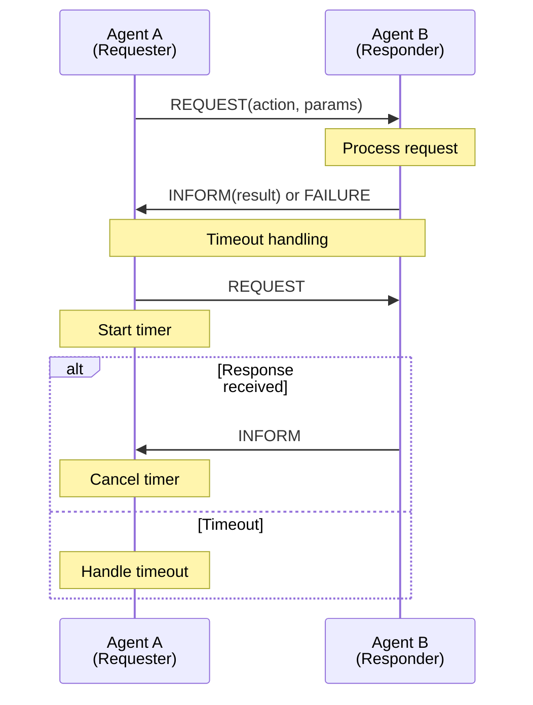
```mermaid
sequenceDiagram
    participant A as Agent A<br/>(Requester)
    participant B as Agent B<br/>(Responder)
    
    A->>B: REQUEST(action, params)
    Note over B: Process request
    B->>A: INFORM(result) or FAILURE
    
    Note over A,B: Timeout handling
    A->>B: REQUEST
    Note over A: Start timer
    alt Response received
        B->>A: INFORM
        Note over A: Cancel timer
    else Timeout
        Note over A: Handle timeout
    end
```

**Pattern Characteristics:**

| Aspect | Details |
|--------|---------|
| **Initiator** | One agent (requester) |
| **Participants** | 2 agents |
| **Message Flow** | Request → Response |
| **Termination** | After response or timeout |
| **Use Cases** | Queries, simple commands |

### 2. Query Pattern

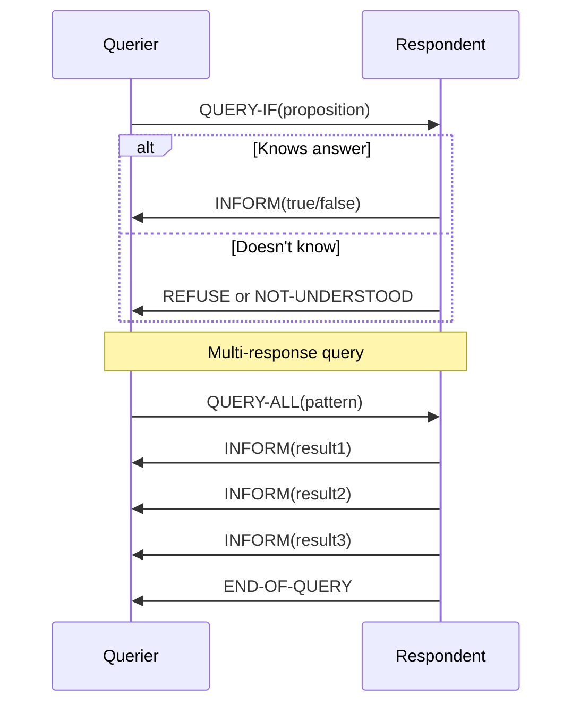
```mermaid
sequenceDiagram
    participant Q as Querier
    participant R as Respondent
    
    Q->>R: QUERY-IF(proposition)
    alt Knows answer
        R->>Q: INFORM(true/false)
    else Doesn't know
        R->>Q: REFUSE or NOT-UNDERSTOOD
    end
    
    Note over Q,R: Multi-response query
    Q->>R: QUERY-ALL(pattern)
    R->>Q: INFORM(result1)
    R->>Q: INFORM(result2)
    R->>Q: INFORM(result3)
    R->>Q: END-OF-QUERY
```

**Query Types:**

| Type | Description | Response | Example |
|------|-------------|----------|---------|
| **query-if** | Boolean question | true/false | "Is server online?" |
| **query-ref** | Reference request | Value(s) | "What is temperature?" |
| **query-all** | Find all matches | Multiple values | "List all users" |

### 3. Subscribe-Notify Pattern

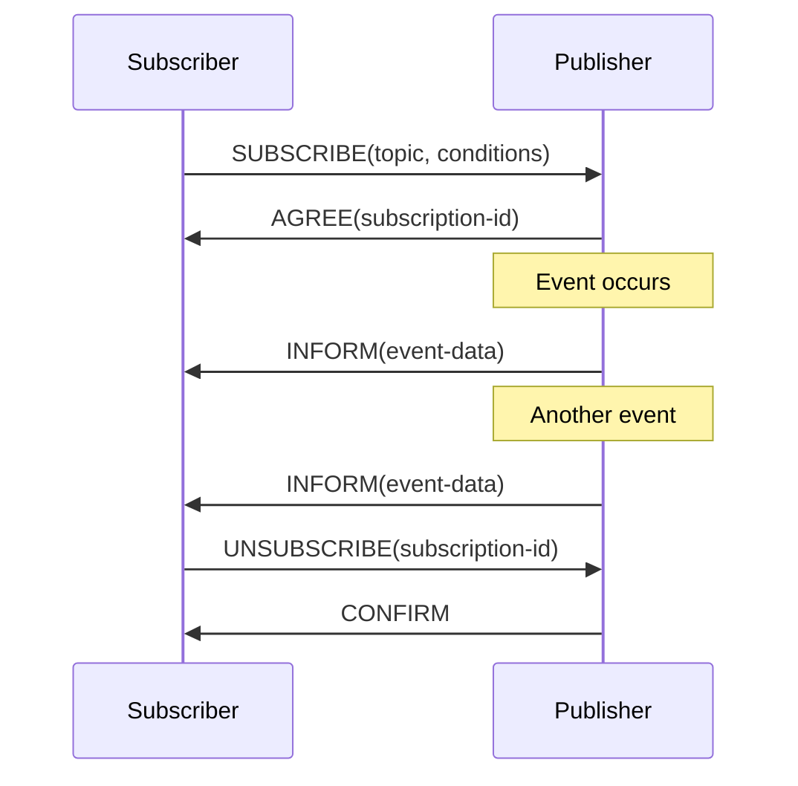
```mermaid
sequenceDiagram
    participant S as Subscriber
    participant P as Publisher
    
    S->>P: SUBSCRIBE(topic, conditions)
    P->>S: AGREE(subscription-id)
    
    Note over P: Event occurs
    P->>S: INFORM(event-data)
    
    Note over P: Another event
    P->>S: INFORM(event-data)
    
    S->>P: UNSUBSCRIBE(subscription-id)
    P->>S: CONFIRM
```

**Pattern Features:**

| Feature | Description |
|---------|-------------|
| **Persistence** | Subscription lasts until unsubscribe |
| **Push-based** | Publisher initiates notifications |
| **Filtering** | Conditions determine which events notify |
| **Scalability** | One publisher, many subscribers |
| **Use Cases** | Event monitoring, real-time updates |

### 4. Broadcast Pattern

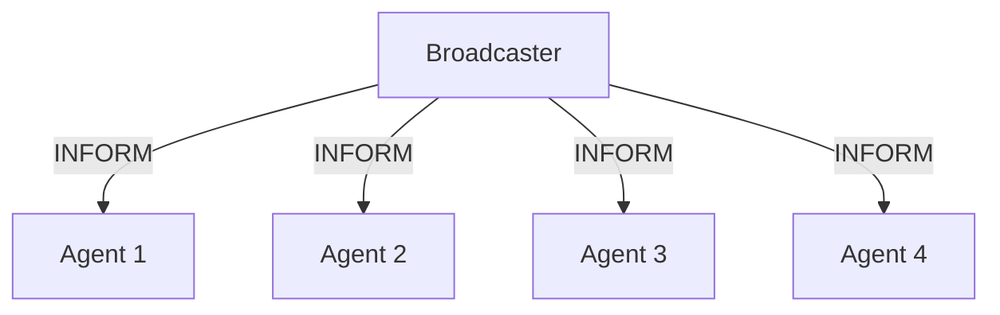
```mermaid
graph TB
    A[Broadcaster] -->|INFORM| B[Agent 1]
    A -->|INFORM| C[Agent 2]
    A -->|INFORM| D[Agent 3]
    A -->|INFORM| E[Agent 4]
    
```

**Broadcast Types:**

| Type | Recipients | Delivery | Use Case |
|------|-----------|----------|----------|
| **Global** | All agents | Best-effort | System announcements |
| **Scoped** | Group/role | Best-effort | Team notifications |
| **Reliable** | All agents | Guaranteed | Critical updates |
| **Multicast** | Specific set | Configurable | Selective distribution |

---

## Coordination Protocols

### 1. Contract Net Protocol

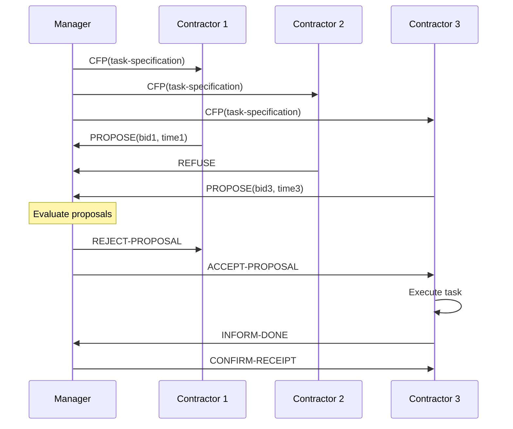
```mermaid
sequenceDiagram
    participant M as Manager
    participant C1 as Contractor 1
    participant C2 as Contractor 2
    participant C3 as Contractor 3
    
    M->>C1: CFP(task-specification)
    M->>C2: CFP(task-specification)
    M->>C3: CFP(task-specification)
    
    C1->>M: PROPOSE(bid1, time1)
    C2->>M: REFUSE
    C3->>M: PROPOSE(bid3, time3)
    
    Note over M: Evaluate proposals
    
    M->>C1: REJECT-PROPOSAL
    M->>C3: ACCEPT-PROPOSAL
    
    C3->>C3: Execute task
    C3->>M: INFORM-DONE
    M->>C3: CONFIRM-RECEIPT
```

**Protocol Phases:**

| Phase | Messages | Purpose |
|-------|----------|---------|
| **1. Announcement** | CFP (Call For Proposals) | Manager broadcasts task |
| **2. Bidding** | PROPOSE, REFUSE | Contractors submit bids |
| **3. Awarding** | ACCEPT/REJECT-PROPOSAL | Manager selects winner |
| **4. Execution** | INFORM-DONE, FAILURE | Contractor performs task |
| **5. Completion** | CONFIRM | Manager acknowledges |

**Decision Factors:**

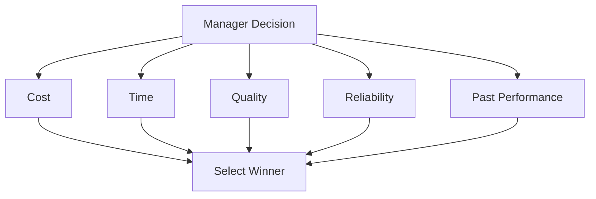
```mermaid
graph TB
    A[Manager Decision] --> B[Cost]
    A --> C[Time]
    A --> D[Quality]
    A --> E[Reliability]
    A --> F[Past Performance]
    
    B --> G[Select Winner]
    C --> G
    D --> G
    E --> G
    F --> G

```

### 2. Auction Protocols

#### English Auction (Ascending Price)

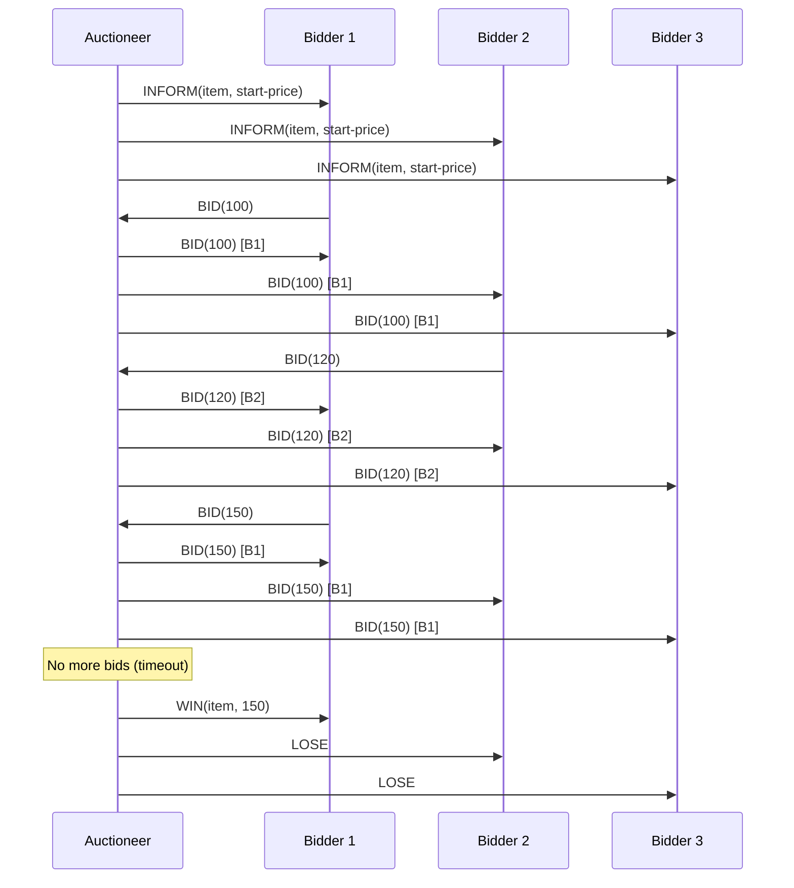
```mermaid
sequenceDiagram
    participant A as Auctioneer
    participant B1 as Bidder 1
    participant B2 as Bidder 2
    participant B3 as Bidder 3
    
    A->>B1: INFORM(item, start-price)
    A->>B2: INFORM(item, start-price)
    A->>B3: INFORM(item, start-price)
    
    B1->>A: BID(100)
    A->>B1: BID(100) [B1]
    A->>B2: BID(100) [B1]
    A->>B3: BID(100) [B1]
    
    B2->>A: BID(120)
    A->>B1: BID(120) [B2]
    A->>B2: BID(120) [B2]
    A->>B3: BID(120) [B2]
    
    B1->>A: BID(150)
    A->>B1: BID(150) [B1]
    A->>B2: BID(150) [B1]
    A->>B3: BID(150) [B1]
    
    Note over A: No more bids (timeout)
    A->>B1: WIN(item, 150)
    A->>B2: LOSE
    A->>B3: LOSE
```

**Auction Types Comparison:**

| Type | Price Direction | Information | Best For |
|------|----------------|-------------|----------|
| **English** | Ascending | Public bids | High-value items |
| **Dutch** | Descending | Public price | Perishable goods |
| **Sealed-Bid** | Single round | Private bids | Government contracts |
| **Vickrey** | Second-price sealed | Private bids | Truthful bidding |
| **Double** | Both buyers/sellers | Public | Stock markets |

### 3. Voting/Consensus Protocol

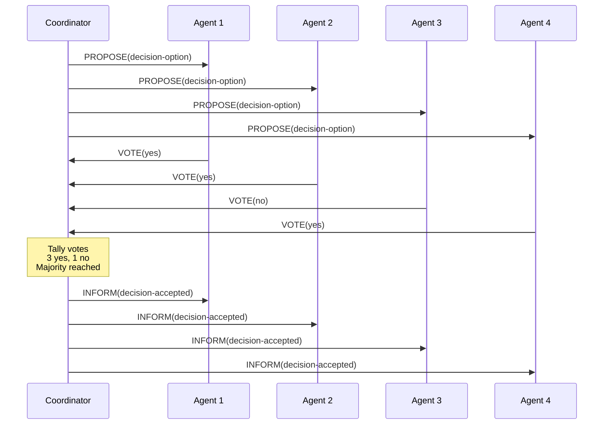
```mermaid
sequenceDiagram
    participant C as Coordinator
    participant A1 as Agent 1
    participant A2 as Agent 2
    participant A3 as Agent 3
    participant A4 as Agent 4
    
    C->>A1: PROPOSE(decision-option)
    C->>A2: PROPOSE(decision-option)
    C->>A3: PROPOSE(decision-option)
    C->>A4: PROPOSE(decision-option)
    
    A1->>C: VOTE(yes)
    A2->>C: VOTE(yes)
    A3->>C: VOTE(no)
    A4->>C: VOTE(yes)
    
    Note over C: Tally votes<br/>3 yes, 1 no<br/>Majority reached
    
    C->>A1: INFORM(decision-accepted)
    C->>A2: INFORM(decision-accepted)
    C->>A3: INFORM(decision-accepted)
    C->>A4: INFORM(decision-accepted)
```

**Voting Mechanisms:**

| Mechanism | Description | Properties |
|-----------|-------------|------------|
| **Simple Majority** | >50% votes | Fast, may exclude minority |
| **Supermajority** | >66% or >75% | Stronger consensus |
| **Unanimous** | 100% agreement | Strongest, may deadlock |
| **Weighted** | Votes have different weights | Reflects agent importance |
| **Ranked Choice** | Preference ordering | Captures nuance |

---

## Negotiation Protocols

### 1. Bilateral Negotiation

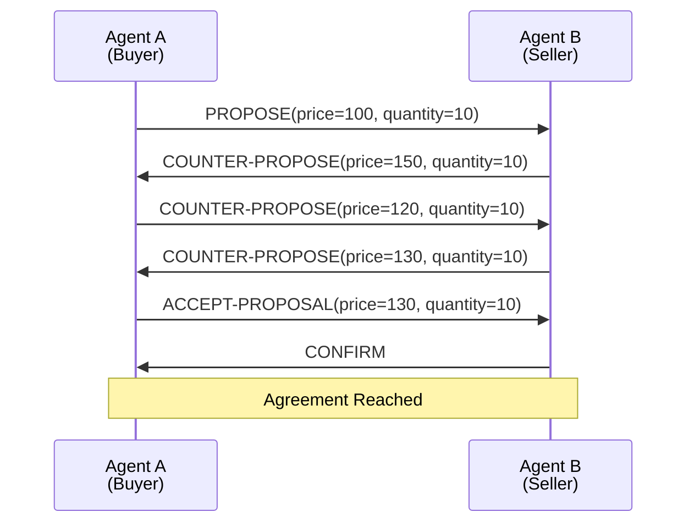
```mermaid
sequenceDiagram
    participant A as Agent A<br/>(Buyer)
    participant B as Agent B<br/>(Seller)
    
    A->>B: PROPOSE(price=100, quantity=10)
    B->>A: COUNTER-PROPOSE(price=150, quantity=10)
    A->>B: COUNTER-PROPOSE(price=120, quantity=10)
    B->>A: COUNTER-PROPOSE(price=130, quantity=10)
    A->>B: ACCEPT-PROPOSAL(price=130, quantity=10)
    B->>A: CONFIRM
    
    Note over A,B: Agreement Reached
```

**Negotiation Strategies:**

| Strategy | Approach | Pros | Cons |
|----------|----------|------|------|
| **Competitive** | Maximize own utility | Best outcome if successful | May fail to reach agreement |
| **Cooperative** | Maximize joint utility | Usually reaches agreement | May not be optimal |
| **Compromising** | Meet in middle | Fast, fair | Suboptimal for both |
| **Accommodating** | Prioritize relationship | Maintains goodwill | Poor individual outcome |
| **Avoiding** | Postpone decision | Buys time | May miss opportunity |

### 2. Multi-Party Negotiation

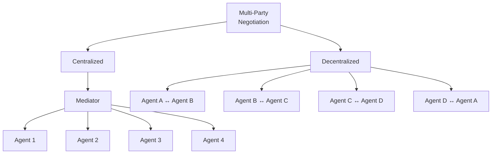
```mermaid
graph TB
    A[Multi-Party<br/>Negotiation] --> B[Centralized]
    A --> C[Decentralized]
    
    B --> B1[Mediator]
    B1 --> B2[Agent 1]
    B1 --> B3[Agent 2]
    B1 --> B4[Agent 3]
    B1 --> B5[Agent 4]
    
    C --> C1[Agent A ↔ Agent B]
    C --> C2[Agent B ↔ Agent C]
    C --> C3[Agent C ↔ Agent D]
    C --> C4[Agent D ↔ Agent A]
```

**Protocol Comparison:**

| Aspect | Centralized | Decentralized |
|--------|-------------|---------------|
| **Coordinator** | Required | Not needed |
| **Complexity** | Lower | Higher |
| **Communication** | n messages to mediator | n² potential connections |
| **Scalability** | Good | Limited |
| **Robustness** | Single point of failure | More robust |
| **Fairness** | Mediator ensures | Emergent |

### 3. Argumentation-Based Negotiation

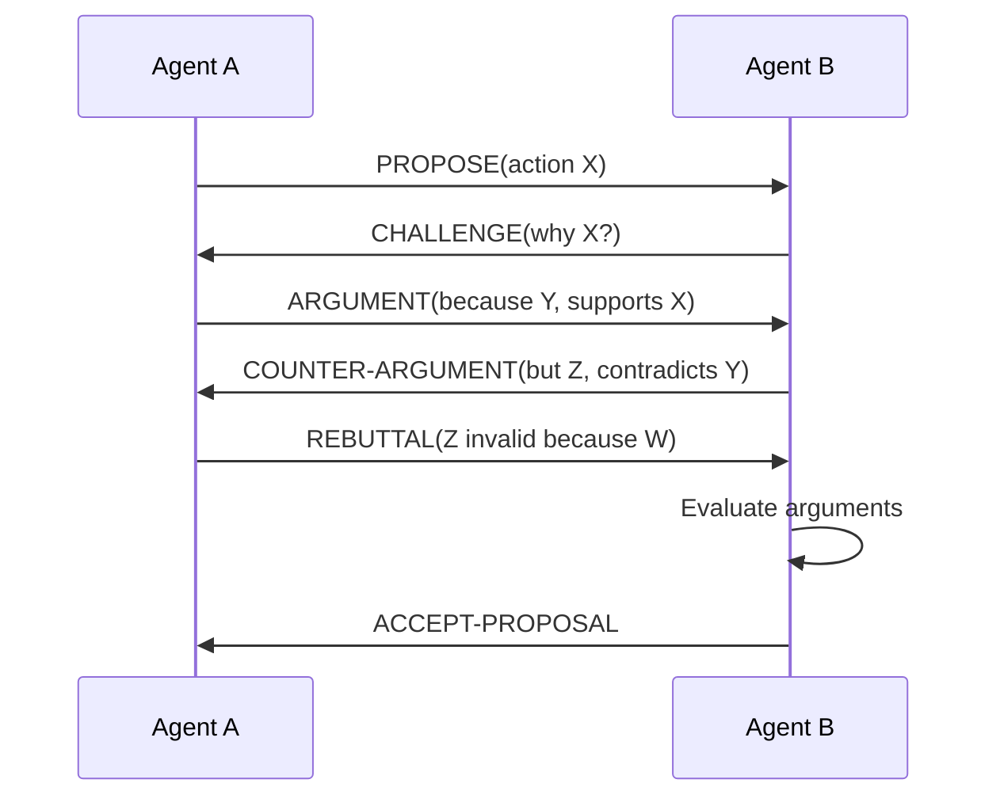
```mermaid
sequenceDiagram
    participant A as Agent A
    participant B as Agent B
    
    A->>B: PROPOSE(action X)
    B->>A: CHALLENGE(why X?)
    A->>B: ARGUMENT(because Y, supports X)
    B->>A: COUNTER-ARGUMENT(but Z, contradicts Y)
    A->>B: REBUTTAL(Z invalid because W)
    B->>B: Evaluate arguments
    B->>A: ACCEPT-PROPOSAL
```

**Argument Components:**

| Component | Description | Example |
|-----------|-------------|---------|
| **Claim** | Proposed conclusion | "We should take route A" |
| **Data** | Supporting evidence | "Route A is 10km shorter" |
| **Warrant** | Reasoning | "Shorter routes save time" |
| **Backing** | Support for warrant | "Historical data shows this" |
| **Rebuttal** | Counterargument | "But route A has traffic" |
| **Qualifier** | Strength of claim | "We probably should..." |

---

## Modern API-Based Communication

### 1. RESTful APIs

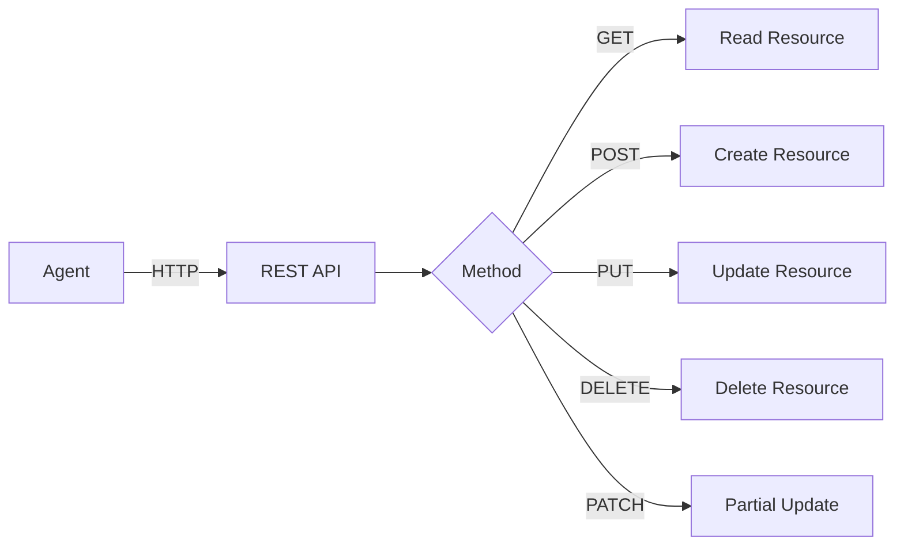
```mermaid
graph LR
    A[Agent] -->|HTTP| B[REST API]
    B --> C{Method}
    
    C -->|GET| D[Read Resource]
    C -->|POST| E[Create Resource]
    C -->|PUT| F[Update Resource]
    C -->|DELETE| G[Delete Resource]
    C -->|PATCH| H[Partial Update]
    
```

**REST Principles:**

| Principle | Description | Benefit |
|-----------|-------------|---------|
| **Stateless** | No client context stored | Scalability |
| **Cacheable** | Responses can be cached | Performance |
| **Uniform Interface** | Standard methods (GET, POST, etc.) | Simplicity |
| **Client-Server** | Separation of concerns | Independence |
| **Layered** | Intermediaries allowed | Flexibility |

**Example REST Communication:**

```http
POST /agents/agent2/messages HTTP/1.1
Host: api.multiagent.com
Content-Type: application/json
Authorization: Bearer token123

{
  "from": "agent1",
  "type": "request",
  "action": "getTemperature",
  "params": {
    "location": "room1"
  }
}
```

**Response:**

```http
HTTP/1.1 200 OK
Content-Type: application/json

{
  "messageId": "msg-789",
  "status": "success",
  "data": {
    "location": "room1",
    "temperature": 22.5,
    "unit": "celsius",
    "timestamp": "2024-10-22T10:30:00Z"
  }
}
```

### 2. WebSocket Communication

```mermaid
sequenceDiagram
    participant A as Agent A
    participant S as WebSocket Server
    participant B as Agent B
    
    A->>S: HTTP Upgrade Request
    S->>A: 101 Switching Protocols
    Note over A,S: Connection established
    
    B->>S: Connect
    Note over B,S: Connection established
    
    A->>S: Message 1 (bidirectional)
    S->>B: Message 1
    
    B->>S: Message 2
    S->>A: Message 2
    
    Note over A,S,B: Full-duplex communication
```

**WebSocket Advantages:**

| Feature | Benefit | Use Case |
|---------|---------|----------|
| **Full-duplex** | Bidirectional simultaneously | Real-time coordination |
| **Low latency** | No HTTP overhead | High-frequency updates |
| **Persistent** | Connection stays open | Continuous communication |
| **Event-driven** | Push notifications | State changes |

### 3. gRPC (Google Remote Procedure Call)

```mermaid
graph TB
    A[Agent Client] -->|HTTP/2| B[gRPC Server]
    B --> C[Service Definition<br/>Protocol Buffers]
    
    C --> D[Unary RPC<br/>Single request/response]
    C --> E[Server Streaming<br/>One request, stream response]
    C --> F[Client Streaming<br/>Stream request, one response]
    C --> G[Bidirectional Streaming<br/>Both stream]
    
```

**gRPC Features:**

| Feature | Description | Advantage |
|---------|-------------|-----------|
| **Protocol Buffers** | Binary serialization | Compact, fast |
| **HTTP/2** | Multiplexing, compression | Efficient |
| **Streaming** | Multiple message types | Flexible |
| **Language-agnostic** | Many language bindings | Interoperable |
| **Type-safe** | Strong typing | Fewer errors |

### 4. Message Queues (MQTT, RabbitMQ, Kafka)

```mermaid
graph TB
    subgraph Producer Agents
    A1[Agent 1]
    A2[Agent 2]
    A3[Agent 3]
    end
    
    A1 -->|Publish| M[Message Queue/<br/>Broker]
    A2 -->|Publish| M
    A3 -->|Publish| M
    
    subgraph Consumer Agents
    B1[Agent 4]
    B2[Agent 5]
    B3[Agent 6]
    end
    
    M -->|Subscribe| B1
    M -->|Subscribe| B2
    M -->|Subscribe| B3
    
```

**Message Queue Comparison:**

| System | Pattern | Ordering | Persistence | Best For |
|--------|---------|----------|-------------|----------|
| **MQTT** | Pub/Sub | No guarantee | Optional | IoT, lightweight |
| **RabbitMQ** | Queue + Pub/Sub | FIFO per queue | Yes | Enterprise, reliability |
| **Kafka** | Log-based | Per partition | Yes | High-throughput, streaming |
| **Redis** | Pub/Sub + Streams | Optional | Optional | Fast, in-memory |
| **ZeroMQ** | Various | Depends | No | Low-latency, embedded |

**Quality of Service Levels (MQTT):**

| QoS Level | Guarantee | Delivery | Use Case |
|-----------|-----------|----------|----------|
| **QoS 0** | At most once | Fire and forget | Non-critical data |
| **QoS 1** | At least once | May duplicate | Important messages |
| **QoS 2** | Exactly once | No duplicates | Critical operations |

---

## Security and Privacy

### Security Threats

```mermaid
graph TB
    A[Security Threats] --> B[Eavesdropping<br/>Intercept messages]
    A --> C[Impersonation<br/>Fake identity]
    A --> D[Message Tampering<br/>Modify content]
    A --> E[Replay Attacks<br/>Resend old messages]
    A --> F[Denial of Service<br/>Overwhelm system]
    A --> G[Man-in-the-Middle<br/>Intercept & relay]
    
```

### Security Mechanisms

| Mechanism | Purpose | Implementation |
|-----------|---------|----------------|
| **Authentication** | Verify identity | API keys, OAuth, certificates |
| **Authorization** | Control access | RBAC, ABAC, policies |
| **Encryption** | Protect content | TLS/SSL, end-to-end encryption |
| **Integrity** | Detect tampering | HMAC, digital signatures |
| **Non-repudiation** | Prove origin | Digital signatures, logs |
| **Confidentiality** | Limit access | Access control, encryption |

### Secure Communication Flow

```mermaid
sequenceDiagram
    participant A as Agent A
    participant CA as Certificate Authority
    participant B as Agent B
    
    Note over A,B: 1. Authentication Phase
    A->>CA: Request certificate
    CA->>A: Issue certificate
    B->>CA: Request certificate
    CA->>B: Issue certificate
    
    Note over A,B: 2. Connection Establishment
    A->>B: Hello + Certificate
    B->>B: Verify certificate with CA
    B->>A: Hello + Certificate
    A->>A: Verify certificate with CA
    
    Note over A,B: 3. Key Exchange
    A->>B: Exchange public keys
    Note over A,B: Establish shared secret
    
    Note over A,B: 4. Secure Communication
    A->>B: Encrypted message
    B->>A: Encrypted response
```

### Privacy Preservation

**Privacy Techniques:**

| Technique | Description | Privacy Level | Performance Impact |
|-----------|-------------|---------------|-------------------|
| **Encryption** | Hide message content | High | Low |
| **Anonymization** | Remove identifying info | Medium | Low |
| **Pseudonymization** | Use fake identities | Medium | Low |
| **Differential Privacy** | Add noise to data | High | Medium |
| **Secure Multi-Party Computation** | Compute without revealing | Very High | High |
| **Homomorphic Encryption** | Compute on encrypted data | Very High | Very High |

**Privacy-Preserving Communication:**

```mermaid
graph TB
    A[Agent A<br/>Original Data] --> B[Privacy Layer]
    B --> C[Anonymize]
    B --> D[Encrypt]
    B --> E[Add Noise]
    
    C --> F[Pseudonym Generator]
    D --> G[Encryption Engine]
    E --> H[Differential Privacy]
    
    F --> I[Protected Message]
    G --> I
    H --> I
    
    I --> J[Communication Channel]
    J --> K[Agent B]
    
```

---

## Performance Optimization

### Message Optimization Strategies

| Strategy | Description | Benefit | Trade-off |
|----------|-------------|---------|-----------|
| **Compression** | Reduce message size | Lower bandwidth | CPU overhead |
| **Batching** | Combine multiple messages | Fewer round-trips | Higher latency |
| **Caching** | Store frequently accessed data | Faster retrieval | Staleness |
| **Filtering** | Send only relevant data | Reduced traffic | Complexity |
| **Prioritization** | Important messages first | Better QoS | Unfairness |
| **Load Balancing** | Distribute across servers | Higher throughput | Complexity |

### Communication Patterns Performance

```mermaid
graph TB
    A[Performance Factors] --> B[Latency]
    A --> C[Throughput]
    A --> D[Scalability]
    A --> E[Reliability]
    
    B --> B1[Network delay<br/>Processing time<br/>Queuing delay]
    C --> C1[Messages/second<br/>Bytes/second]
    D --> D1[Agents supported<br/>Messages handled]
    E --> E1[Delivery guarantee<br/>Fault tolerance]
    
```

**Pattern Performance Comparison:**

| Pattern | Latency | Throughput | Scalability | Complexity |
|---------|---------|------------|-------------|------------|
| **Direct P2P** | Low | Medium | Poor | Low |
| **Message Queue** | Medium | High | Excellent | Medium |
| **Broadcast** | Low | Low | Poor | Low |
| **Pub/Sub** | Medium | High | Excellent | Medium |
| **Request-Reply** | Medium | Medium | Medium | Low |
| **Streaming** | Low | Very High | Good | High |

### Bandwidth Optimization

```mermaid
graph LR
    A[Original Message<br/>10KB] --> B[Compression<br/>gzip/brotli]
    B --> C[Compressed<br/>2KB<br/>80% reduction]
    
    D[Full Object<br/>100 fields] --> E[Field Selection<br/>Only needed]
    E --> F[Minimal Object<br/>5 fields<br/>95% reduction]
    
    G[JSON<br/>Text format] --> H[Binary Format<br/>Protobuf/BSON]
    H --> I[Binary<br/>50% size reduction]
    

```

### Caching Strategies

| Strategy | Description | Hit Rate | Use Case |
|----------|-------------|----------|----------|
| **LRU** | Least Recently Used | Medium-High | General purpose |
| **LFU** | Least Frequently Used | Medium | Stable access patterns |
| **TTL** | Time-To-Live expiration | Variable | Time-sensitive data |
| **Write-through** | Update cache on write | High | Read-heavy workloads |
| **Write-back** | Delayed cache update | High | Write-heavy workloads |

---

## Implementation Examples

### Example 1: FIPA-ACL Request-Inform Pattern (Python)

```python
import json
from datetime import datetime
from typing import Dict, Any

class FIPAMessage:
    """FIPA-ACL compliant message structure"""
    
    def __init__(self, performative: str, sender: str, receiver: str, 
                 content: Any, **kwargs):
        self.performative = performative
        self.sender = sender
        self.receiver = receiver
        self.content = content
        self.language = kwargs.get('language', 'JSON')
        self.ontology = kwargs.get('ontology', 'domain-ontology')
        self.protocol = kwargs.get('protocol', 'fipa-request')
        self.conversation_id = kwargs.get('conversation_id', 
                                         self._generate_conv_id())
        self.reply_with = kwargs.get('reply_with', None)
        self.in_reply_to = kwargs.get('in_reply_to', None)
        self.timestamp = datetime.utcnow().isoformat()
    
    def _generate_conv_id(self) -> str:
        """Generate unique conversation ID"""
        return f"conv-{datetime.utcnow().timestamp()}"
    
    def to_dict(self) -> Dict[str, Any]:
        """Convert message to dictionary"""
        return {
            'performative': self.performative,
            'sender': self.sender,
            'receiver': self.receiver,
            'content': self.content,
            'language': self.language,
            'ontology': self.ontology,
            'protocol': self.protocol,
            'conversation_id': self.conversation_id,
            'reply_with': self.reply_with,
            'in_reply_to': self.in_reply_to,
            'timestamp': self.timestamp
        }
    
    def to_json(self) -> str:
        """Serialize to JSON"""
        return json.dumps(self.to_dict(), indent=2)
    
    @classmethod
    def from_dict(cls, data: Dict[str, Any]) -> 'FIPAMessage':
        """Create message from dictionary"""
        return cls(
            performative=data['performative'],
            sender=data['sender'],
            receiver=data['receiver'],
            content=data['content'],
            language=data.get('language'),
            ontology=data.get('ontology'),
            protocol=data.get('protocol'),
            conversation_id=data.get('conversation_id'),
            reply_with=data.get('reply_with'),
            in_reply_to=data.get('in_reply_to')
        )

# Usage Example
class WeatherAgent:
    def __init__(self, agent_id: str):
        self.agent_id = agent_id
    
    def request_weather(self, target_agent: str, location: str) -> FIPAMessage:
        """Send weather information request"""
        msg = FIPAMessage(
            performative='REQUEST',
            sender=self.agent_id,
            receiver=target_agent,
            content={
                'action': 'get-weather',
                'parameters': {'location': location}
            },
            protocol='fipa-request',
            reply_with=f'req-{datetime.utcnow().timestamp()}'
        )
        return msg
    
    def respond_weather(self, request_msg: FIPAMessage, 
                       weather_data: Dict) -> FIPAMessage:
        """Respond to weather request"""
        msg = FIPAMessage(
            performative='INFORM',
            sender=self.agent_id,
            receiver=request_msg.sender,
            content={
                'result': weather_data
            },
            protocol=request_msg.protocol,
            conversation_id=request_msg.conversation_id,
            in_reply_to=request_msg.reply_with
        )
        return msg

# Demo
agent1 = WeatherAgent('weather-requester')
agent2 = WeatherAgent('weather-provider')

# Agent1 requests weather
request = agent1.request_weather('weather-provider', 'New York')
print("REQUEST:")
print(request.to_json())

# Agent2 responds
weather_data = {
    'location': 'New York',
    'temperature': 22,
    'conditions': 'Partly Cloudy',
    'humidity': 65
}
response = agent2.respond_weather(request, weather_data)
print("\nRESPONSE:")
print(response.to_json())
```

### Example 2: Contract Net Protocol Implementation

```python
import asyncio
from typing import List, Dict, Optional
from dataclasses import dataclass
from enum import Enum

class ProposalStatus(Enum):
    PENDING = "pending"
    ACCEPTED = "accepted"
    REJECTED = "rejected"

@dataclass
class Task:
    task_id: str
    description: str
    requirements: Dict
    deadline: float

@dataclass
class Proposal:
    contractor_id: str
    task_id: str
    cost: float
    time: float
    quality_score: float
    status: ProposalStatus = ProposalStatus.PENDING

class ContractNetManager:
    """Manager agent in Contract Net Protocol"""
    
    def __init__(self, manager_id: str):
        self.manager_id = manager_id
        self.active_tasks: Dict[str, Task] = {}
        self.proposals: Dict[str, List[Proposal]] = {}
    
    async def announce_task(self, task: Task, contractors: List[str]):
        """Send Call For Proposals (CFP)"""
        print(f"\n[{self.manager_id}] Announcing task: {task.task_id}")
        
        cfp_message = FIPAMessage(
            performative='CFP',
            sender=self.manager_id,
            receiver='all-contractors',
            content={
                'task_id': task.task_id,
                'description': task.description,
                'requirements': task.requirements,
                'deadline': task.deadline
            }
        )
        
        self.active_tasks[task.task_id] = task
        self.proposals[task.task_id] = []
        
        # Broadcast to all contractors
        for contractor_id in contractors:
            print(f"  → Sending CFP to {contractor_id}")
        
        return cfp_message
    
    def receive_proposal(self, proposal: Proposal):
        """Receive proposal from contractor"""
        print(f"[{self.manager_id}] Received proposal from {proposal.contractor_id}")
        print(f"  Cost: ${proposal.cost}, Time: {proposal.time}h, Quality: {proposal.quality_score}")
        
        if proposal.task_id in self.proposals:
            self.proposals[proposal.task_id].append(proposal)
    
    def evaluate_proposals(self, task_id: str) -> Optional[Proposal]:
        """Evaluate and select best proposal"""
        if task_id not in self.proposals or not self.proposals[task_id]:
            return None
        
        proposals = self.proposals[task_id]
        
        # Scoring function: lower cost, lower time, higher quality
        def score_proposal(p: Proposal) -> float:
            # Normalize and weight factors
            cost_score = 1.0 / (p.cost + 1)  # Lower is better
            time_score = 1.0 / (p.time + 1)  # Lower is better
            quality_score = p.quality_score  # Higher is better
            
            # Weighted combination
            return 0.3 * cost_score + 0.3 * time_score + 0.4 * quality_score
        
        # Select best proposal
        best_proposal = max(proposals, key=score_proposal)
        
        print(f"\n[{self.manager_id}] Evaluating proposals for {task_id}:")
        for p in proposals:
            status = "WINNER" if p == best_proposal else "rejected"
            print(f"  {p.contractor_id}: score={score_proposal(p):.3f} [{status}]")
        
        return best_proposal
    
    async def award_contract(self, task_id: str):
        """Award contract to best bidder"""
        winner = self.evaluate_proposals(task_id)
        
        if not winner:
            print(f"[{self.manager_id}] No valid proposals for {task_id}")
            return
        
        # Accept winner
        accept_msg = FIPAMessage(
            performative='ACCEPT-PROPOSAL',
            sender=self.manager_id,
            receiver=winner.contractor_id,
            content={
                'task_id': task_id,
                'contract_terms': {
                    'cost': winner.cost,
                    'time': winner.time
                }
            }
        )
        
        print(f"\n[{self.manager_id}] Awarding contract to {winner.contractor_id}")
        winner.status = ProposalStatus.ACCEPTED
        
        # Reject others
        for proposal in self.proposals[task_id]:
            if proposal != winner:
                reject_msg = FIPAMessage(
                    performative='REJECT-PROPOSAL',
                    sender=self.manager_id,
                    receiver=proposal.contractor_id,
                    content={'task_id': task_id}
                )
                proposal.status = ProposalStatus.REJECTED
                print(f"  Rejecting {proposal.contractor_id}")
        
        return accept_msg

class ContractNetContractor:
    """Contractor agent in Contract Net Protocol"""
    
    def __init__(self, contractor_id: str, capabilities: Dict):
        self.contractor_id = contractor_id
        self.capabilities = capabilities
        self.current_load = 0.0
    
    async def receive_cfp(self, cfp_message: FIPAMessage) -> Optional[Proposal]:
        """Receive CFP and decide whether to bid"""
        task_id = cfp_message.content['task_id']
        requirements = cfp_message.content['requirements']
        
        print(f"\n[{self.contractor_id}] Received CFP for {task_id}")
        
        # Check if capable
        if not self._can_handle(requirements):
            print(f"  Cannot handle requirements, sending REFUSE")
            return None
        
        # Calculate bid
        proposal = self._calculate_bid(task_id, requirements)
        
        print(f"  Submitting proposal: ${proposal.cost}, {proposal.time}h")
        
        return proposal
    
    def _can_handle(self, requirements: Dict) -> bool:
        """Check if contractor can handle task"""
        # Simple capability check
        required_skills = requirements.get('skills', [])
        return all(skill in self.capabilities.get('skills', []) 
                  for skill in required_skills)
    
    def _calculate_bid(self, task_id: str, requirements: Dict) -> Proposal:
        """Calculate proposal for task"""
        # Simple bidding strategy
        base_cost = requirements.get('complexity', 1) * 100
        base_time = requirements.get('complexity', 1) * 10
        
        # Adjust based on current load
        cost = base_cost * (1 + self.current_load * 0.2)
        time = base_time * (1 + self.current_load * 0.3)
        
        # Quality score based on specialization
        quality = self.capabilities.get('quality_rating', 0.7)
        
        return Proposal(
            contractor_id=self.contractor_id,
            task_id=task_id,
            cost=cost,
            time=time,
            quality_score=quality
        )
    
    async def execute_task(self, task_id: str):
        """Execute awarded task"""
        print(f"\n[{self.contractor_id}] Executing task {task_id}")
        await asyncio.sleep(1)  # Simulate work
        
        # Send completion message
        completion_msg = FIPAMessage(
            performative='INFORM-DONE',
            sender=self.contractor_id,
            receiver='manager',
            content={
                'task_id': task_id,
                'status': 'completed',
                'result': 'Task successfully completed'
            }
        )
        
        print(f"[{self.contractor_id}] Task {task_id} completed")
        return completion_msg

# Demo
async def demo_contract_net():
    """Demonstrate Contract Net Protocol"""
    
    # Create manager
    manager = ContractNetManager('project-manager')
    
    # Create contractors with different capabilities
    contractors = [
        ContractNetContractor('contractor-1', {
            'skills': ['python', 'ml', 'data'],
            'quality_rating': 0.9
        }),
        ContractNetContractor('contractor-2', {
            'skills': ['python', 'web', 'api'],
            'quality_rating': 0.7
        }),
        ContractNetContractor('contractor-3', {
            'skills': ['python', 'ml', 'deployment'],
            'quality_rating': 0.8
        })
    ]
    
    # Create task
    task = Task(
        task_id='task-001',
        description='Build ML model',
        requirements={
            'skills': ['python', 'ml'],
            'complexity': 3
        },
        deadline=48.0
    )
    
    # Manager announces task
    await manager.announce_task(task, [c.contractor_id for c in contractors])
    
    # Contractors submit proposals
    for contractor in contractors:
        cfp_msg = FIPAMessage(
            performative='CFP',
            sender=manager.manager_id,
            receiver=contractor.contractor_id,
            content={
                'task_id': task.task_id,
                'description': task.description,
                'requirements': task.requirements,
                'deadline': task.deadline
            }
        )
        
        proposal = await contractor.receive_cfp(cfp_msg)
        if proposal:
            manager.receive_proposal(proposal)
    
    # Manager evaluates and awards
    await manager.award_contract(task.task_id)

# Run demo
# asyncio.run(demo_contract_net())
```

### Example 3: WebSocket Real-Time Communication

```python
import asyncio
import websockets
import json
from typing import Set, Dict

class AgentWebSocketServer:
    """WebSocket server for agent communication"""
    
    def __init__(self, host: str = 'localhost', port: int = 8765):
        self.host = host
        self.port = port
        self.connected_agents: Dict[str, websockets.WebSocketServerProtocol] = {}
        self.message_handlers = {}
    
    async def register_agent(self, websocket: websockets.WebSocketServerProtocol, 
                            agent_id: str):
        """Register new agent connection"""
        self.connected_agents[agent_id] = websocket
        print(f"Agent {agent_id} connected. Total agents: {len(self.connected_agents)}")
        
        # Send welcome message
        welcome = {
            'type': 'welcome',
            'agent_id': agent_id,
            'timestamp': datetime.utcnow().isoformat(),
            'connected_agents': list(self.connected_agents.keys())
        }
        await websocket.send(json.dumps(welcome))
    
    async def unregister_agent(self, agent_id: str):
        """Remove agent connection"""
        if agent_id in self.connected_agents:
            del self.connected_agents[agent_id]
            print(f"Agent {agent_id} disconnected. Total agents: {len(self.connected_agents)}")
    
    async def broadcast(self, message: Dict, exclude: str = None):
        """Broadcast message to all connected agents"""
        message_json = json.dumps(message)
        
        tasks = []
        for agent_id, websocket in self.connected_agents.items():
            if agent_id != exclude:
                tasks.append(websocket.send(message_json))
        
        if tasks:
            await asyncio.gather(*tasks, return_exceptions=True)
    
    async def send_to_agent(self, target_agent_id: str, message: Dict):
        """Send message to specific agent"""
        if target_agent_id in self.connected_agents:
            websocket = self.connected_agents[target_agent_id]
            await websocket.send(json.dumps(message))
            return True
        return False
    
    async def handle_message(self, websocket: websockets.WebSocketServerProtocol, 
                            message: Dict, sender_id: str):
        """Process incoming message"""
        msg_type = message.get('type')
        
        if msg_type == 'broadcast':
            # Broadcast to all except sender
            await self.broadcast(message, exclude=sender_id)
        
        elif msg_type == 'direct':
            # Send to specific agent
            target = message.get('target')
            success = await self.send_to_agent(target, message)
            
            # Send acknowledgment
            ack = {
                'type': 'ack',
                'message_id': message.get('message_id'),
                'status': 'delivered' if success else 'failed',
                'target': target
            }
            await websocket.send(json.dumps(ack))
        
        elif msg_type == 'query':
            # Handle query-response pattern
            response = await self.process_query(message)
            await websocket.send(json.dumps(response))
    
    async def process_query(self, query: Dict) -> Dict:
        """Process query and return response"""
        # Implement query logic
        return {
            'type': 'response',
            'query_id': query.get('query_id'),
            'result': 'Query processed',
            'timestamp': datetime.utcnow().isoformat()
        }
    
    async def agent_handler(self, websocket: websockets.WebSocketServerProtocol, 
                           path: str):
        """Handle agent connection"""
        agent_id = None
        
        try:
            # First message should be registration
            reg_message = await websocket.recv()
            reg_data = json.loads(reg_message)
            
            if reg_data.get('type') == 'register':
                agent_id = reg_data.get('agent_id')
                await self.register_agent(websocket, agent_id)
                
                # Handle subsequent messages
                async for message in websocket:
                    data = json.loads(message)
                    await self.handle_message(websocket, data, agent_id)
        
        except websockets.exceptions.ConnectionClosed:
            print(f"Connection closed for {agent_id}")
        
        finally:
            if agent_id:
                await self.unregister_agent(agent_id)
    
    async def start(self):
        """Start WebSocket server"""
        print(f"Starting WebSocket server on {self.host}:{self.port}")
        async with websockets.serve(self.agent_handler, self.host, self.port):
            await asyncio.Future()  # Run forever

class AgentWebSocketClient:
    """WebSocket client for agent"""
    
    def __init__(self, agent_id: str, server_url: str = 'ws://localhost:8765'):
        self.agent_id = agent_id
        self.server_url = server_url
        self.websocket = None
        self.message_queue = asyncio.Queue()
    
    async def connect(self):
        """Connect to WebSocket server"""
        self.websocket = await websockets.connect(self.server_url)
        
        # Register
        reg_message = {
            'type': 'register',
            'agent_id': self.agent_id,
            'timestamp': datetime.utcnow().isoformat()
        }
        await self.websocket.send(json.dumps(reg_message))
        
        # Receive welcome
        welcome = await self.websocket.recv()
        print(f"[{self.agent_id}] Connected: {welcome}")
        
        # Start listening
        asyncio.create_task(self.listen())
    
    async def listen(self):
        """Listen for incoming messages"""
        try:
            async for message in self.websocket:
                data = json.loads(message)
                await self.message_queue.put(data)
                await self.handle_message(data)
        except websockets.exceptions.ConnectionClosed:
            print(f"[{self.agent_id}] Connection closed")
    
    async def handle_message(self, message: Dict):
        """Handle incoming message"""
        msg_type = message.get('type')
        print(f"[{self.agent_id}] Received {msg_type}: {message}")
    
    async def send_message(self, message: Dict):
        """Send message to server"""
        message['sender'] = self.agent_id
        message['timestamp'] = datetime.utcnow().isoformat()
        await self.websocket.send(json.dumps(message))
    
    async def broadcast(self, content: str):
        """Broadcast message to all agents"""
        message = {
            'type': 'broadcast',
            'content': content
        }
        await self.send_message(message)
    
    async def send_direct(self, target_agent: str, content: str):
        """Send direct message to specific agent"""
        message = {
            'type': 'direct',
            'target': target_agent,
            'content': content,
            'message_id': f"msg-{datetime.utcnow().timestamp()}"
        }
        await self.send_message(message)
    
    async def close(self):
        """Close connection"""
        if self.websocket:
            await self.websocket.close()

# Demo usage
async def demo_websocket():
    """Demonstrate WebSocket communication"""
    
    # Start server in background
    server = AgentWebSocketServer()
    server_task = asyncio.create_task(server.start())
    
    await asyncio.sleep(1)  # Wait for server to start
    
    # Create clients
    agent1 = AgentWebSocketClient('agent-1')
    agent2 = AgentWebSocketClient('agent-2')
    agent3 = AgentWebSocketClient('agent-3')
    
    # Connect agents
    await agent1.connect()
    await agent2.connect()
    await agent3.connect()
    
    await asyncio.sleep(0.5)
    
    # Agent1 broadcasts
    await agent1.broadcast("Hello all agents!")
    
    await asyncio.sleep(0.5)
    
    # Agent2 sends direct message to Agent3
    await agent2.send_direct('agent-3', "Private message for you")
    
    await asyncio.sleep(2)
    
    # Cleanup
    await agent1.close()
    await agent2.close()
    await agent3.close()

# Run demo
# asyncio.run(demo_websocket())
```

### Example 4: Message Queue (MQTT) Implementation

```python
import paho.mqtt.client as mqtt
import json
from typing import Callable, Dict
from datetime import datetime

class MQTTAgent:
    """Agent using MQTT for communication"""
    
    def __init__(self, agent_id: str, broker_host: str = 'localhost', 
                 broker_port: int = 1883):
        self.agent_id = agent_id
        self.broker_host = broker_host
        self.broker_port = broker_port
        self.client = mqtt.Client(agent_id)
        self.message_handlers: Dict[str, Callable] = {}
        
        # Set callbacks
        self.client.on_connect = self._on_connect
        self.client.on_message = self._on_message
        self.client.on_disconnect = self._on_disconnect
    
    def _on_connect(self, client, userdata, flags, rc):
        """Callback when connected to broker"""
        if rc == 0:
            print(f"[{self.agent_id}] Connected to MQTT broker")
        else:
            print(f"[{self.agent_id}] Connection failed with code {rc}")
    
    def _on_message(self, client, userdata, msg):
        """Callback when message received"""
        try:
            payload = json.loads(msg.payload.decode())
            topic = msg.topic
            
            print(f"[{self.agent_id}] Received on {topic}: {payload}")
            
            # Call registered handler
            if topic in self.message_handlers:
                self.message_handlers[topic](payload)
        
        except Exception as e:
            print(f"[{self.agent_id}] Error processing message: {e}")
    
    def _on_disconnect(self, client, userdata, rc):
        """Callback when disconnected"""
        print(f"[{self.agent_id}] Disconnected from broker")
    
    def connect(self):
        """Connect to MQTT broker"""
        self.client.connect(self.broker_host, self.broker_port, 60)
        self.client.loop_start()
    
    def disconnect(self):
        """Disconnect from broker"""
        self.client.loop_stop()
        self.client.disconnect()
    
    def publish(self, topic: str, message: Dict, qos: int = 1, retain: bool = False):
        """Publish message to topic"""
        message['sender'] = self.agent_id
        message['timestamp'] = datetime.utcnow().isoformat()
        
        payload = json.dumps(message)
        result = self.client.publish(topic, payload, qos=qos, retain=retain)
        
        if result.rc == mqtt.MQTT_ERR_SUCCESS:
            print(f"[{self.agent_id}] Published to {topic}")
        else:
            print(f"[{self.agent_id}] Publish failed: {result.rc}")
    
    def subscribe(self, topic: str, handler: Callable = None, qos: int = 1):
        """Subscribe to topic with optional handler"""
        self.client.subscribe(topic, qos=qos)
        print(f"[{self.agent_id}] Subscribed to {topic}")
        
        if handler:
            self.message_handlers[topic] = handler
    
    def unsubscribe(self, topic: str):
        """Unsubscribe from topic"""
        self.client.unsubscribe(topic)
        if topic in self.message_handlers:
            del self.message_handlers[topic]
        print(f"[{self.agent_id}] Unsubscribed from {topic}")
    
    def request(self, topic: str, request_data: Dict, timeout: float = 5.0):
        """Send request and wait for response"""
        response_topic = f"{topic}/response/{self.agent_id}"
        response_received = False
        response_data = None
        
        def response_handler(payload):
            nonlocal response_received, response_data
            response_received = True
            response_data = payload
        
        # Subscribe to response topic
        self.subscribe(response_topic, response_handler)
        
        # Publish request
        request_data['response_topic'] = response_topic
        self.publish(topic, request_data)
        
        # Wait for response
        import time
        start_time = time.time()
        while not response_received and (time.time() - start_time) < timeout:
            time.sleep(0.1)
        
        # Cleanup
        self.unsubscribe(response_topic)
        
        return response_data

# Demo: Sensor-Actuator System using MQTT
class SensorAgent(MQTTAgent):
    """Agent that publishes sensor data"""
    
    def __init__(self, agent_id: str, sensor_type: str):
        super().__init__(agent_id)
        self.sensor_type = sensor_type
    
    def publish_reading(self, value: float):
        """Publish sensor reading"""
        message = {
            'type': 'sensor_reading',
            'sensor_type': self.sensor_type,
            'value': value,
            'unit': 'celsius' if self.sensor_type == 'temperature' else 'percent'
        }
        self.publish(f'sensors/{self.sensor_type}', message)

class ActuatorAgent(MQTTAgent):
    """Agent that controls actuators based on sensor data"""
    
    def __init__(self, agent_id: str, actuator_type: str):
        super().__init__(agent_id)
        self.actuator_type = actuator_type
        self.threshold = 25.0  # Temperature threshold
    
    def start_monitoring(self):
        """Start monitoring sensor data"""
        self.subscribe('sensors/temperature', self.handle_temperature)
    
    def handle_temperature(self, payload: Dict):
        """React to temperature readings"""
        temperature = payload['value']
        
        if temperature > self.threshold:
            print(f"[{self.agent_id}] Temperature {temperature}°C exceeds threshold!")
            self.activate_cooling()
        else:
            print(f"[{self.agent_id}] Temperature {temperature}°C is normal")
    
    def activate_cooling(self):
        """Activate cooling system"""
        message = {
            'type': 'actuator_command',
            'actuator': self.actuator_type,
            'action': 'activate',
            'reason': 'temperature_high'
        }
        self.publish(f'actuators/{self.actuator_type}/command', message)

# Demo usage
def demo_mqtt():
    """Demonstrate MQTT communication"""
    import time
    
    # Create agents
    temp_sensor = SensorAgent('temp-sensor-01', 'temperature')
    cooling_actuator = ActuatorAgent('cooling-01', 'air_conditioner')
    
    # Connect
    temp_sensor.connect()
    cooling_actuator.connect()
    
    time.sleep(1)
    
    # Start monitoring
    cooling_actuator.start_monitoring()
    
    # Simulate sensor readings
    temperatures = [22.0, 24.0, 26.0, 28.0, 27.0, 25.0]
    
    for temp in temperatures:
        temp_sensor.publish_reading(temp)
        time.sleep(2)
    
    # Cleanup
    temp_sensor.disconnect()
    cooling_actuator.disconnect()

# Run demo
# demo_mqtt()
```

---

## Best Practices

### Protocol Selection Guidelines

```mermaid
graph TB
    A[Start] --> B{Agent<br/>Count?}
    B -->|2 agents| C[Direct Communication]
    B -->|3-10 agents| D[Centralized or P2P]
    B -->|>10 agents| E[Message Queue]
    
    C --> F{Real-time?}
    F -->|Yes| G[WebSocket]
    F -->|No| H[REST API]
    
    D --> I{Coordination<br/>Needed?}
    I -->|Yes| J[Contract Net/Auction]
    I -->|No| K[Broadcast]
    
    E --> L{IoT/Embedded?}
    L -->|Yes| M[MQTT]
    L -->|No| N[RabbitMQ/Kafka]

```

### Communication Design Checklist

| Consideration | Questions to Ask | Best Practice |
|---------------|------------------|---------------|
| **Message Size** | How large are messages? | Use compression for >1KB |
| **Frequency** | Messages per second? | Batch if >10/sec |
| **Latency** | Time-critical? | WebSocket for <100ms |
| **Reliability** | Can tolerate loss? | Use QoS/acknowledgments |
| **Order** | Must be sequential? | Use message queues with ordering |
| **Security** | Sensitive data? | Always encrypt |
| **Scalability** | Future growth? | Design for 10x current load |
| **Monitoring** | Need observability? | Add logging/tracing |

### Common Anti-Patterns

| Anti-Pattern | Problem | Solution |
|-------------|---------|----------|
| **Chatty Communication** | Too many small messages | Batch messages, use caching |
| **Tight Coupling** | Agents depend on specific others | Use publish-subscribe |
| **No Timeout** | Waiting indefinitely | Always set timeouts |
| **Synchronous Everything** | Blocking operations | Use async where possible |
| **No Error Handling** | Crashes on bad messages | Validate and handle errors |
| **Hardcoded Addresses** | Can't change endpoints | Use service discovery |
| **No Versioning** | Breaking changes | Version your protocols |
| **Ignoring Security** | Vulnerable system | Security by design |

---

## Protocol Standards Comparison

### Feature Matrix

| Protocol | Standard Body | Message Format | Transport | Complexity | Adoption |
|----------|--------------|----------------|-----------|------------|----------|
| **KQML** | None (Academic) | S-expressions | Any | High | Low |
| **FIPA-ACL** | FIPA | Multiple | Any | Medium | Medium |
| **REST** | W3C | JSON/XML | HTTP | Low | Very High |
| **gRPC** | Google/CNCF | Protobuf | HTTP/2 | Medium | High |
| **MQTT** | OASIS | Binary | TCP | Low | High (IoT) |
| **AMQP** | OASIS | Binary | TCP | High | Medium |
| **WebSocket** | IETF | Any | TCP | Low | High |

### Use Case Recommendations

| Use Case | Recommended Protocol | Rationale |
|----------|---------------------|-----------|
| **Academic Research** | FIPA-ACL | Standard semantics, well-documented |
| **Web Services** | REST API | Universal support, simple |
| **Real-time Gaming** | WebSocket | Low latency, bidirectional |
| **IoT Sensors** | MQTT | Lightweight, publish-subscribe |
| **Microservices** | gRPC | Type-safe, efficient |
| **Enterprise Integration** | AMQP/RabbitMQ | Reliable, feature-rich |
| **Data Streaming** | Kafka | High throughput, persistence |
| **Mobile Apps** | REST + WebSocket | HTTP for queries, WS for updates |

---

## Monitoring and Debugging

### Communication Metrics

```mermaid
graph TB
    A[Monitoring] --> B[Performance Metrics]
    A --> C[Reliability Metrics]
    A --> D[Business Metrics]
    
    B --> B1[Latency<br/>Throughput<br/>Queue depth]
    C --> C1[Error rate<br/>Timeout rate<br/>Retry count]
    D --> D1[Messages processed<br/>Conversations completed<br/>Tasks coordinated]
    

```

**Key Metrics Table:**

| Metric | Description | Target | Alert Threshold |
|--------|-------------|--------|-----------------|
| **Message Latency** | End-to-end time | <100ms | >500ms |
| **Throughput** | Messages/second | >1000 | <100 |
| **Error Rate** | Failed messages/total | <0.1% | >1% |
| **Queue Depth** | Unprocessed messages | <100 | >1000 |
| **Connection Count** | Active connections | Varies | Near limit |
| **Timeout Rate** | Timed-out requests | <0.5% | >2% |

### Logging Best Practices

```python
import logging
from datetime import datetime

class AgentCommunicationLogger:
    """Logger for agent communication"""
    
    def __init__(self, agent_id: str):
        self.agent_id = agent_id
        self.logger = logging.getLogger(agent_id)
    
    def log_sent(self, receiver: str, message_type: str, content: str):
        """Log outgoing message"""
        self.logger.info(
            f"SENT | to={receiver} | type={message_type} | "
            f"content={content[:50]}... | ts={datetime.utcnow().isoformat()}"
        )
    
    def log_received(self, sender: str, message_type: str, content: str):
        """Log incoming message"""
        self.logger.info(
            f"RECV | from={sender} | type={message_type} | "
            f"content={content[:50]}... | ts={datetime.utcnow().isoformat()}"
        )
    
    def log_error(self, error: str, context: dict):
        """Log communication error"""
        self.logger.error(
            f"ERROR | {error} | context={context} | "
            f"ts={datetime.utcnow().isoformat()}"
        )
```

### Debugging Tools

| Tool | Purpose | Use Case |
|------|---------|----------|
| **Wireshark** | Network packet analysis | Protocol debugging |
| **Postman** | API testing | REST/WebSocket testing |
| **MQTT Explorer** | MQTT message inspection | IoT debugging |
| **RabbitMQ Management** | Queue monitoring | Message queue analysis |
| **Jaeger/Zipkin** | Distributed tracing | Multi-hop communication |
| **Prometheus** | Metrics collection | Performance monitoring |
| **ELK Stack** | Log aggregation | System-wide analysis |

---

## Future Trends

### Emerging Protocols and Patterns

```mermaid
mindmap
    root((Future<br/>Trends))
        Edge Computing
            Local communication
            Reduced latency
            Bandwidth efficiency
        Blockchain
            Decentralized coordination
            Smart contracts
            Trustless interaction
        Quantum Communication
            Quantum key distribution
            Quantum teleportation
            Ultra-secure channels
        AI-Enhanced Protocols
            Adaptive routing
            Predictive caching
            Self-healing networks
        5G/6G Integration
            Ultra-low latency
            Massive IoT
            Network slicing
```

### Protocol Evolution

| Trend | Description | Impact |
|-------|-------------|--------|
| **Schema Evolution** | Dynamic protocol adaptation | More flexible systems |
| **Self-Describing Messages** | Embedded metadata | Better interoperability |
| **Semantic Protocols** | Meaning-aware communication | Richer interactions |
| **Context-Aware Routing** | Smart message delivery | Improved efficiency |
| **Federated Learning** | Distributed training protocols | Privacy-preserving AI |

---

## Summary

### Quick Reference: Protocol Selection

| Scenario | Use This | Why |
|----------|----------|-----|
| 2 agents, query-response | REST API | Simple, widely supported |
| Real-time updates | WebSocket | Low latency, bidirectional |
| Many IoT devices | MQTT | Lightweight, pub-sub |
| Task allocation | Contract Net | Fair, distributed |
| Resource bidding | Auction Protocol | Competitive, optimal |
| High throughput | Kafka/gRPC | Performance, scalability |
| Formal semantics needed | FIPA-ACL | Well-defined meaning |
| Enterprise integration | AMQP/RabbitMQ | Reliable, feature-rich |

### Protocol Layers Summary

```mermaid
graph TB
    A[Application Layer] -->|Uses| B[Protocol Layer<br/>FIPA, KQML]
    B -->|Encodes in| C[Message Format<br/>JSON, XML, Protobuf]
    C -->|Transmits via| D[Transport Layer<br/>HTTP, WebSocket, MQTT]
    D -->|Runs on| E[Network Layer<br/>TCP/IP]

```

### Key Takeaways

1. **Choose the Right Protocol**: Match protocol to requirements (latency, reliability, scalability)
2. **Design for Failure**: Timeouts, retries, error handling are essential
3. **Security First**: Always encrypt sensitive data, authenticate agents
4. **Monitor Everything**: Track metrics, log communications, trace errors
5. **Version Your Protocols**: Plan for evolution and backward compatibility
6. **Test Thoroughly**: Simulate network issues, high load, edge cases
7. **Document Clearly**: Specifications, examples, integration guides

---

## Glossary

| Term | Definition |
|------|------------|
| **ACL** | Agent Communication Language |
| **AMQP** | Advanced Message Queuing Protocol |
| **Broker** | Intermediary that routes messages between agents |
| **CFP** | Call For Proposals (Contract Net) |
| **FIPA** | Foundation for Intelligent Physical Agents |
| **KQML** | Knowledge Query and Manipulation Language |
| **MQTT** | Message Queuing Telemetry Transport |
| **Ontology** | Shared vocabulary for a domain |
| **Performative** | Type of communicative act |
| **Pub/Sub** | Publish-Subscribe pattern |
| **QoS** | Quality of Service |
| **RPC** | Remote Procedure Call |
| **Speech Act** | Communication as action |
| **WebSocket** | Full-duplex protocol over TCP |

---

## References

### Standards

1. **FIPA ACL Specifications** - http://www.fipa.org/repository/aclspecs.html
2. **MQTT v5.0 Specification** - https://docs.oasis-open.org/mqtt/mqtt/v5.0/
3. **AMQP 1.0 Specification** - https://www.amqp.org/
4. **WebSocket Protocol (RFC 6455)** - https://tools.ietf.org/html/rfc6455
5. **gRPC Documentation** - https://grpc.io/docs/

### Books

6. **Wooldridge, M.** (2009). *An Introduction to MultiAgent Systems*. Wiley.
7. **Ferber, J.** (1999). *Multi-Agent Systems: An Introduction to Distributed AI*. Addison-Wesley.
8. **Weiss, G.** (2013). *Multiagent Systems* (2nd ed.). MIT Press.

### Papers

9. **Finin, T., et al.** (1994). "KQML as an agent communication language."
10. **Labrou, Y., & Finin, T.** (1997). "A proposal for a new KQML specification."
11. **Singh, M. P.** (1998). "Agent communication languages: Rethinking the principles."

---

## Appendices

### Appendix A: Message Format Examples

#### FIPA-ACL Complete Example

```
(REQUEST
  :sender (agent-identifier 
    :name agent1@platform1.com
    :addresses (sequence http://platform1.com:8080/agent1))
  :receiver (set (agent-identifier
    :name agent2@platform2.com))
  :content "((action (agent-identifier :name agent2@platform2.com)
    (sell-item :item book123 :price 29.99)))"
  :reply-with order-001
  :language fipa-sl
  :ontology ecommerce-ontology
  :protocol fipa-request
  :conversation-id conv-12345
)
```

#### JSON Modern Format

```json
{
  "protocol": "fipa-request",
  "performative": "request",
  "sender": {
    "agentId": "agent1",
    "platform": "platform1.com",
    "address": "http://platform1.com:8080/agent1"
  },
  "receiver": {
    "agentId": "agent2",
    "platform": "platform2.com"
  },
  "content": {
    "action": "sell-item",
    "parameters": {
      "item": "book123",
      "price": 29.99
    }
  },
  "metadata": {
    "conversationId": "conv-12345",
    "replyWith": "order-001",
    "language": "JSON",
    "ontology": "ecommerce-ontology",
    "timestamp": "2024-10-22T10:30:00Z"
  }
}
```

### Appendix B: Error Codes

| Code | Meaning | Action |
|------|---------|--------|
| **1000** | Message malformed | Fix format |
| **1001** | Unknown performative | Use valid type |
| **1002** | Missing required field | Add field |
| **2000** | Agent not found | Check address |
| **2001** | Agent unavailable | Retry later |
| **2002** | Agent refused | Respect refusal |
| **3000** | Timeout | Retry or abort |
| **3001** | Network error | Check connectivity |
| **4000** | Permission denied | Check authorization |
| **4001** | Resource exhausted | Wait or scale |

---

## Document Information

- **Version**: 1.0
- **Last Updated**: October 2024
- **Maintained by**: AI Agents Documentation Project
- **License**: MIT
- **Repository**: [AI Agents Comprehensive Guide](https://github.com/yourusername/ai_agents)

---

## Navigation

- **← Previous**: [Agent Architectures](agent-architectures.md)
- **↑ Parent**: [Architecture Overview](./README.md)
- **→ Next**: [Core Components](core-components.md)

**Related Topics**:
- [Multi-Agent Systems](../05-multi-agent-systems/)
- [Design Patterns](../07-design-patterns/)
- [Implementation Examples](../06-case-studies/)

---

*This guide provides comprehensive coverage of agent communication protocols from classical standards to modern implementations. For hands-on tutorials, see the [Implementation Guide](../implementation/).*