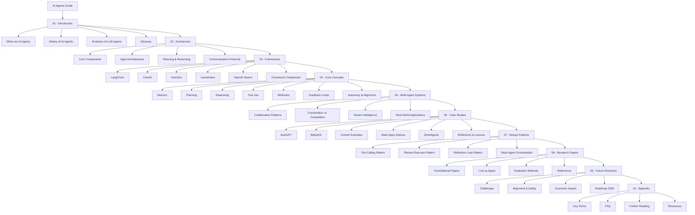
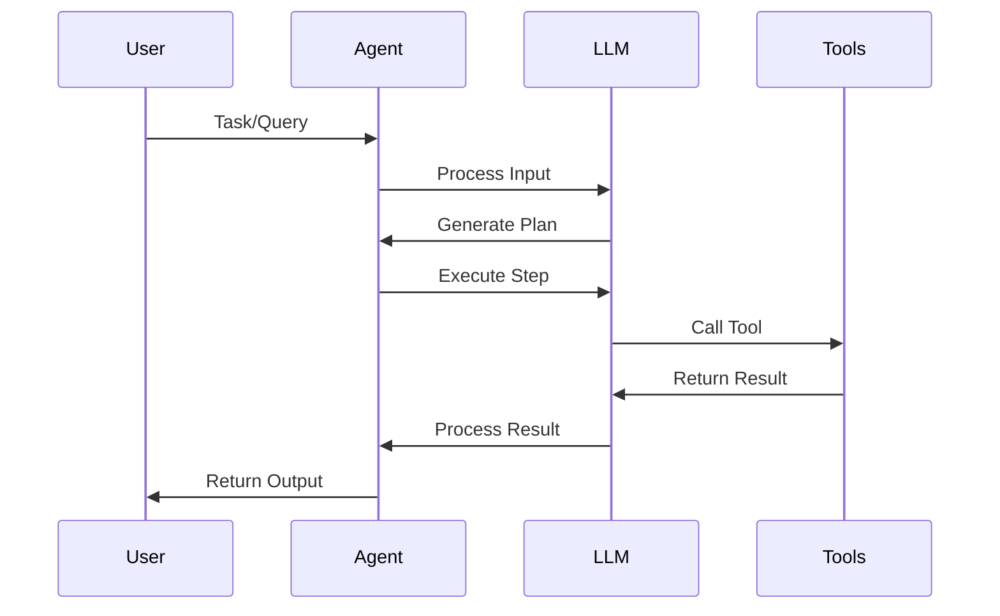
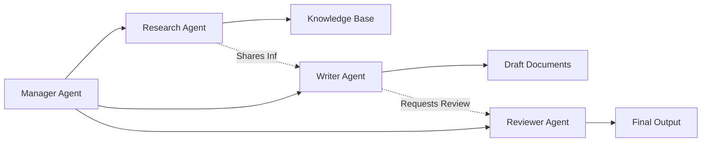

# AI Agents: A Comprehensive Guide

A complete resource for understanding, building, and deploying AI agents powered by Large Language Models (LLMs). This repository covers everything from foundational concepts to advanced multi-agent systems and real-world implementations.

## 📚 Repository Structure



## 🚀 Getting Started

### Prerequisites
- Basic understanding of Python programming
- Familiarity with Large Language Models (LLMs)
- Knowledge of REST APIs and asynchronous programming (helpful but not required)

### Quick Navigation

**New to AI Agents?** Start here:
1. [What are AI Agents?](01-introduction/what-are-ai-agents.md)
2. [History of AI Agents](01-introduction/history-of-ai-agents.md)
3. [Evolution of LLM Agents](01-introduction/evolution-of-llm-agents.md)
4. [Glossary](01-introduction/glossary.md)

**Building Your First Agent?** Check out:
1. [Core Components](02-architecture/core-components.md)
2. [Agent Architectures](02-architecture/agent-architectures.md)
3. [Framework Comparison](03-frameworks/comparison-table.md)

**Advanced Topics:**
- [Multi-Agent Systems](05-multi-agent-systems/)
- [Design Patterns](07-design-patterns/)
- [Research Papers](08-research-papers/)

## 📖 Content Overview

### 01. Introduction
Foundational knowledge about AI agents, their history, and evolution.

- **[What are AI Agents?](01-introduction/what-are-ai-agents.md)** - Core definitions and concepts
- **[History of AI Agents](01-introduction/history-of-ai-agents.md)** - Evolution from rule-based to LLM-powered agents
- **[Evolution of LLM Agents](01-introduction/evolution-of-llm-agents.md)** - How LLMs transformed agent capabilities
- **[Glossary](01-introduction/glossary.md)** - Key terminology and definitions

### 02. Architecture
Deep dive into agent design, components, and communication.

- **[Core Components](02-architecture/core-components.md)** - Essential building blocks
- **[Agent Architectures](02-architecture/agent-architectures.md)** - Different architectural patterns
- **[Planning and Reasoning](02-architecture/planning-and-reasoning.md)** - How agents think and plan
- **[Communication Protocols](02-architecture/communication-protocols.md)** - Inter-agent communication
- **[Diagrams](02-architecture/diagrams/)** - Visual representations of architectures

### 03. Frameworks
Comprehensive guides to popular agent frameworks.

- **[LangChain](03-frameworks/langchain.md)** - Comprehensive framework for LLM applications
- **[CrewAI](03-frameworks/crewai.md)** - Role-based multi-agent orchestration
- **[AutoGen](03-frameworks/autogen.md)** - Microsoft's multi-agent framework
- **[LlamaIndex](03-frameworks/llamaindex.md)** - Data framework for LLM applications
- **[OpenAI Swarm](03-frameworks/openai-swift-agents.md)** - Lightweight multi-agent coordination
- **[Comparison Table](03-frameworks/comparison-table.md)** - Side-by-side framework comparison

### 04. Core Concepts
Essential concepts that power intelligent agents.

- **[Memory](04-core-concepts/memory.md)** - Short-term, long-term, and semantic memory
- **[Planning](04-core-concepts/planning.md)** - Task decomposition and execution strategies
- **[Reasoning](04-core-concepts/reasoning.md)** - Chain-of-thought and logical inference
- **[Tool Use](04-core-concepts/tool-use.md)** - Function calling and external integrations
- **[Reflection](04-core-concepts/reflection.md)** - Self-evaluation and improvement
- **[Feedback Loops](04-core-concepts/feedback-loops.md)** - Learning from outcomes
- **[Autonomy and Alignment](04-core-concepts/autonomy-and-alignment.md)** - Balancing independence with safety

### 05. Multi-Agent Systems
Coordination and collaboration between multiple agents.

- **[Collaboration Patterns](05-multi-agent-systems/collaboration-patterns.md)** - How agents work together
- **[Coordination vs Competition](05-multi-agent-systems/coordination-vs-competition.md)** - Different interaction models
- **[Swarm Intelligence](05-multi-agent-systems/swarm-intelligence.md)** - Emergent collective behavior
- **[Real-World Applications](05-multi-agent-systems/real-world-applications.md)** - Production use cases

### 06. Case Studies
Real-world implementations and lessons learned.

- **[AutoGPT](06-case-studies/autogpt.md)** - Autonomous GPT-4 agent
- **[BabyAGI](06-case-studies/babyagi.md)** - Task-driven autonomous agent
- **[CrewAI Examples](06-case-studies/crewai.md)** - Multi-agent crew implementations
- **[Meta Open Deimos](06-case-studies/meta-open-deimos.md)** - Meta's agent system
- **[SmolAgents](06-case-studies/smolagents.md)** - Lightweight agent implementations
- **[Reflections and Lessons](06-case-studies/relections-and-lessions.md)** - Key takeaways

### 07. Design Patterns
Proven patterns for building robust agents.

- **[Tool Calling Pattern](07-design-patterns/tool-calling-pattern.md)** - External function integration
- **[Planner-Executor Pattern](07-design-patterns/planner-executor-pattern.md)** - Separating planning from execution
- **[Reflection Loop Pattern](07-design-patterns/reflection-loop-pattern.md)** - Self-improvement cycles
- **[Multi-Agent Orchestration](07-design-patterns/multi-agent-orchestration.md)** - Coordinating multiple agents

### 08. Research Papers
Academic foundations and cutting-edge research.

- **[Foundational Papers](08-research-papers/foundational-papers.md)** - Seminal works in the field
- **[LLM as Agent](08-research-papers/llm-as-agent.md)** - Research on LLM-based agents
- **[Evaluation Methods](08-research-papers/evaluation-methods.md)** - How to measure agent performance
- **[References](08-research-papers/references.bib)** - Complete bibliography

### 09. Future Directions
Emerging trends and future possibilities.

### 10. Appendix
Additional resources and references.

## 🛠️ Common Agent Workflows

### Basic Agent Flow


### Multi-Agent Collaboration


## 🤝 Contributing

We welcome contributions! Please see [CONTRIBUTING.md](CONTRIBUTING.md) for guidelines.

### How to Contribute:
1. Fork the repository
2. Create a feature branch (`git checkout -b feature/AmazingFeature`)
3. Commit your changes (`git commit -m 'Add some AmazingFeature'`)
4. Push to the branch (`git push origin feature/AmazingFeature`)
5. Open a Pull Request

## 📋 Summary

For a complete overview of all topics, see [SUMMARY.md](SUMMARY.md).

## 📄 License

This project is licensed under the terms specified in [LICENSE](LICENSE).

## 🎯 Use Cases

AI agents are being used across various domains:

- **Software Development**: Code generation, debugging, documentation
- **Research**: Literature review, data analysis, hypothesis generation
- **Customer Service**: Automated support, query resolution
- **Content Creation**: Writing, editing, multimedia generation
- **Data Analysis**: ETL processes, report generation, insights
- **Automation**: Workflow orchestration, task management

## 📚 Recommended Reading Path

**For Beginners:**
```
Introduction → Core Concepts → Frameworks → Case Studies
```

**For Developers:**
```
Architecture → Frameworks → Design Patterns → Case Studies
```

**For Researchers:**
```
Research Papers → Core Concepts → Multi-Agent Systems → Future Directions
```

**For System Architects:**
```
Architecture → Design Patterns → Multi-Agent Systems → Real-World Applications
```

## 🔗 External Resources

- [OpenAI API Documentation](https://platform.openai.com/docs)
- [Anthropic Claude Documentation](https://docs.anthropic.com)
- [LangChain Documentation](https://python.langchain.com)
- [AutoGen Documentation](https://microsoft.github.io/autogen)

## 💡 Quick Tips

1. **Start Simple**: Begin with single-agent systems before moving to multi-agent
2. **Test Thoroughly**: Agent behavior can be unpredictable; extensive testing is crucial
3. **Monitor Costs**: LLM API calls can add up quickly
4. **Implement Safeguards**: Always include error handling and safety measures
5. **Iterate**: Agent systems improve through continuous refinement

## 📞 Community & Support

- **Issues**: Use GitHub Issues for bugs and feature requests
- **Discussions**: Join our discussions for questions and ideas
- **Documentation**: Check existing docs before opening issues

---

**Last Updated**: October 2025

**Maintained by**: Rita Hchanger

**Star this repo** ⭐ if you find it helpful!